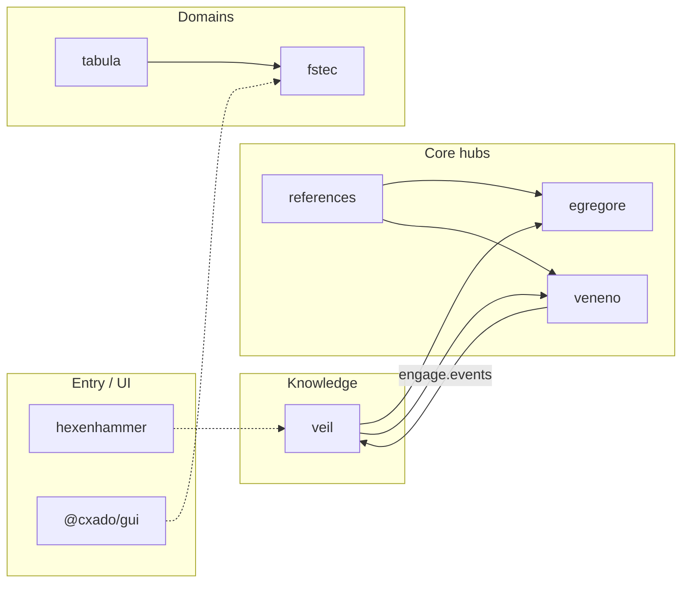

# cxado

Meta-repository umbrella for the cxado cybersecurity product line: knowledge (Veil), pentest (Veneno), SOC agents (Egregore), DevSecOps reference (Fabrica), scan aggregation (ASOC API), plus domain products — compliance (Tabula/fstec) and awareness (Hexenhammer).

Shared hubs DRY agent rules, skills, references, wire contracts, and UI (`@cxado/gui`).

## Quick start

```bash
git clone --recurse-submodules https://github.com/butbeautifulv/cxado.git
cd cxado
make bootstrap
```

`make bootstrap` runs: `git submodule update --init --recursive`, then `refs-link`, `rules-link`, `skills-link`, `skills-install`, `gui-link`.

Already cloned without submodules:

```bash
git submodule update --init --recursive
make bootstrap
```

Open multi-root workspace: **`cxado.code-workspace`**

## Architecture (from codebase index)

Indexed graph (codebase-memory-mcp, 2026-06): **~57k nodes**, **~151k edges**. Canonical write-up: [docs/adr/cxado-architecture.md](docs/adr/cxado-architecture.md) · visual map: [docs/ecosystem-map.md](docs/ecosystem-map.md).



**Strongest cross-repo boundaries** (call graph): veil ↔ egregore, veil ↔ veneno, references → egregore/veneno.

| Layer (MCP) | Module | Role |
|-------------|--------|------|
| core | egregore, veneno, references | High fan-in shared logic |
| internal | veil, fabrica, asoc-api | Product backends / templates |
| entry | hexenhammer, gui | Outbound UI and campaign surfaces |

## Projects

| Path | Repository | Role | Stack |
|------|------------|------|-------|
| `projects/veil` | [veil](https://github.com/butbeautifulv/veil) | TI graph, ingest, veil-api, veil-mcp | Go, Neo4j |
| `projects/veneno` | [veneno](https://github.com/butbeautifulv/veneno) | Pentest execution, tool catalog | Go |
| `projects/egregore` | [egregore](https://github.com/butbeautifulv/egregore) | Event-driven multi-agent SOC | Python, FastAPI |
| `projects/fabrica` | [fabrica](https://github.com/butbeautifulv/fabrica) | DevSecOps CI/CD reference | YAML, scripts |
| `projects/asoc-api` | [asoc-api](https://github.com/butbeautifulv/asoc-api) | Scan aggregation → NATS | Go |
| `projects/tabula` | [tabula](https://github.com/butbeautifulv/tabula) | Compliance domain umbrella | meta |
| `projects/tabula/fstec` | [fstec](https://github.com/butbeautifulv/fstec) | FSTEC measures, orders, reporting | Next.js, Prisma |
| `projects/hexenhammer` | [hexenhammer](https://github.com/butbeautifulv/hexenhammer) | Phishing simulation, campaigns | Next.js, Drizzle |

Agent entry points per project: [AGENTS.md](AGENTS.md).

## Shared hubs

| Path | Repository | Purpose |
|------|------------|---------|
| `shared/agent-rules` | [cxado-agent-rules](https://github.com/butbeautifulv/cxado-agent-rules) | 7 core Cursor rules (`make rules-link`) |
| `shared/skills` | [cxado-skills](https://github.com/butbeautifulv/cxado-skills) | DevSecOps + agent skills (`make skills-install`) |
| `shared/references` | [cxado-references](https://github.com/butbeautifulv/cxado-references) | JCSF, DAF, OWASP, hexstrike extracts |
| `shared/gui` | [cxado-gui](https://github.com/butbeautifulv/cxado-gui) | Compliance UI kit (`@cxado/gui`, `make gui-link`) |
| `shared/contracts` | in meta-repo | Wire contracts (`make test-contracts`) |

## Make targets

| Target | What it does |
|--------|----------------|
| `make bootstrap` | Submodules + all link/install steps |
| `make rules-link` | Symlink `shared/agent-rules/core/` → project `.cursor`/`.agents/rules` + meta-repo `.cursor/rules` |
| `make skills-install` | Symlink cxado-skills → `~/.cursor/skills/` |
| `make skills-link` | Symlink devsecops skills into fabrica |
| `make refs-link` | Symlink `shared/references` → project `refs/` |
| `make gui-link` | Symlink `@cxado/gui` into consumer `node_modules` |
| `make test-contracts` | Cross-repo `engage.events` wire smoke |

## Agent development & MCP

Cursor agents in this workspace use an **MCP-first** workflow — explore with codebase-memory and Serena before blind grep.

| MCP | Use for |
|-----|---------|
| **codebase-memory-mcp** | Architecture, `search_code`, `trace_path` — always scope with `path_filter` |
| **Serena** | `find_symbol`, renames — always set `relative_path` to the submodule |
| **Context7** | Third-party library docs (shadcn, Next.js, Tailwind) |
| **cursor-ide-browser** | UI smoke tests |

```text
# Example: find auth code in egregore
search_code(pattern="KeycloakJwtVerifier",
  project="home-bbv-Desktop-cys_framework",
  path_filter="projects/egregore", file_pattern="*.py")
```

Docs: [docs/agents/cursor-mcp-tooling.md](docs/agents/cursor-mcp-tooling.md) · enforcement rule: `shared/agent-rules/core/agent-mcp-tooling.mdc`

**Re-index** after large structural changes:

```bash
./scripts/reindex-post-merge.sh
# then via MCP: index_repository(repo_path="...", mode="full", persistence=true)
```

Local artifact: `.codebase-memory/graph.db.zst` (gitignored; optional team share).

## Data flows (partial / planned)

| Flow | Mechanism | Status |
|------|-----------|--------|
| Veneno → Veil | `engage.events` (NATS) | wired; `make test-contracts` |
| ASOC → Egregore | NATS | planned |
| Fabrica → projects | `adopt.sh` CI templates | reference |
| Egregore ↔ Veil | veil-mcp | [stub](docs/integration/egregore-veil-mcp.md) |

## Docs index

| Doc | Contents |
|-----|----------|
| [AGENTS.md](AGENTS.md) | Agent index, MCP scoping cheat sheet |
| [docs/ecosystem-map.md](docs/ecosystem-map.md) | Public catalog, rules/skills layers, project matrix |
| [docs/adr/cxado-architecture.md](docs/adr/cxado-architecture.md) | Architecture ADR |
| [docs/bootstrap-smoke-test.md](docs/bootstrap-smoke-test.md) | Post-clone checklist |
| [docs/legacy-cleanup.md](docs/legacy-cleanup.md) | Migration from `.external/` |

## Migration from manual `.external/`

| Was | Now |
|-----|-----|
| Copy repos into `.external/` by hand | `git clone cxado && make bootstrap` |
| Per-project skills copies | `make skills-install` |
| JCSF/DAF in multiple trees | `shared/references/` + `make refs-link` |
| Local `projects/fstec` clone | `tabula/fstec` submodule |

Legacy `.external/` at workspace root is **removed**.
