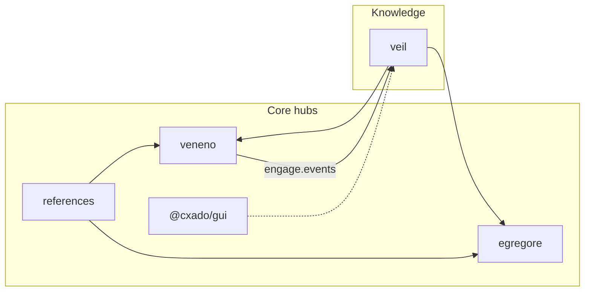

# cxado

Meta-repository umbrella for the cxado cybersecurity product line: knowledge (Veil), pentest (Veneno), SOC agents (Egregore), DevSecOps reference (Fabrica).

Shared hubs DRY agent rules, skills, references, wire contracts, and UI (`@cxado/gui`).

## Quick start

```bash
git clone --recurse-submodules https://github.com/butbeautifulv/cxado.git
cd cxado
make bootstrap
```

`make bootstrap` runs: `git submodule update --init --recursive`, then `skills-link`, `skills-install`, `gui-link`, and cleanup of legacy symlinks. Shared hubs (`shared/*`) are **in-tree** in cxado — not submodules. Reference corpora live in **`refs/`** at meta root (gitignored, ~1 GB local). Core Cursor rules: `shared/agent-rules/core/` + `.cursor/rules/` at meta root.

### Default local stack

```bash
make cxado-up
make -C projects/egregore dev
```

Runbook: [docs/deploy/cxado-default-stack.md](docs/deploy/cxado-default-stack.md) · ports: [deploy/ports.md](deploy/ports.md).

### Architecture docs site (k3s offline)

Static HTML + Mermaid site for architects: [docs/architecture-site/](docs/architecture-site/).

```bash
./scripts/k8s/k3s-deploy-arch-docs-offline.sh   # bundle + apply manifests
CXADO_ARCH_DOCS_HOST=0.0.0.0 ./scripts/k8s/smoke-test-arch-docs.sh
```

URL: `https://<k3s-node>:30080` (TLS via `cxado-tls-gateway`).

Already cloned without submodules:

```bash
git submodule update --init --recursive
make bootstrap
```

Open multi-root workspace: **`cxado.code-workspace`**

## Architecture (from codebase index)

Indexed architecture (2026-06 baseline): **~57k nodes**, **~151k edges** (historical graph index; **codebase-memory-mcp removed 2026-07**). Canonical write-up: [docs/adr/cxado-architecture.md](docs/adr/cxado-architecture.md) · visual map: [docs/ecosystem-map.md](docs/ecosystem-map.md).



**Strongest cross-repo boundaries** (call graph): veil ↔ egregore, veil ↔ veneno, references → egregore/veneno.

| Layer (MCP) | Module | Role |
|-------------|--------|------|
| core | egregore, veneno, references | High fan-in shared logic |
| internal | veil, fabrica | Product backends / templates |
| entry | gui | Shared UI kit (`@cxado/gui`) |

## Projects

| Path | Repository | Role | Stack |
|------|------------|------|-------|
| `projects/veil` | [veil](https://github.com/butbeautifulv/veil) | TI graph, ingest, veil-api, veil-mcp | Go, Neo4j |
| `projects/veneno` | [veneno](https://github.com/butbeautifulv/veneno) | Pentest execution, tool catalog | Go |
| `projects/egregore` | [egregore](https://github.com/butbeautifulv/egregore) | Event-driven multi-agent SOC | Python, FastAPI |
| `projects/fabrica` | [fabrica](https://github.com/butbeautifulv/fabrica) | DevSecOps CI/CD reference | YAML, scripts |

Agent entry points per project: [AGENTS.md](AGENTS.md).

**Out of cxado scope** (removed from monorepo, local clones on `~/Desktop/`): hexenhammer, tabula, fstec, asoc-api.

# Shared hubs (in meta-repo)

| Path | Purpose |
|------|---------|
| `shared/agent-rules/` | Core Cursor rules — `.cursor/rules/` at cxado root |
| `shared/skills/` | DevSecOps + agent skills (`make skills-install`) |
| `refs/` | JCSF, DAF, OWASP extracts — **gitignored**, local populate (see `refs/README.md`) |
| `shared/gui/` | `@cxado/gui` UI kit (`make gui-link`) |
| `shared/contracts/` | Wire schemas (`make test-contracts`) |

## Make targets

| Target | What it does |
|--------|----------------|
| `make bootstrap` | Submodules + skills/gui link + skills install + legacy symlink cleanup |
| `make skills-install` | Symlink `shared/skills` → `~/.cursor/skills/` |
| `make skills-link` | Symlink devsecops skills into fabrica |
| `make refs-cleanup` | Remove legacy `projects/*/refs` symlinks (SSOT: `refs/` at meta root) |
| `make gui-link` | Symlink `@cxado/gui` into consumer `node_modules` |
| `make agent-skills-install` | Fetch infra/agent skills into `.agents/skills/` |
| `make cxado-up` | Veil graph + egregore infra + observability (Docker) |
| `make cxado-up-lite` | Lite profile: no Tempo, **with** Langfuse, 1 worker |
| `make cxado-status` | Health checks for default stack |
| `make k3s-baseline` | Collect full k3s Prometheus baseline snapshot |
| `make k3s-baseline-critical` | Collect critical-query baseline subset |
| `make k3s-cluster-snapshot` | Capture k3s cluster state snapshot |
| `make k3s-validation-gate` | Phase 9 full validation (infra + scenarios) |
| `make k3s-validation-infra` | Phase 9 infra-only gate (fast) |
| `make test-contracts` | Cross-repo `engage.events` wire smoke |

## Agent development & MCP

Cursor agents: **Context7** for third-party library docs; **scoped Grep/Read** for internal code.

| Tool | Use for |
|------|---------|
| **Context7** | Third-party library docs (shadcn, Next.js, Tailwind, FastAPI) |
| **cursor-ide-browser** | UI smoke tests |
| **Grep / Read / Glob** | Internal code — always scope to `projects/<submodule>/` |

Docs: [docs/agents/cursor-mcp-tooling.md](docs/agents/cursor-mcp-tooling.md) · enforcement rule: `shared/agent-rules/core/agent-mcp-tooling.mdc`

## Data flows (partial / planned)

| Flow | Mechanism | Status |
|------|-----------|--------|
| Veneno → Veil | `engage.events` (NATS) | wired; `make test-contracts` |
| Fabrica → projects | `adopt.sh` CI templates | reference |
| Egregore ↔ Veil | veil-mcp | [wired](docs/integration/egregore-veil-mcp.md) |

## Docs index

| Doc | Contents |
|-----|----------|
| [docs/DOCUMENTATION.md](docs/DOCUMENTATION.md) | **SSOT guide** — where to document what |
| [docs/ecosystem-map.md](docs/ecosystem-map.md) | Public catalog, projects, data flows |
| [docs/integration/README.md](docs/integration/README.md) | Cross-project wiring |
| [docs/deploy/cxado-default-stack.md](docs/deploy/cxado-default-stack.md) | Local dev stack runbook |
| [AGENTS.md](AGENTS.md) | Agent index, MCP scoping |
| [docs/adr/cxado-architecture.md](docs/adr/cxado-architecture.md) | Architecture ADR |

More: [observability](docs/observability/README.md) · [k3s baseline](docs/deploy/k3s-offline-baseline.md) · [legacy cleanup](docs/legacy-cleanup.md)

## Migration from manual `.external/`

| Was | Now |
|-----|-----|
| Copy repos into `.external/` by hand | `git clone cxado && make bootstrap` |
| Per-project skills copies | `make skills-install` |
| JCSF/DAF in multiple trees | `refs/` at cxado meta root (no per-project symlinks) |
| Local `projects/fstec` clone | removed — use `~/Desktop/tabula` if needed |

Legacy `.external/` at workspace root is **removed**.
