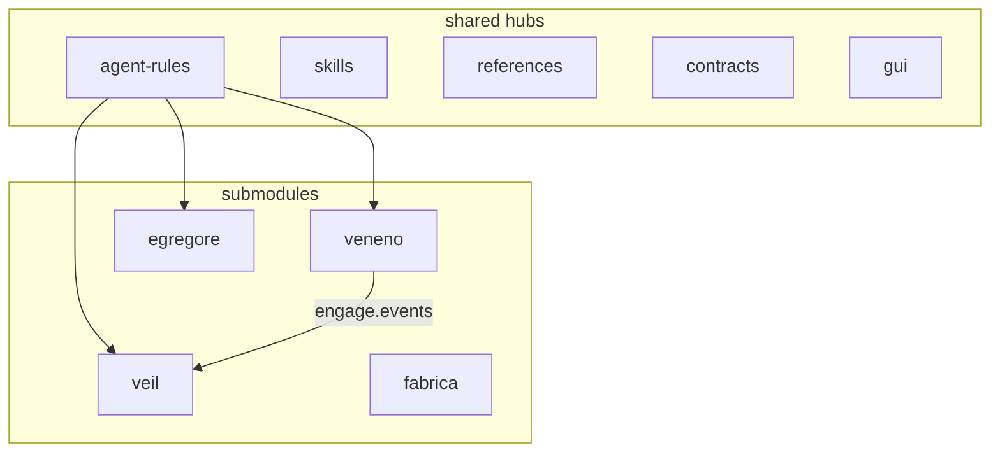

# ADR: cxado meta-repository architecture

| Field | Value |
|-------|-------|
| Status | accepted |
| Date | 2026-06-24 |
| Source | docs/adr + ecosystem-map (git SSOT) |
| Index | historical graph (~57k nodes, ~151k edges, 2026-06); codebase-memory-mcp **removed** 2026-07 |

Canonical copy for git and human review. Update this file when architecture changes.

See also: [ecosystem-map.md](../ecosystem-map.md), [AGENTS.md](../../AGENTS.md).

---

## PURPOSE

cxado (cys_framework) is a meta-repository umbrella for cybersecurity products: knowledge (Veil), pentest execution (Veneno), SOC agents (Egregore), DevSecOps reference (Fabrica). Shared hubs DRY agent rules, skills, references, contracts, and UI (`@cxado/gui`).

**Out of scope (2026-07):** tabula, fstec, hexenhammer, asoc-api — removed from submodules; clones on `~/Desktop/`.

## STACK

- **Languages:** Python (~1295 files), TypeScript (~1160), Go (~779), YAML, Bash
- **Veil / Veneno:** Go, Neo4j/NATS where applicable
- **Egregore:** Python, event-driven multi-agent SOC; optional Keycloak JWT on API and tool gateway (`AUTH_ENABLED`)
- **Fabrica:** YAML CI/CD templates, DevSecOps scripts
- **Bootstrap:** `make bootstrap` → submodules, skills-link, gui-link, legacy symlink cleanup

## ARCHITECTURE

**Meta-repo layout:** `projects/*` submodules + `shared/*` hubs + `docs/` ecosystem map.

**Indexed graph (~57k nodes, ~151k edges):**

- **Core hubs (high fan-in):** egregore, references, veneno
- **Outbound-heavy:** veil (fan-out ~4189), gui (shared UI kit)
- **Cross-project boundaries (call graph):** veil→egregore (~2528), veil→references (~1064), veil↔veneno (~600), references→egregore/veneno

**Domains:**

| Domain | Product | Status |
|--------|---------|--------|
| Knowledge | veil | active submodule |
| Pentest | veneno | active submodule |
| SOC | egregore | active submodule |
| DevSecOps | fabrica | active submodule |

**Data flows (planned/partial):** Veneno → Veil (engage.events); Fabrica `adopt.sh` → projects.

**GUI:** `@cxado/gui` in `shared/gui` — shared UI kit; `make gui-link` into Veil pilot.

## PATTERNS

- **Submodule per product** with independent git lifecycle; meta-repo pins versions
- **DRY agent layer:** `shared/agent-rules/core` at cxado root (`.cursor/rules/` symlinks); thin project overlays in submodules
- **Phased plans:** `docs/plans/*_master.plan.md` with branch-per-phase workflow

## TRADEOFFS

- **Monorepo workspace vs submodule autonomy:** core platform products are submodules; out-of-scope repos live on `~/Desktop/`
- **MCP cross-repo boundaries** in historical graph indexes were partly similarity artifacts — validate with code review and scoped grep

## PHILOSOPHY

- **Hubs over copies:** one canonical place for rules, skills, references, GUI primitives
- **Domains over monolith:** separate product lines may leave the meta-repo when out of scope
- **Agent-native docs:** AGENTS.md per project + ecosystem-map + this ADR for session continuity
- **Agent MCP (Cursor):** Context7 for library docs; scoped grep/read for internal code — see [docs/agents/cursor-mcp-tooling.md](../agents/cursor-mcp-tooling.md)
