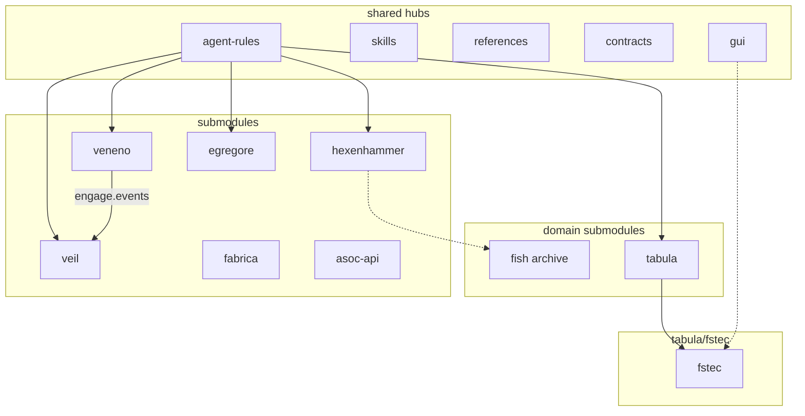

# ADR: cxado meta-repository architecture

| Field | Value |
|-------|-------|
| Status | accepted |
| Date | 2026-06-24 |
| Source | codebase-memory-mcp (`get_architecture` + `manage_adr`) |
| Index | `.codebase-memory/graph.db.zst` (59k nodes, 167k edges at time of writing) |

Canonical copy for git and human review. Agents can also load this via MCP `manage_adr(mode='get', project='home-bbv-Desktop-cys_framework')`. After major structural changes, re-index with `index_repository` and update this file if the ADR drifts.

See also: [ecosystem-map.md](../ecosystem-map.md), [AGENTS.md](../../AGENTS.md).

---

## PURPOSE

cxado (cys_framework) is a meta-repository umbrella for cybersecurity products: knowledge (Veil), pentest execution (Veneno), SOC agents (Egregore), DevSecOps reference (Fabrica), scan aggregation (ASOC API), plus emerging domains — compliance/Tabula (fstec), awareness (hexenhammer). Shared hubs DRY agent rules, skills, references, contracts, and UI (`@cxado/gui`).

## STACK

- **Languages:** Python (~1295 files), TypeScript (~1160), Go (~779), YAML, Bash
- **Veil / Veneno / ASOC:** Go, Neo4j/NATS where applicable
- **Egregore:** Python, event-driven multi-agent SOC
- **Fabrica:** YAML CI/CD templates, DevSecOps scripts
- **fstec / hexenhammer / fish:** Next.js 16, React 19, Drizzle or Prisma, PostgreSQL
- **Bootstrap:** `make bootstrap` → submodules, rules-link, skills-link, refs-link, gui-link

## ARCHITECTURE

**Meta-repo layout:** `projects/*` submodules + `shared/*` hubs + `docs/` ecosystem map.

**Indexed graph (59k nodes, 167k edges):**

- **Core hubs (high fan-in):** egregore, fstec, fish, references, veneno
- **Outbound-heavy:** veil (fan-out ~6943), hexenhammer (entry layer)
- **Cross-project boundaries (call graph):** veil↔egregore, veil↔fstec, veneno↔veil strongest

**Domains:**

| Domain | Product | Status |
|--------|---------|--------|
| Knowledge | veil | active submodule |
| Pentest | veneno | active submodule |
| SOC | egregore | active submodule |
| DevSecOps | fabrica | active submodule |
| Compliance | tabula → fstec | submodule; GUI migration on `fstec/gui-detach-wip` |
| Awareness | hexenhammer | submodule; phase 04 generic branding done |
| Archive | fish | external; donor for hexenhammer |

**Data flows (planned/partial):** Veneno → Veil (engage.events); ASOC → NATS → Egregore; Fabrica `adopt.sh` → projects.

**GUI:** `@cxado/gui` in `shared/gui` — compliance UI kit; fstec strangler migration WIP on separate branch; hexenhammer uses local shadcn until phase 05.

## PATTERNS

- **Submodule per product** with independent git lifecycle; meta-repo pins versions
- **DRY agent layer:** `shared/agent-rules/core` symlinked via `make rules-link`; thin project overlays (1–4 `.mdc`)
- **Strangler fig (fstec GUI):** re-export shims `@/components/ui` → `@cxado/gui/*`; domain logic stays in app `lib/`
- **Domain extraction (hexenhammer):** mechanisms from fish archive; org-agnostic env (`HEX_*`, `HEX_PUBLIC_*`)
- **Three-context Next.js apps:** `(public)/`, `(admin)/` or `(platform)/`, `api/` — public never imports admin
- **Phased plans:** `docs/plans/*_master.plan.md` with branch-per-phase workflow

## TRADEOFFS

- **Monorepo workspace vs submodule autonomy:** tabula and hexenhammer are proper submodules; legacy `projects/fstec/` local drop deprecated
- **Full codebase index includes references/corpus:** large graph (Veil 754 playbooks inflates nodes); use MCP filters or `moderate` mode for focused queries
- **GUI detachment paused on fstec:** master stays self-contained; WIP on `fstec/gui-detach-wip` avoids breaking production builds
- **fish kept as archive:** avoids МАШ coupling in hexenhammer; duplicate maintenance until hexenhammer fully replaces active use
- **MCP cross-repo boundaries** are partly similarity/import artifacts — validate with `trace_path` before trusting fan-in counts

## PHILOSOPHY

- **Hubs over copies:** one canonical place for rules, skills, references, GUI primitives
- **Domains over monolith:** Tabula (compliance) and Hexenhammer (awareness) are separate product lines under cxado
- **Pause before merge:** GUI and domain migrations snapshot to branches; master stays green
- **Agent-native docs:** AGENTS.md per project + ecosystem-map + this ADR for session continuity
- **Agent MCP (Cursor):** codebase-memory-mcp + Serena + Context7 — see [docs/agents/cursor-mcp-tooling.md](../agents/cursor-mcp-tooling.md)
- **Index artifact:** `.codebase-memory/graph.db.zst` for team bootstrap; re-index after major structural changes
