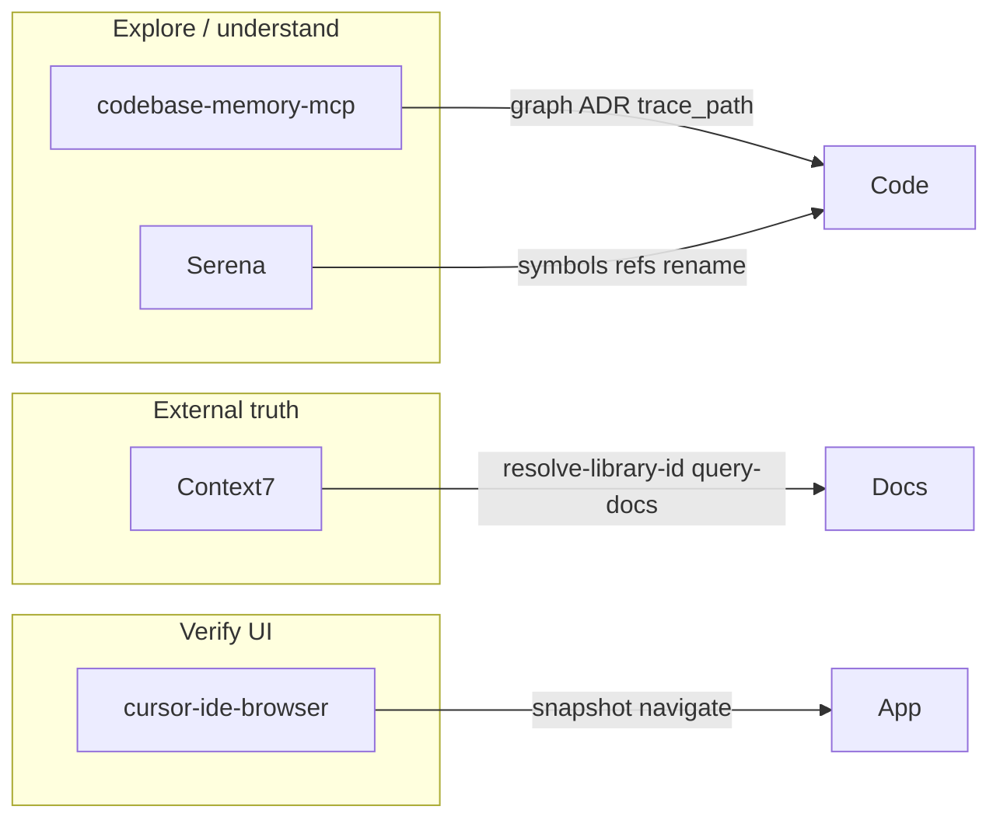

# Cursor agent MCP tooling (cxado)

Active MCP servers for agent-assisted development in this workspace. Config lives in `~/.cursor/mcp.json` (user-level, not in git).

**Enforcement:** `shared/agent-rules/core/agent-mcp-tooling.mdc` (`alwaysApply: true`) — symlinked into every project and meta-repo `.cursor/rules` via `make rules-link`.

## Current stack (2026-06)

| MCP | Role | When to use |
|-----|------|-------------|
| **codebase-memory-mcp** | Knowledge graph over the monorepo | Architecture, cross-module flows, ADR, “where is X used?” at scale |
| **Serena** | LSP-backed symbol operations | Precise refactors: `find_symbol`, references, rename, diagnostics |
| **Context7** (`ctx7`) | Up-to-date library docs | shadcn/ui, Tailwind v4, Next.js, MCP SDK — before guessing APIs |

Also available (built-in): **cursor-ide-browser** — UI smoke tests, snapshots, form fills.



---

## codebase-memory-mcp

**Project id:** `home-bbv-Desktop-cys_framework`

### Bootstrap

```bash
# once per machine / after large refactors
index_repository(repo_path="/home/bbv/Desktop/cys_framework", mode="full", persistence=true)
```

Artifact: [`.codebase-memory/graph.db.zst`](../../.codebase-memory/graph.db.zst) (~17 MB). Optional commit for team sharing; otherwise local only.

### Key tools

| Tool | Purpose |
|------|---------|
| `get_architecture` | Packages, layers, clusters, boundaries |
| `search_graph` / `search_code` | Semantic / structural search |
| `trace_path` | Call chains between symbols |
| `manage_adr` | Session ADR (`get` / `update`) |
| `detect_changes` | Drift after refactors |
| `index_status` | Index health |

### Git mirror

Architecture ADR in git: [docs/adr/cxado-architecture.md](../adr/cxado-architecture.md). Keep MCP and markdown in sync after domain moves (Tabula, hexenhammer, fstec GUI).

---

## Serena

Semantic code intelligence (oraios/serena) via `uvx`. Project root: `/home/bbv/Desktop/cys_framework`, context: `ide-assistant`.

### Key tools

| Tool | Purpose |
|------|---------|
| `find_symbol` | Locate definitions by name/path |
| `find_referencing_symbols` | Who calls / imports this |
| `rename_symbol` | Safe rename across workspace |
| `get_symbols_overview` | File structure at a glance |
| `get_diagnostics_for_file` | Type/lint issues from LSP |
| `replace_symbol_body` | Surgical body replace |

Prefer Serena over blind grep for renames and “find all usages” in large submodules (veil, fstec, hexenhammer).

---

## Context7 (`ctx7`)

Live documentation for third-party libraries. **Do not commit API keys** — key is in `~/.cursor/mcp.json` only.

### Workflow

1. `resolve-library-id` — e.g. `shadcn/ui`, `tailwindcss`, `next.js`
2. `query-docs` — ask with concrete `libraryId` + task (“add Button in Next.js App Router”)

Use before implementing UI in **hexenhammer**, **fstec** (`@cxado/gui`), or any stack that may differ from training data.

---

## Division of labour

| Task | Prefer |
|------|--------|
| “Where is oauth / create_app / X defined?” | `search_code` + `path_filter` → Serena `find_symbol` + `relative_path` |
| “How do modules connect?” | `trace_path`, then `get_architecture` if you need the big picture |
| “Rename / find references” | Serena (scoped) |
| “What’s the current shadcn/Tailwind API?” | Context7 |
| “Does the login page work?” | cursor-ide-browser |
| Persistent architecture decisions | `manage_adr` + [docs/adr/](../adr/) |

---

## Exploration ladder & scoping

Monorepo agents often get **0 results** or **reference noise** without scoping.

### 1. codebase-memory — always scope

```text
search_code(
  pattern="oauth",
  project="home-bbv-Desktop-cys_framework",
  path_filter="projects/egregore",
  file_pattern="*.py"
)
```

- **`path_filter`** — regex on file paths; required for submodule work
- **`get_architecture`** — useful but heavy; use after `search_code` / `trace_path`, not as step 1
- **Stale index** — if `search_code` returns 0 but code exists: `index_status(project)` → re-index **after PR merge**, not mid-branch

### 2. Serena — `relative_path`, not `--project`

MCP has no `--project` flag. Scope with **`relative_path`**:

```text
find_symbol(name_path_pattern="create_app", relative_path="projects/egregore")
find_referencing_symbols(..., relative_path="projects/egregore")
```

Unscoped `find_symbol` matches `shared/references`, veil corpus scripts, etc.

### 3. Context7 — third-party only

Use for shadcn, Next.js, FastAPI *docs*, Keycloak HTTP API — not for navigating `cys_core/` or `interfaces/`.

### 4. Fallback

Scoped `grep` is acceptable when MCP returns 0 **and** you documented `index_status` or MCP error.

### Submodule scope cheat sheet

| Submodule | `path_filter` / `relative_path` |
|-----------|--------------------------------|
| egregore | `projects/egregore` |
| veil | `projects/veil` |
| veneno | `projects/veneno` |
| hexenhammer | `projects/hexenhammer` |
| fstec | `projects/tabula/fstec` |

---

## Re-index (post-merge only)

Run when a submodule had large changes **and** no other agent is editing it:

```bash
./scripts/reindex-post-merge.sh          # full monorepo
./scripts/reindex-post-merge.sh egregore # reminder + moderate hint
```

Or call MCP: `index_repository(repo_path="/home/bbv/Desktop/cys_framework", mode="full", persistence=true)`.

After **Tabula / fstec GUI / hexenhammer** structural changes: re-run and update ADR.

---

## Reload

After editing `~/.cursor/mcp.json`: **Cursor → Settings → MCP → Reload** (or restart Cursor). Serena first start may take 10–15s while `uvx` fetches from GitHub.
