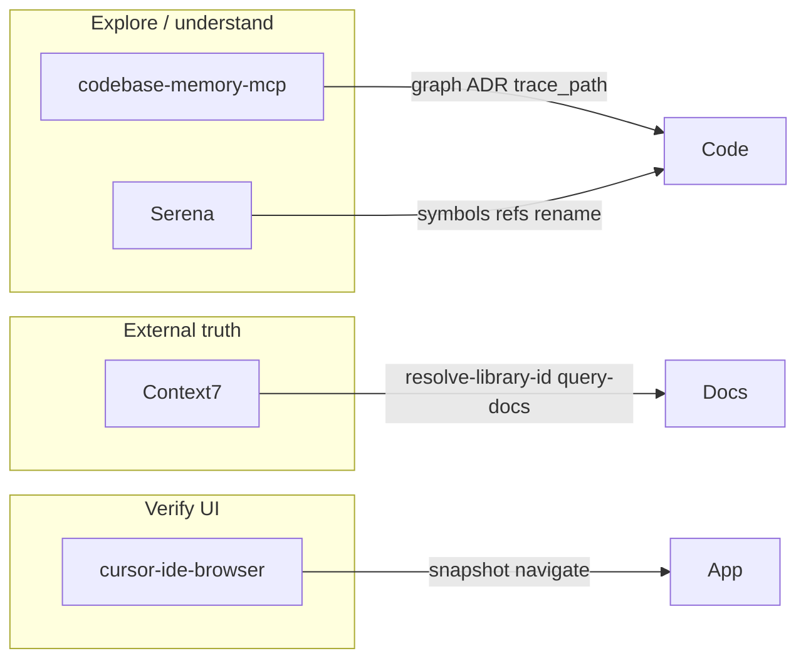

# Cursor agent MCP tooling (cxado)

Active MCP servers for agent-assisted development in this workspace. Config lives in `~/.cursor/mcp.json` (user-level, not in git).

## Current stack (2026-06)

| MCP | Role | When to use |
|-----|------|-------------|
| **codebase-memory-mcp** | Knowledge graph over the monorepo | Architecture, cross-module flows, ADR, “where is X used?” at scale |
| **Serena** | LSP-backed symbol operations | Precise refactors: `find_symbol`, references, rename, diagnostics |
| **Context7** (`ctx7`) | Up-to-date library docs | shadcn/ui, Tailwind v4, Next.js, MCP SDK — before guessing APIs |

Also available (built-in): **cursor-ide-browser** — UI smoke tests, snapshots, form fills.



---

## codebase-memory-mcp

**Project id:** `home-bbv-Desktop-cys_framework`

### Bootstrap

```bash
# once per machine / after large refactors
index_repository(repo_path="/home/bbv/Desktop/cys_framework", mode="full", persistence=true)
```

Artifact: [`.codebase-memory/graph.db.zst`](../../.codebase-memory/graph.db.zst) (~17 MB). Optional commit for team sharing; otherwise local only.

### Key tools

| Tool | Purpose |
|------|---------|
| `get_architecture` | Packages, layers, clusters, boundaries |
| `search_graph` / `search_code` | Semantic / structural search |
| `trace_path` | Call chains between symbols |
| `manage_adr` | Session ADR (`get` / `update`) |
| `detect_changes` | Drift after refactors |
| `index_status` | Index health |

### Git mirror

Architecture ADR in git: [docs/adr/cxado-architecture.md](../adr/cxado-architecture.md). Keep MCP and markdown in sync after domain moves (Tabula, hexenhammer, fstec GUI).

---

## Serena

Semantic code intelligence (oraios/serena) via `uvx`. Project root: `/home/bbv/Desktop/cys_framework`, context: `ide-assistant`.

### Key tools

| Tool | Purpose |
|------|---------|
| `find_symbol` | Locate definitions by name/path |
| `find_referencing_symbols` | Who calls / imports this |
| `rename_symbol` | Safe rename across workspace |
| `get_symbols_overview` | File structure at a glance |
| `get_diagnostics_for_file` | Type/lint issues from LSP |
| `replace_symbol_body` | Surgical body replace |

Prefer Serena over blind grep for renames and “find all usages” in large submodules (veil, fstec, hexenhammer).

---

## Context7 (`ctx7`)

Live documentation for third-party libraries. **Do not commit API keys** — key is in `~/.cursor/mcp.json` only.

### Workflow

1. `resolve-library-id` — e.g. `shadcn/ui`, `tailwindcss`, `next.js`
2. `query-docs` — ask with concrete `libraryId` + task (“add Button in Next.js App Router”)

Use before implementing UI in **hexenhammer**, **fstec** (`@cxado/gui`), or any stack that may differ from training data.

---

## Division of labour

| Task | Prefer |
|------|--------|
| “How do modules connect?” | codebase-memory → `get_architecture`, `trace_path` |
| “Rename / find references” | Serena |
| “What’s the current shadcn/Tailwind API?” | Context7 |
| “Does the login page work?” | cursor-ide-browser |
| Persistent architecture decisions | `manage_adr` + [docs/adr/](../adr/) |

After **Tabula / fstec GUI / hexenhammer** structural changes: re-run `index_repository` and update ADR.

---

## Reload

After editing `~/.cursor/mcp.json`: **Cursor → Settings → MCP → Reload** (or restart Cursor). Serena first start may take 10–15s while `uvx` fetches from GitHub.
