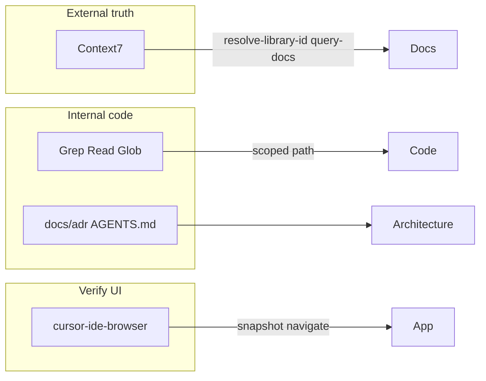

# Cursor agent MCP tooling (cxado)

Active MCP servers for agent-assisted development. Config: `~/.cursor/mcp.json` (user-level, not in git).

**Enforcement:** [`shared/agent-rules/core/agent-mcp-tooling.mdc`](../shared/agent-rules/core/agent-mcp-tooling.mdc) (`alwaysApply: true`) — loaded from meta [`.cursor/rules/`](../.cursor/rules/) when using `cxado.code-workspace`.

## Current stack (2026-07)

| Tool | Role | When to use |
|------|------|-------------|
| **Context7** (`context7`) | Up-to-date library docs | shadcn/ui, Tailwind v4, Next.js, FastAPI, MCP SDK — before guessing APIs |
| **cursor-ide-browser** (built-in) | UI automation | Smoke tests, snapshots, form fills |
| **Grep / Read / Glob** (built-in) | Internal code navigation | Always scope to `projects/<submodule>/` |



---

## Context7 (`context7`)

Live documentation for third-party libraries. API key lives in `~/.cursor/mcp.json` only — **never commit**.

### Workflow

1. `resolve-library-id` — e.g. `shadcn/ui`, `tailwindcss`, `next.js`
2. `query-docs` — concrete `libraryId` + task (“add Button in Next.js App Router”)

Use before implementing UI in **Veil** (`@cxado/gui`) or any stack that may differ from training data.

---

## Internal code (no graph MCP)

Navigate the monorepo with **scoped** built-in search:

```text
# Example: ripgrep scoped to egregore
Grep(pattern="create_app", path="projects/egregore", glob="*.py")
```

| Submodule | Scope `path` / `glob` |
|-----------|------------------------|
| egregore | `projects/egregore` |
| veil | `projects/veil` |
| veneno | `projects/veneno` |
| fabrica | `projects/fabrica` |

Architecture SSOT: [docs/adr/cxado-architecture.md](../adr/cxado-architecture.md), [docs/ecosystem-map.md](../ecosystem-map.md).

Unscoped search hits `refs/` (~1 GB), veil corpus scripts, and other noise — avoid it.

---

## Division of labour

| Task | Prefer |
|------|--------|
| “What's the current shadcn/Tailwind API?” | Context7 |
| “Where is oauth / create_app defined?” | Scoped Grep → Read |
| “How do modules connect?” | `docs/adr/`, project ARCHITECTURE docs |
| “Does the login page work?” | cursor-ide-browser |
| Persistent architecture decisions | [docs/adr/](../adr/) in git |

---

## Reload

After editing `~/.cursor/mcp.json`: **Cursor → Settings → MCP → Reload** (or restart Cursor).

## Removed (2026-07)

**codebase-memory-mcp** and `.codebase-memory/` graph indexes were removed — stale indexes and poor hit rate in practice. Use scoped grep + ADR docs instead.
