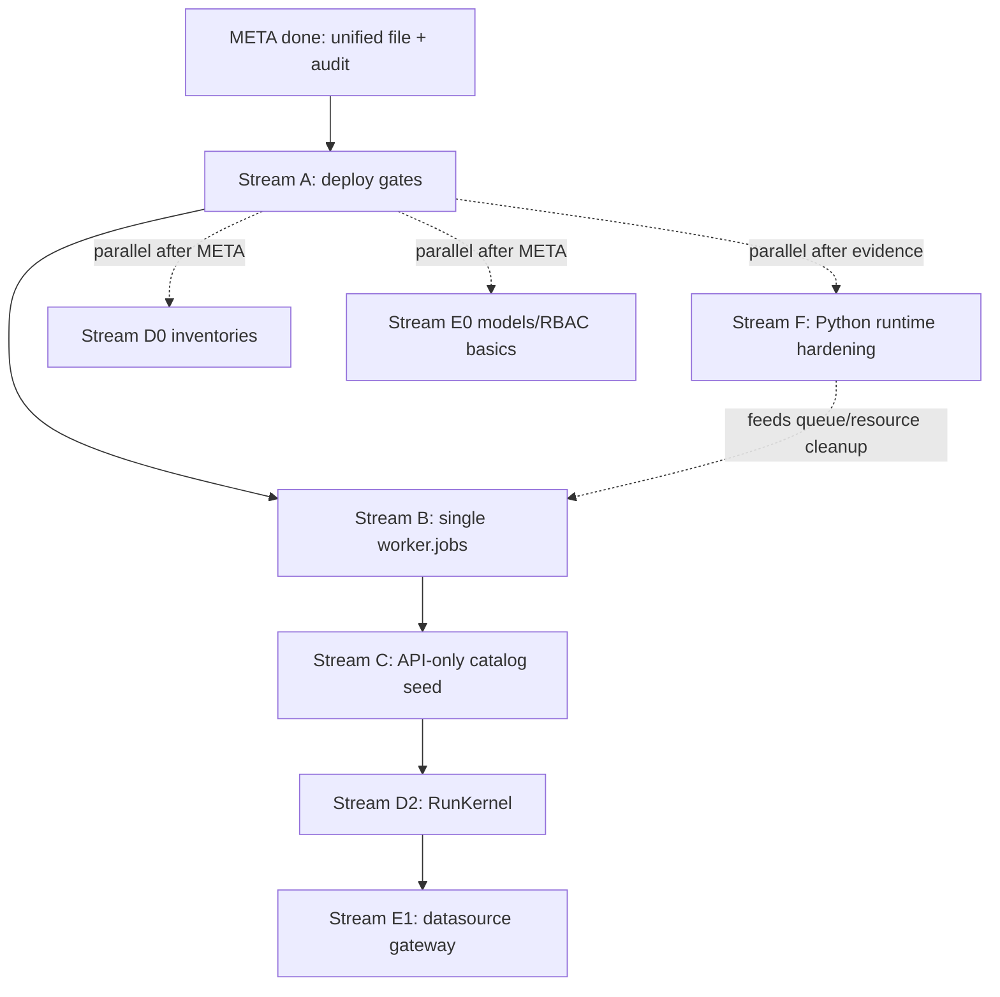
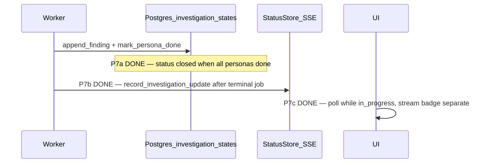
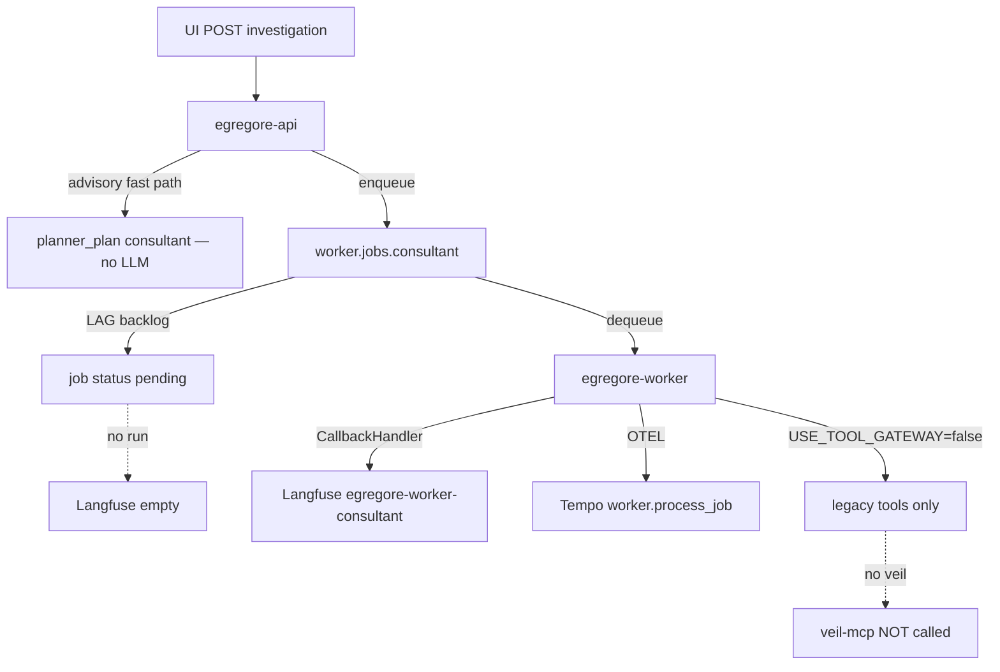
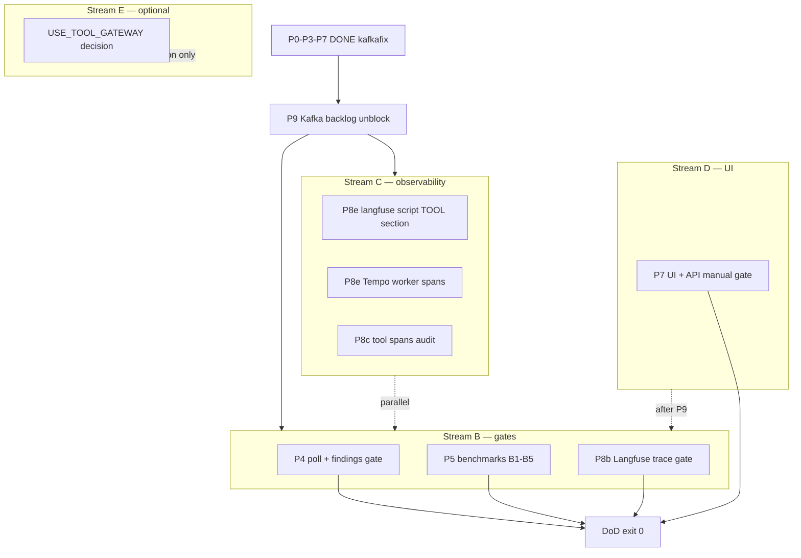
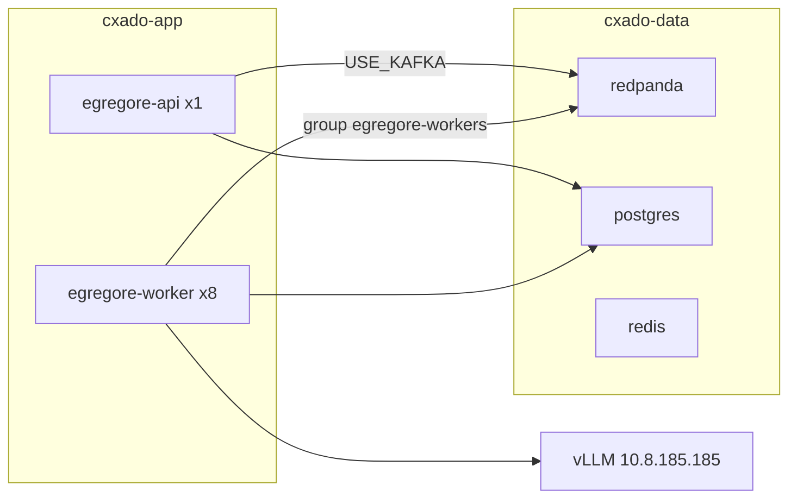
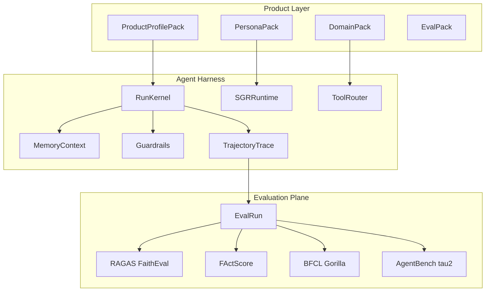
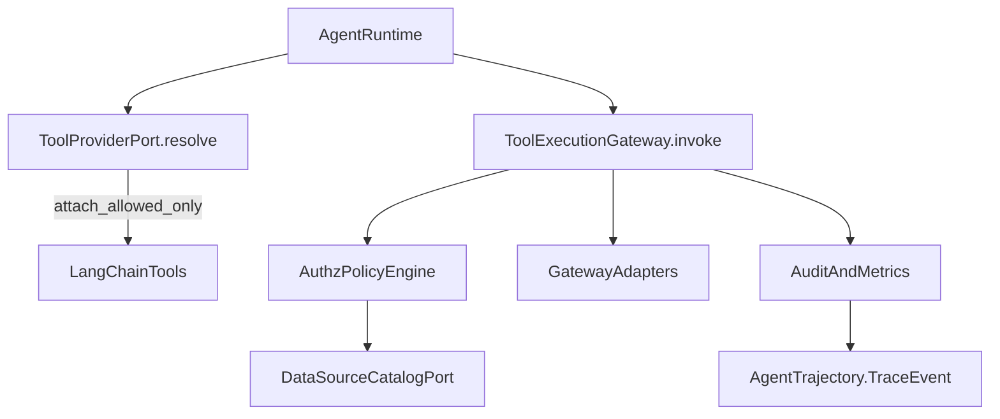

# Egregore Unified Masterplan

Единый исполняемый backlog: сначала закрыть deploy gates, затем устранить корневую причину Kafka-очереди, параллельно запланировать Python runtime hardening, после этого убрать hybrid catalog seed и только потом продолжать platform/datasources waves.

**Merged:** 328 todos | completed 301 | pending/in_progress 25 | cancelled 2

**Source counts are exact for current source plans:** deploy imported 86, platform imported 151, datasources imported 49, new queue/catalog/python/deploy-extra 42. Earlier rough estimates in the meta-plan (~311) are superseded by this generated count.

---

## 1. Executive summary + critical path

| Order | Stream | Why it is here | Done when |
|-------|--------|----------------|-----------|
| 1 | **A DEPLOY** | Stabilize the currently deployed k3s path before refactors | P9/E2E/P7/P8 gates pass on `kafkapoll` |
| 2 | **B QUEUE** | Fix the root bottleneck: per-persona Kafka topics and one-partition consultant queue | single `worker.jobs`, N partitions, LAG=0 under parallel POST |
| 3 | **C CATALOG** | Remove runtime FS merge after queue path is stable | API seed/bootstrap only; prod never reads `agents/personas/*.yaml` |
| 4 | **D PLATFORM** | Rework orchestration around a shared RunKernel | D2 kernel contract unifies `ManageRun` and `RunWorkerJob` |
| 5 | **E DATASOURCES** | Add datasource RBAC on top of stable kernel/tool traces | E1 gateway authz and TraceEvent gates pass |
| 6 | **F PYTHON RUNTIME** | Harden async/resource/config/error patterns discovered from Python skills | no hidden event-loop/resource leaks; typed boundaries and tests cover refactor |



**Execution rule:** Stream D0, E0 and Stream F inventory may run in parallel with Stream A. F implementation should be sliced so it supports, not blocks, Stream B/C: lifecycle and async-boundary fixes first, broader typing/docs after queue stability. D1 starts after `unified-cat-04`; D2 starts after Stream B code is in place and Stream C seed policy is clear. E1 starts after D2 exposes the kernel/tool trace hooks.

---

## 2. Architecture decisions (ADR-lite)

### ADR-1: Single worker job queue

- **Decision:** One Kafka topic `worker.jobs` (partitions ≥ worker count). Job JSON carries `persona`; worker loads agent dynamically.
- **Rejects:** `worker.jobs.{persona}` per-topic (current) — causes serial bottleneck on consultant, consumer rebalance, LAG.
- **Migration:** drain old `worker.jobs.*` topics, deploy code writing to `worker.jobs`, then re-run E2E and lag gates before deleting/deprecating old topic helpers.
- **Files:** [`kafka_topics.py`](projects/egregore/cys_core/infrastructure/kafka_topics.py), [`kafka_queue.py`](projects/egregore/cys_core/infrastructure/kafka_queue.py), [`15-redpanda-topics-job.yaml`](deploy/k8s/cxado-offline/15-redpanda-topics-job.yaml)

### ADR-2: Dual orchestration → RunKernel (platform D2)

- **Today:** [`ManageRun`](projects/egregore/cys_core/application/use_cases/manage_run.py) (sync `/runs`) vs [`RunWorkerJob`](projects/egregore/cys_core/application/use_cases/run_worker_job.py) (Kafka).
- **Target:** Shared `RunKernelPort` (platform wave D2).
- **Dependency:** queue unification must land first so `RunWorkerJob` consumes the same job shape that the kernel contract will standardize.

### ADR-3: API-only catalog seed

- **Decision:** Production runtime reads Postgres catalog only. Seed via `POST /catalog/seed` + bootstrap script. FS merge in [`hybrid_registry.py`](projects/egregore/cys_core/infrastructure/catalog/hybrid_registry.py) → dev/test only (`USE_MEMORY_FALLBACK`).
- **Implication:** platform product packs seed through the API/bootstrap path; datasources use Postgres/API catalog adapters, not hybrid FS discovery.

### ADR-4: Datasource authorization subject and tracing

- **Decision:** datasource authz subject is the `persona` from the queue job payload (ADR-1), plus profile/tenant from the run context.
- **Trace dependency:** datasource policy/tool trace events depend on `unified-plat-master-p2-02-trajectory-model`; gateway enforcement depends on `unified-plat-master-p2-10-kernel-tool-hook`.

### ADR-5: Interim deploy (until ADR-1 shipped)

- `max_poll_interval_ms` in kafka consumer (local diff, tag `kafkapoll`)
- Operational drain: `kubectl rollout restart deploy/egregore-worker` when consultant LAG > 0

### ADR-6: Python runtime hardening without DDD breakage

- **Decision:** improve async/resource/error/config patterns only at layer boundaries: `interfaces/*`, `bootstrap/*`, `cys_core/application` ports/use cases, and `cys_core/infrastructure` adapters.
- **Do not:** import infrastructure into domain/application, move FastAPI concerns into domain, or add generic framework abstractions without a concrete failing call path.
- **Observed hotspots:** `asyncio.run` wrappers in Kafka publishers and queue sync methods, fire-and-forget `asyncio.create_task` in FastAPI and Redis bus dispatch, broad `except Exception` fallback to memory/False, per-message Kafka producers, sync `httpx.get` in tool adapters, async Redis/Kafka clients without explicit close hooks.
- **Pattern target:** async-first app paths, CLI-only sync wrappers, managed lifespan/background tasks, typed infrastructure ports, startup config validation, structured fallback metrics, and cancellation/resource tests.

---

## 3. Streams A–F + gates

| Stream/wave | Start after | Primary gate | Artifact |
|-------------|-------------|--------------|----------|
| A DEPLOY | META | `e2e-verify-egregore.sh` exit 0; consultant LAG=0; trace audit explains UI/Langfuse path | `deploy/.local/logs/e2e_verify_*.log`, `deploy/.local/logs/kafka_lag_*.md`, `deploy/.local/logs/trace_audit_*.md` |
| B QUEUE | A gates or controlled parallel branch; re-run A gates after deploy | 2 parallel AD POST requests do not serialize/block; `worker.jobs` has N partitions and LAG=0 | `deploy/.local/logs/kafka_migration_*.md` |
| C CATALOG | B code path stable | catalog version > 0 after bootstrap; prod mode never reads FS personas | `docs/CATALOG_SEED.md` |
| D0 PLATFORM inventory | META | inventories updated with `ManageRun`, queue split, and API-only catalog facts | inventory docs/tests in platform PR |
| D1 PLATFORM product packs | `unified-cat-04` | product packs seed through API/bootstrap, no hybrid wording | tests/docs in platform PR |
| D2 PLATFORM RunKernel | B + C policy clear | RunKernel contract tests green; interactive and worker paths share trace schema | pytest + E2E smoke |
| D3/D4 PLATFORM | D2 | tool/SGR/memory/eval/UI waves build on kernel trace contract | pytest/eval artifacts |
| E0 DATASOURCES | META | domain models + GET-only RBAC basics pass unit tests | pytest |
| E1 DATASOURCES | D2 tool hook | non-GET datasource denied at gateway; policy/tool TraceEvents emitted | pytest + trace sample |
| E2 DATASOURCES | D4/E1 | eval/governance docs and tests complete | eval/governance artifacts |
| F0 PYTHON inventory | META | hotspots documented with file paths and refactor slices | `docs/PYTHON_RUNTIME_HARDENING.md` or plan update |
| F1 PYTHON async/resources | A gates or controlled branch before B deploy | no hidden `asyncio.run` in app paths; Kafka/Redis/httpx resources close deterministically | unit/integration tests |
| F2 PYTHON typing/config/tests | F1 | startup config validation, typed ports/DTOs, fallback metrics, pytest fixtures/import-linter gates pass | pytest/import-linter/ruff |

Gate log template: deploy/.local/logs/unified_gate_TEMPLATE.md (local artifact, gitignored)

---

## 4. Merged backlog by stream

| Stream | Todo count | Status now | Main blockers | Notes |
|--------|------------|------------|---------------|-------|
| A DEPLOY | 87 | imported status preserved | Kafka backlog and `kafkapoll` deploy | Completed deploy todos stay completed; do not reopen them for Stream B refactor |
| B QUEUE | 10 | pending | A gates or a controlled parallel deploy branch | Supersedes per-persona Kafka helpers from completed deploy P1e/P2b |
| C CATALOG | 9 | pending | B code path stable | Supersedes platform `master-p1-06-seed-cybersec-product` implementation path |
| D PLATFORM | 151 | pending | D1 after C, D2 after B/C | Execute by waves D0-D4, not by original phase order alone |
| E DATASOURCES | 49 | pending | E1 after D2; E2 after D4/E1 | Catalog adapter is Postgres/API, not hybrid FS |
| F PYTHON RUNTIME | 22 | pending | F1 after deploy evidence; keep DDD layers intact | Based on Python skills audit of async/config/errors/resources/tests |

### Stream A — DEPLOY

Immediate pending sequence: `unified-dep-kafka-max-poll` → P9 drain/pending/dequeue gates → P4 E2E poll/findings/logs → P7/P8 observability/UI gates → P5 benchmarks. This stream validates the current production path before Stream B changes the queue topology.

### Stream B — QUEUE

Implement as one focused queue PR/deploy: topic constant, enqueue path, consumer subscription, tests, k8s topic job, migration doc, deploy, lag gate, persona-group deprecation, architecture doc.

### Stream C — CATALOG

Implement after queue semantics are stable: inventory hybrid call sites, verify `SeedCatalog`, add bootstrap script/init job, remove production FS merge, keep FS fallback only for explicit dev/test memory fallback, add contract tests and docs.

### Stream D — PLATFORM

Wave order is D0 inventory → D1 product packs/API seed alignment → D2 RunKernel → D3 tools/SGR/memory/eval model work → D4 eval/UI/runbooks. Platform todos retain their original source IDs but execute through these wave tags.

### Stream E — DATASOURCES

Wave order is E0 models/RBAC defaults → E1 gateway enforcement and TraceEvent integration → E2 eval/governance. `ds-c3-01` and `ds-c3-02` are blocked by the platform trajectory model as well as the kernel tool hook.

### Stream F — PYTHON RUNTIME HARDENING

This stream is a refactor plan based on `fastapi-templates`, `async-python-patterns`, `python-testing-patterns`, `python-observability`, `python-error-handling`, `python-configuration`, `python-resilience`, `python-design-patterns`, `python-type-safety`, `python-background-jobs`, `python-resource-management`, and `uv-package-manager`.

| Wave | Focus | Files observed | Rule |
|------|-------|----------------|------|
| F0 | Inventory and contracts | `kafka_queue.py`, `kafka_events.py`, `kafka_control_events.py`, `interfaces/api/app.py`, `bus_transport.py`, `rate_limit.py`, `settings.py` | Document exact call paths before edits |
| F1 | Async/resource safety | Kafka queue/publishers, FastAPI lifespan tasks, Redis bus/rate limiter, HTTP clients | Async-first app paths; CLI-only sync wrappers; deterministic `aclose()` |
| F2 | Config/error/type/test hardening | `Settings`, application ports, WorkerJob payloads, metrics, pytest fixtures | Typed boundaries, fail-fast config, visible fallback metrics, no DDD layer inversion |

Initial findings to validate during F0:

- `KafkaJobQueue.enqueue/dequeue` and several Kafka publisher sync helpers call `asyncio.run`; keep these only in CLI/test adapters or replace with explicit async ports.
- `KafkaJobQueue`, Redis bus/rate limiter and one-shot Kafka producers lack a shared managed-resource lifecycle; add `aclose()` and tests for cancellation/timeout cleanup.
- FastAPI manual planner and Redis async handler dispatch use fire-and-forget tasks; move them under a small task supervisor with shutdown cancellation and exception capture.
- Kafka/Redis fallback paths often catch `Exception` and return `False` or memory fallback silently; replace with typed errors, structured logs and bounded Prometheus labels.
- HTTP tool adapters use ad hoc `httpx` clients/timeouts; centralize client creation/retry/timeout policy for SIEM/MCP/Veil/Veneno boundaries.
- `Settings` is typed but should validate enum-like fields, timeout ordering, required Kafka bootstrap when `USE_KAFKA=1`, and unsafe default secrets in prod.
- Hot paths still pass raw `dict[str, Any]` job/result payloads; introduce DTOs at ingress/worker/infrastructure boundaries only, preserving domain/application dependency direction.

---

## 5. Todo index (source_id → unified_id)

| unified_id | source_id | source | status |
|------------|-----------|--------|--------|
| unified-dep-p0-snapshot-cluster | p0-snapshot-cluster | deploy | completed |
| unified-dep-p0-snapshot-resources | p0-snapshot-resources | deploy | completed |
| unified-dep-p0-snapshot-redis-queue | p0-snapshot-redis-queue | deploy | completed |
| unified-dep-p0-restart-stuck-workers | p0-restart-stuck-workers | deploy | completed |
| unified-dep-p1a-orchestrator-logger | p1a-orchestrator-logger | deploy | completed |
| unified-dep-p1a-orchestrator-logger-test | p1a-orchestrator-logger-test | deploy | completed |
| unified-dep-p1b-settings-worker-timeout | p1b-settings-worker-timeout | deploy | completed |
| unified-dep-p1b-orchestrator-wait-for | p1b-orchestrator-wait-for | deploy | completed |
| unified-dep-p1b-orchestrator-dequeue-block | p1b-orchestrator-dequeue-block | deploy | completed |
| unified-dep-p1b-timeout-unit-test | p1b-timeout-unit-test | deploy | completed |
| unified-dep-p1c-advisory-goal-commit | p1c-advisory-goal-commit | deploy | completed |
| unified-dep-p1c-dispatch-sync-helper | p1c-dispatch-sync-helper | deploy | completed |
| unified-dep-p1c-dispatch-sync-test | p1c-dispatch-sync-test | deploy | completed |
| unified-dep-p1d-redis-list-queue | p1d-redis-list-queue | deploy | completed |
| unified-dep-p1d-redis-list-test | p1d-redis-list-test | deploy | completed |
| unified-dep-p1e-kafka-topics-helper | p1e-kafka-topics-helper | deploy | completed |
| unified-dep-p1e-kafka-multi-consumer | p1e-kafka-multi-consumer | deploy | completed |
| unified-dep-p1e-kafka-consumer-test | p1e-kafka-consumer-test | deploy | completed |
| unified-dep-p1f-configmap-timeouts | p1f-configmap-timeouts | deploy | completed |
| unified-dep-p1f-values-timeouts | p1f-values-timeouts | deploy | completed |
| unified-dep-p1-image-queuefix | p1-image-queuefix | deploy | completed |
| unified-dep-p1-verify-ad-200 | p1-verify-ad-200 | deploy | completed |
| unified-dep-p2a-redpanda-manifest | p2a-redpanda-manifest | deploy | completed |
| unified-dep-p2a-redpanda-apply | p2a-redpanda-apply | deploy | completed |
| unified-dep-p2b-topics-job-manifest | p2b-topics-job-manifest | deploy | completed |
| unified-dep-p2b-topics-job-run | p2b-topics-job-run | deploy | completed |
| unified-dep-p2c-deploy-script-redpanda | p2c-deploy-script-redpanda | deploy | completed |
| unified-dep-p2-verify-redpanda | p2-verify-redpanda | deploy | completed |
| unified-dep-p3a-values-kafka-env | p3a-values-kafka-env | deploy | completed |
| unified-dep-p3a-configmap-kafka | p3a-configmap-kafka | deploy | completed |
| unified-dep-p3a-helm-values-defaults | p3a-helm-values-defaults | deploy | completed |
| unified-dep-p3b-values-worker-8 | p3b-values-worker-8 | deploy | completed |
| unified-dep-p3b-rollout-workers | p3b-rollout-workers | deploy | completed |
| unified-dep-p3-image-prod | p3-image-prod | deploy | completed |
| unified-dep-p3-flush-redis-queue | p3-flush-redis-queue | deploy | completed |
| unified-dep-p3-verify-kafka-produce | p3-verify-kafka-produce | deploy | completed |
| unified-dep-p4a-e2e-script-skeleton | p4a-e2e-script-skeleton | deploy | completed |
| unified-dep-p4a-e2e-health | p4a-e2e-health | deploy | completed |
| unified-dep-p4b-e2e-post-ad | p4b-e2e-post-ad | deploy | completed |
| unified-dep-p4b-e2e-poll-investigation | p4b-e2e-poll-investigation | deploy | pending |
| unified-dep-p4c-e2e-planner-assert | p4c-e2e-planner-assert | deploy | pending |
| unified-dep-p4c-e2e-finding-assert | p4c-e2e-finding-assert | deploy | pending |
| unified-dep-p4d-e2e-langfuse | p4d-e2e-langfuse | deploy | pending |
| unified-dep-p4d-e2e-worker-logs | p4d-e2e-worker-logs | deploy | pending |
| unified-dep-p4e-e2e-exit-code | p4e-e2e-exit-code | deploy | completed |
| unified-dep-p5-benchmark-b1-b2 | p5-benchmark-b1-b2 | deploy | pending |
| unified-dep-p5-benchmark-b3-b5 | p5-benchmark-b3-b5 | deploy | pending |
| unified-dep-p5-langfuse-report | p5-langfuse-report | deploy | pending |
| unified-dep-p5-summary-doc | p5-summary-doc | deploy | completed |
| unified-dep-p6-fallback-vllm | p6-fallback-vllm | deploy | cancelled |
| unified-dep-p6-fallback-langfuse-eval | p6-fallback-langfuse-eval | deploy | pending |
| unified-dep-p7a-close-investigation-helper | p7a-close-investigation-helper | deploy | completed |
| unified-dep-p7a-mark-persona-close | p7a-mark-persona-close | deploy | completed |
| unified-dep-p7a-close-unit-test | p7a-close-unit-test | deploy | completed |
| unified-dep-p7b-worker-notify-port | p7b-worker-notify-port | deploy | completed |
| unified-dep-p7b-orchestrator-wire-notifier | p7b-orchestrator-wire-notifier | deploy | completed |
| unified-dep-p7b-sse-payload-id | p7b-sse-payload-id | deploy | completed |
| unified-dep-p7b-notify-unit-test | p7b-notify-unit-test | deploy | completed |
| unified-dep-p7c-ui-live-badge | p7c-ui-live-badge | deploy | completed |
| unified-dep-p7c-ui-poll-fix | p7c-ui-poll-fix | deploy | completed |
| unified-dep-p7c-ui-terminal-detect | p7c-ui-terminal-detect | deploy | completed |
| unified-dep-p7c-ui-stop-poll-terminal | p7c-ui-stop-poll-terminal | deploy | completed |
| unified-dep-p7d-ui-planner-ok-badge | p7d-ui-planner-ok-badge | deploy | completed |
| unified-dep-p7d-ui-findings-fallback | p7d-ui-findings-fallback | deploy | completed |
| unified-dep-p7d-status-events-match | p7d-status-events-match | deploy | completed |
| unified-dep-p7e-ui-image-build | p7e-ui-image-build | deploy | completed |
| unified-dep-p7e-ui-rollout | p7e-ui-rollout | deploy | completed |
| unified-dep-p7-gate-api-closed | p7-gate-api-closed | deploy | pending |
| unified-dep-p7-gate-ui-ad | p7-gate-ui-ad | deploy | pending |
| unified-dep-p8a-trace-path-matrix | p8a-trace-path-matrix | deploy | completed |
| unified-dep-p8a-verify-worker-callbacks | p8a-verify-worker-callbacks | deploy | completed |
| unified-dep-p8a-verify-api-callbacks | p8a-verify-api-callbacks | deploy | pending |
| unified-dep-p8b-ui-no-trace-root-cause | p8b-ui-no-trace-root-cause | deploy | completed |
| unified-dep-p8b-e2e-trace-gate | p8b-e2e-trace-gate | deploy | pending |
| unified-dep-p8c-tool-spans-audit | p8c-tool-spans-audit | deploy | pending |
| unified-dep-p8c-use-tool-gateway-audit | p8c-use-tool-gateway-audit | deploy | pending |
| unified-dep-p8d-veil-mcp-verify | p8d-veil-mcp-verify | deploy | pending |
| unified-dep-p8d-consultant-tools-inventory | p8d-consultant-tools-inventory | deploy | completed |
| unified-dep-p8e-langfuse-forensic-extend | p8e-langfuse-forensic-extend | deploy | completed |
| unified-dep-p8e-tempo-worker-spans | p8e-tempo-worker-spans | deploy | pending |
| unified-dep-p8-gate-obs-summary | p8-gate-obs-summary | deploy | completed |
| unified-dep-p9a-kafka-lag-snapshot | p9a-kafka-lag-snapshot | deploy | completed |
| unified-dep-p9b-drain-consultant-backlog | p9b-drain-consultant-backlog | deploy | in_progress |
| unified-dep-p9c-stuck-pending-jobs | p9c-stuck-pending-jobs | deploy | pending |
| unified-dep-p9d-partition-strategy | p9d-partition-strategy | deploy | pending |
| unified-dep-p9-gate-dequeue | p9-gate-dequeue | deploy | pending |
| unified-plat-master-p0-01-inventory-runtime | master-p0-01-inventory-runtime | platform | completed |
| unified-plat-master-p0-02-inventory-orchestration | master-p0-02-inventory-orchestration | platform | completed |
| unified-plat-master-p0-03-inventory-tools | master-p0-03-inventory-tools | platform | completed |
| unified-plat-master-p0-04-inventory-memory | master-p0-04-inventory-memory | platform | completed |
| unified-plat-master-p0-05-inventory-eval | master-p0-05-inventory-eval | platform | completed |
| unified-plat-master-p0-06-inventory-policy | master-p0-06-inventory-policy | platform | completed |
| unified-plat-master-p0-07-inventory-soc | master-p0-07-inventory-soc | platform | completed |
| unified-plat-master-p0-08-trace-event-model | master-p0-08-trace-event-model | platform | completed |
| unified-plat-master-p0-09-smoke-interactive | master-p0-09-smoke-interactive | platform | completed |
| unified-plat-master-p0-10-smoke-worker | master-p0-10-smoke-worker | platform | completed |
| unified-plat-master-p0-11-stub-metric-spec | master-p0-11-stub-metric-spec | platform | completed |
| unified-plat-master-p0-12-policy-fallback-metric-spec | master-p0-12-policy-fallback-metric-spec | platform | completed |
| unified-plat-master-p1-01-product-pack-model | master-p1-01-product-pack-model | platform | completed |
| unified-plat-master-p1-02-domain-pack-model | master-p1-02-domain-pack-model | platform | completed |
| unified-plat-master-p1-03-persona-pack-model | master-p1-03-persona-pack-model | platform | completed |
| unified-plat-master-p1-04-eval-pack-model | master-p1-04-eval-pack-model | platform | completed |
| unified-plat-master-p1-05-product-manifest-schema | master-p1-05-product-manifest-schema | platform | completed |
| unified-plat-master-p1-06-seed-cybersec-product | master-p1-06-seed-cybersec-product | platform | cancelled |
| unified-plat-master-p1-07-seed-general-product | master-p1-07-seed-general-product | platform | completed |
| unified-plat-master-p1-08-seed-gaia-product | master-p1-08-seed-gaia-product | platform | completed |
| unified-plat-master-p1-09-default-profile-compat | master-p1-09-default-profile-compat | platform | completed |
| unified-plat-master-p1-10-policy-defaults-split | master-p1-10-policy-defaults-split | platform | completed |
| unified-plat-master-p1-11-event-model-generic | master-p1-11-event-model-generic | platform | completed |
| unified-plat-master-p1-12-event-adapter-security | master-p1-12-event-adapter-security | platform | completed |
| unified-plat-master-p1-13-routing-domain-adapter | master-p1-13-routing-domain-adapter | platform | completed |
| unified-plat-master-p1-14-tests-product-pack | master-p1-14-tests-product-pack | platform | completed |
| unified-plat-master-p2-01-run-kernel-port | master-p2-01-run-kernel-port | platform | completed |
| unified-plat-master-p2-02-trajectory-model | master-p2-02-trajectory-model | platform | completed |
| unified-plat-master-p2-03-trace-model-call | master-p2-03-trace-model-call | platform | completed |
| unified-plat-master-p2-04-trace-tool-call | master-p2-04-trace-tool-call | platform | completed |
| unified-plat-master-p2-05-trace-memory | master-p2-05-trace-memory | platform | completed |
| unified-plat-master-p2-06-trace-eval | master-p2-06-trace-eval | platform | completed |
| unified-plat-master-p2-07-kernel-state-map | master-p2-07-kernel-state-map | platform | completed |
| unified-plat-master-p2-08-kernel-budget | master-p2-08-kernel-budget | platform | completed |
| unified-plat-master-p2-09-kernel-memory-hook | master-p2-09-kernel-memory-hook | platform | completed |
| unified-plat-master-p2-10-kernel-tool-hook | master-p2-10-kernel-tool-hook | platform | completed |
| unified-plat-master-p2-11-runstep-adapter | master-p2-11-runstep-adapter | platform | completed |
| unified-plat-master-p2-12-workerjob-adapter | master-p2-12-workerjob-adapter | platform | completed |
| unified-plat-master-p2-13-kernel-tests | master-p2-13-kernel-tests | platform | completed |
| unified-plat-master-p2-14-e2e-smoke-kernel | master-p2-14-e2e-smoke-kernel | platform | completed |
| unified-plat-master-p3-01-tool-provider-port | master-p3-01-tool-provider-port | platform | completed |
| unified-plat-master-p3-02-tool-status-model | master-p3-02-tool-status-model | platform | completed |
| unified-plat-master-p3-03-tool-schema-exporter | master-p3-03-tool-schema-exporter | platform | completed |
| unified-plat-master-p3-04-tool-gateway-port | master-p3-04-tool-gateway-port | platform | completed |
| unified-plat-master-p3-05-tools-discovery-module | master-p3-05-tools-discovery-module | platform | completed |
| unified-plat-master-p3-06-tools-rag-module | master-p3-06-tools-rag-module | platform | completed |
| unified-plat-master-p3-07-tools-siem-module | master-p3-07-tools-siem-module | platform | completed |
| unified-plat-master-p3-08-tools-sandbox-module | master-p3-08-tools-sandbox-module | platform | completed |
| unified-plat-master-p3-09-tools-web-module | master-p3-09-tools-web-module | platform | completed |
| unified-plat-master-p3-10-tools-orchestration-module | master-p3-10-tools-orchestration-module | platform | completed |
| unified-plat-master-p3-11-tool-registry-compose | master-p3-11-tool-registry-compose | platform | completed |
| unified-plat-master-p3-12-stub-result-contract | master-p3-12-stub-result-contract | platform | completed |
| unified-plat-master-p3-13-tool-matrix-generated | master-p3-13-tool-matrix-generated | platform | completed |
| unified-plat-master-p3-14-bfcl-schema-smoke | master-p3-14-bfcl-schema-smoke | platform | completed |
| unified-plat-master-p4-01-sgr-tool-availability | master-p4-01-sgr-tool-availability | platform | completed |
| unified-plat-master-p4-02-sgr-allowlist-fix | master-p4-02-sgr-allowlist-fix | platform | completed |
| unified-plat-master-p4-03-sgr-hybrid-port | master-p4-03-sgr-hybrid-port | platform | completed |
| unified-plat-master-p4-04-sgr-hybrid-service | master-p4-04-sgr-hybrid-service | platform | completed |
| unified-plat-master-p4-05-sgr-hybrid-runtime-wire | master-p4-05-sgr-hybrid-runtime-wire | platform | completed |
| unified-plat-master-p4-06-sgr-hybrid-trace | master-p4-06-sgr-hybrid-trace | platform | completed |
| unified-plat-master-p4-07-sgr-iron-selector | master-p4-07-sgr-iron-selector | platform | completed |
| unified-plat-master-p4-08-sgr-iron-args | master-p4-08-sgr-iron-args | platform | completed |
| unified-plat-master-p4-09-sgr-iron-policy | master-p4-09-sgr-iron-policy | platform | completed |
| unified-plat-master-p4-10-sgr-iron-runtime-wire | master-p4-10-sgr-iron-runtime-wire | platform | completed |
| unified-plat-master-p4-11-sgr-nextstep-deferred-doc | master-p4-11-sgr-nextstep-deferred-doc | platform | completed |
| unified-plat-master-p4-12-sgr-gaia-ab | master-p4-12-sgr-gaia-ab | platform | completed |
| unified-plat-master-p4-13-sgr-bfcl-ab | master-p4-13-sgr-bfcl-ab | platform | completed |
| unified-plat-master-p4-14-sgr-tests | master-p4-14-sgr-tests | platform | completed |
| unified-plat-master-p5-01-memory-record-model | master-p5-01-memory-record-model | platform | completed |
| unified-plat-master-p5-02-retrieval-context-model | master-p5-02-retrieval-context-model | platform | completed |
| unified-plat-master-p5-03-rag-query-contract | master-p5-03-rag-query-contract | platform | completed |
| unified-plat-master-p5-04-rag-trace-capture | master-p5-04-rag-trace-capture | platform | completed |
| unified-plat-master-p5-05-memory-acl-audit | master-p5-05-memory-acl-audit | platform | completed |
| unified-plat-master-p5-06-memory-types-split | master-p5-06-memory-types-split | platform | completed |
| unified-plat-master-p5-07-memory-quality-hooks | master-p5-07-memory-quality-hooks | platform | completed |
| unified-plat-master-p5-08-rag-fixture-dataset | master-p5-08-rag-fixture-dataset | platform | completed |
| unified-plat-master-p5-09-rag-provenance-tests | master-p5-09-rag-provenance-tests | platform | completed |
| unified-plat-master-p5-10-rag-eval-export | master-p5-10-rag-eval-export | platform | completed |
| unified-plat-master-p6-01-eval-case-model | master-p6-01-eval-case-model | platform | completed |
| unified-plat-master-p6-02-eval-dataset-model | master-p6-02-eval-dataset-model | platform | completed |
| unified-plat-master-p6-03-eval-run-model | master-p6-03-eval-run-model | platform | completed |
| unified-plat-master-p6-04-eval-result-model | master-p6-04-eval-result-model | platform | completed |
| unified-plat-master-p6-05-eval-runner-port | master-p6-05-eval-runner-port | platform | completed |
| unified-plat-master-p6-06-eval-backend-port | master-p6-06-eval-backend-port | platform | completed |
| unified-plat-master-p6-07-eval-artifact-store | master-p6-07-eval-artifact-store | platform | completed |
| unified-plat-master-p6-08-eval-langfuse-adapter | master-p6-08-eval-langfuse-adapter | platform | completed |
| unified-plat-master-p6-09-eval-cli-skeleton | master-p6-09-eval-cli-skeleton | platform | completed |
| unified-plat-master-p6-10-eval-cli-selectors | master-p6-10-eval-cli-selectors | platform | completed |
| unified-plat-master-p6-11-eval-lazy-deps | master-p6-11-eval-lazy-deps | platform | completed |
| unified-plat-master-p6-12-eval-tests | master-p6-12-eval-tests | platform | completed |
| unified-plat-master-p7-01-ragas-adapter-skeleton | master-p7-01-ragas-adapter-skeleton | platform | completed |
| unified-plat-master-p7-02-ragas-faithfulness | master-p7-02-ragas-faithfulness | platform | completed |
| unified-plat-master-p7-03-ragas-answer-relevancy | master-p7-03-ragas-answer-relevancy | platform | completed |
| unified-plat-master-p7-04-ragas-context-metrics | master-p7-04-ragas-context-metrics | platform | completed |
| unified-plat-master-p7-05-faitheval-loader | master-p7-05-faitheval-loader | platform | completed |
| unified-plat-master-p7-06-faitheval-unanswerable | master-p7-06-faitheval-unanswerable | platform | completed |
| unified-plat-master-p7-07-faitheval-inconsistent | master-p7-07-faitheval-inconsistent | platform | completed |
| unified-plat-master-p7-08-faitheval-counterfactual | master-p7-08-faitheval-counterfactual | platform | completed |
| unified-plat-master-p7-09-factscore-adapter-skeleton | master-p7-09-factscore-adapter-skeleton | platform | completed |
| unified-plat-master-p7-10-factscore-wikipedia | master-p7-10-factscore-wikipedia | platform | completed |
| unified-plat-master-p7-11-factscore-cyber-kb-spec | master-p7-11-factscore-cyber-kb-spec | platform | completed |
| unified-plat-master-p7-12-factuality-quality-hook | master-p7-12-factuality-quality-hook | platform | completed |
| unified-plat-master-p7-13-rag-eval-tests | master-p7-13-rag-eval-tests | platform | completed |
| unified-plat-master-p7-14-factscore-smoke | master-p7-14-factscore-smoke | platform | completed |
| unified-plat-master-p8-01-bfcl-adapter-skeleton | master-p8-01-bfcl-adapter-skeleton | platform | completed |
| unified-plat-master-p8-02-bfcl-tool-schema-map | master-p8-02-bfcl-tool-schema-map | platform | completed |
| unified-plat-master-p8-03-bfcl-simple | master-p8-03-bfcl-simple | platform | completed |
| unified-plat-master-p8-04-bfcl-multiple | master-p8-04-bfcl-multiple | platform | completed |
| unified-plat-master-p8-05-bfcl-multiturn | master-p8-05-bfcl-multiturn | platform | completed |
| unified-plat-master-p8-06-bfcl-irrelevance | master-p8-06-bfcl-irrelevance | platform | completed |
| unified-plat-master-p8-07-agentbench-adapter-skeleton | master-p8-07-agentbench-adapter-skeleton | platform | completed |
| unified-plat-master-p8-08-agentbench-db-lite | master-p8-08-agentbench-db-lite | platform | completed |
| unified-plat-master-p8-09-agentbench-trace-map | master-p8-09-agentbench-trace-map | platform | completed |
| unified-plat-master-p8-10-tau2-adapter-skeleton | master-p8-10-tau2-adapter-skeleton | platform | completed |
| unified-plat-master-p8-11-tau2-mock-domain | master-p8-11-tau2-mock-domain | platform | completed |
| unified-plat-master-p8-12-tau2-retail-domain | master-p8-12-tau2-retail-domain | platform | completed |
| unified-plat-master-p8-13-tau2-banking-knowledge | master-p8-13-tau2-banking-knowledge | platform | completed |
| unified-plat-master-p8-14-trajectory-metrics | master-p8-14-trajectory-metrics | platform | completed |
| unified-plat-master-p9-01-policy-fallback-observable | master-p9-01-policy-fallback-observable | platform | completed |
| unified-plat-master-p9-02-policy-fail-closed | master-p9-02-policy-fail-closed | platform | completed |
| unified-plat-master-p9-03-risk-downgrade-gate | master-p9-03-risk-downgrade-gate | platform | completed |
| unified-plat-master-p9-04-catalog-gate-eval-config | master-p9-04-catalog-gate-eval-config | platform | completed |
| unified-plat-master-p9-05-adversarial-prompt-injection | master-p9-05-adversarial-prompt-injection | platform | completed |
| unified-plat-master-p9-06-adversarial-rag-poisoning | master-p9-06-adversarial-rag-poisoning | platform | completed |
| unified-plat-master-p9-07-adversarial-memory-poisoning | master-p9-07-adversarial-memory-poisoning | platform | completed |
| unified-plat-master-p9-08-adversarial-tool-abuse | master-p9-08-adversarial-tool-abuse | platform | completed |
| unified-plat-master-p9-09-product-policy-tests | master-p9-09-product-policy-tests | platform | completed |
| unified-plat-master-p9-10-audit-log-contract | master-p9-10-audit-log-contract | platform | completed |
| unified-plat-master-p9-11-governance-doc | master-p9-11-governance-doc | platform | completed |
| unified-plat-master-p10-01-quality-signal-model | master-p10-01-quality-signal-model | platform | completed |
| unified-plat-master-p10-02-persona-quality-merge | master-p10-02-persona-quality-merge | platform | completed |
| unified-plat-master-p10-03-tool-quality-model | master-p10-03-tool-quality-model | platform | completed |
| unified-plat-master-p10-04-quality-routing-port | master-p10-04-quality-routing-port | platform | completed |
| unified-plat-master-p10-05-planner-quality-routing | master-p10-05-planner-quality-routing | platform | completed |
| unified-plat-master-p10-06-model-routing-policy | master-p10-06-model-routing-policy | platform | completed |
| unified-plat-master-p10-07-catalog-promotion-gate | master-p10-07-catalog-promotion-gate | platform | completed |
| unified-plat-master-p10-08-regression-report | master-p10-08-regression-report | platform | completed |
| unified-plat-master-p10-09-quality-dashboard-data | master-p10-09-quality-dashboard-data | platform | completed |
| unified-plat-master-p10-10-quality-routing-tests | master-p10-10-quality-routing-tests | platform | completed |
| unified-plat-master-p11-01-ui-eval-runs | master-p11-01-ui-eval-runs | platform | completed |
| unified-plat-master-p11-02-ui-trace-viewer | master-p11-02-ui-trace-viewer | platform | completed |
| unified-plat-master-p11-03-ui-profile-compare | master-p11-03-ui-profile-compare | platform | completed |
| unified-plat-master-p11-04-grafana-eval-dashboard | master-p11-04-grafana-eval-dashboard | platform | completed |
| unified-plat-master-p11-05-runbook-ragas | master-p11-05-runbook-ragas | platform | completed |
| unified-plat-master-p11-06-runbook-factscore | master-p11-06-runbook-factscore | platform | completed |
| unified-plat-master-p11-07-runbook-bfcl | master-p11-07-runbook-bfcl | platform | completed |
| unified-plat-master-p11-08-runbook-agentbench-tau2 | master-p11-08-runbook-agentbench-tau2 | platform | completed |
| unified-plat-master-p11-09-ci-small-fixtures | master-p11-09-ci-small-fixtures | platform | completed |
| unified-plat-master-p11-10-nightly-heavy-suites | master-p11-10-nightly-heavy-suites | platform | completed |
| unified-plat-master-p11-11-non-soc-domain-guide | master-p11-11-non-soc-domain-guide | platform | completed |
| unified-plat-master-p11-12-migration-guide | master-p11-12-migration-guide | platform | completed |
| unified-ds-ds-a1-01-datasource-model | ds-a1-01-datasource-model | datasources | completed |
| unified-ds-ds-a1-02-datasource-capabilities | ds-a1-02-datasource-capabilities | datasources | completed |
| unified-ds-ds-a1-03-datasource-acl-fields | ds-a1-03-datasource-acl-fields | datasources | completed |
| unified-ds-ds-a1-04-datasource-validation | ds-a1-04-datasource-validation | datasources | completed |
| unified-ds-ds-a1-05-datasource-tests | ds-a1-05-datasource-tests | datasources | completed |
| unified-ds-ds-a2-01-port | ds-a2-01-port | datasources | completed |
| unified-ds-ds-a2-02-inmemory-adapter | ds-a2-02-inmemory-adapter | datasources | completed |
| unified-ds-ds-a2-03-catalog-adapter-skeleton | ds-a2-03-catalog-adapter-skeleton | datasources | completed |
| unified-ds-ds-a2-04-registry-factory-hook | ds-a2-04-registry-factory-hook | datasources | completed |
| unified-ds-ds-b1-01-authz-decision-dto | ds-b1-01-authz-decision-dto | datasources | completed |
| unified-ds-ds-b1-02-authz-input-shape | ds-b1-02-authz-input-shape | datasources | completed |
| unified-ds-ds-b1-03-authz-contract-tests | ds-b1-03-authz-contract-tests | datasources | completed |
| unified-ds-ds-b2-01-get-only-default-rule | ds-b2-01-get-only-default-rule | datasources | completed |
| unified-ds-ds-b2-02-persona-to-roles | ds-b2-02-persona-to-roles | datasources | completed |
| unified-ds-ds-b2-03-classification-check | ds-b2-03-classification-check | datasources | completed |
| unified-ds-ds-b2-04-allowlist-override | ds-b2-04-allowlist-override | datasources | completed |
| unified-ds-ds-b2-05-matrix-tests | ds-b2-05-matrix-tests | datasources | completed |
| unified-ds-ds-c1-01-tool-metadata | ds-c1-01-tool-metadata | datasources | completed |
| unified-ds-ds-c1-02-attach-time-filter | ds-c1-02-attach-time-filter | datasources | completed |
| unified-ds-ds-c1-03-attach-time-tests | ds-c1-03-attach-time-tests | datasources | completed |
| unified-ds-ds-c2-01-exec-boundary-check | ds-c2-01-exec-boundary-check | datasources | completed |
| unified-ds-ds-c2-02-error-shape | ds-c2-02-error-shape | datasources | completed |
| unified-ds-ds-c2-03-exec-boundary-tests | ds-c2-03-exec-boundary-tests | datasources | completed |
| unified-ds-ds-c3-01-trace-policy-events | ds-c3-01-trace-policy-events | datasources | completed |
| unified-ds-ds-c3-02-trace-tool-events | ds-c3-02-trace-tool-events | datasources | completed |
| unified-ds-ds-c3-03-audit-storage-adapter | ds-c3-03-audit-storage-adapter | datasources | completed |
| unified-ds-ds-c3-04-audit-tests | ds-c3-04-audit-tests | datasources | completed |
| unified-ds-ds-d1-01-exporter-options | ds-d1-01-exporter-options | datasources | completed |
| unified-ds-ds-d1-02-model-family-knobs | ds-d1-02-model-family-knobs | datasources | completed |
| unified-ds-ds-d1-03-schema-export-tests | ds-d1-03-schema-export-tests | datasources | completed |
| unified-ds-ds-d2-01-schema-fetch | ds-d2-01-schema-fetch | datasources | completed |
| unified-ds-ds-d2-02-args-validation | ds-d2-02-args-validation | datasources | completed |
| unified-ds-ds-d2-03-schema-mismatch-error | ds-d2-03-schema-mismatch-error | datasources | completed |
| unified-ds-ds-d2-04-validation-tests | ds-d2-04-validation-tests | datasources | completed |
| unified-ds-ds-e1-01-eval-outcome-contract | ds-e1-01-eval-outcome-contract | datasources | completed |
| unified-ds-ds-e1-02-eval-config-model | ds-e1-02-eval-config-model | datasources | completed |
| unified-ds-ds-e1-03-eval-outcome-smoke | ds-e1-03-eval-outcome-smoke | datasources | completed |
| unified-ds-ds-e2-01-partial-action-similarity | ds-e2-01-partial-action-similarity | datasources | completed |
| unified-ds-ds-e2-02-action-by-type | ds-e2-02-action-by-type | datasources | completed |
| unified-ds-ds-e2-03-diagnostic-tests | ds-e2-03-diagnostic-tests | datasources | completed |
| unified-ds-ds-f1-01-verifier-prompts | ds-f1-01-verifier-prompts | datasources | completed |
| unified-ds-ds-f1-02-score-json-schema | ds-f1-02-score-json-schema | datasources | completed |
| unified-ds-ds-f1-03-wire-into-trace-critic | ds-f1-03-wire-into-trace-critic | datasources | completed |
| unified-ds-ds-f1-04-verifier-tests | ds-f1-04-verifier-tests | datasources | completed |
| unified-ds-ds-g1-01-staging-status | ds-g1-01-staging-status | datasources | completed |
| unified-ds-ds-g1-02-write-gate-contract | ds-g1-02-write-gate-contract | datasources | completed |
| unified-ds-ds-g1-03-promotion-rules | ds-g1-03-promotion-rules | datasources | completed |
| unified-ds-ds-g1-04-governance-doc | ds-g1-04-governance-doc | datasources | completed |
| unified-ds-ds-g1-05-governance-tests | ds-g1-05-governance-tests | datasources | completed |
| unified-dep-kafka-max-poll | dep-kafka-max-poll | new | pending |
| unified-que-01-topic-constant | que-01 | new | completed |
| unified-que-02-enqueue-single | que-02 | new | completed |
| unified-que-03-consumer-single | que-03 | new | completed |
| unified-que-04-max-poll-test | que-04 | new | completed |
| unified-que-05-k8s-topics-job | que-05 | new | completed |
| unified-que-06-migration-doc | que-06 | new | completed |
| unified-que-07-helm-deploy | que-07 | new | pending |
| unified-que-08-lag-gate | que-08 | new | pending |
| unified-que-09-deprecate-persona-group | que-09 | new | completed |
| unified-que-10-architecture-doc | que-10 | new | completed |
| unified-cat-01-inventory-hybrid | cat-01 | new | completed |
| unified-cat-02-seed-api-audit | cat-02 | new | completed |
| unified-cat-03-bootstrap-script | cat-03 | new | completed |
| unified-cat-04-remove-fs-merge | cat-04 | new | completed |
| unified-cat-05-fallback-dev-only | cat-05 | new | completed |
| unified-cat-06-reload-semantics | cat-06 | new | completed |
| unified-cat-07-migrate-job | cat-07 | new | pending |
| unified-cat-08-tests | cat-08 | new | completed |
| unified-cat-09-docs | cat-09 | new | completed |
| unified-py-01-async-boundary-inventory | py-01 | new | completed |
| unified-py-02-resource-lifecycle-contract | py-02 | new | completed |
| unified-py-03-kafka-queue-aclose | py-03 | new | completed |
| unified-py-04-kafka-fallback-policy | py-04 | new | completed |
| unified-py-05-kafka-publisher-port | py-05 | new | completed |
| unified-py-06-sync-wrapper-guard | py-06 | new | completed |
| unified-py-07-fastapi-task-supervisor | py-07 | new | completed |
| unified-py-08-planner-job-state | py-08 | new | completed |
| unified-py-09-bus-dispatch-supervision | py-09 | new | completed |
| unified-py-10-rate-limiter-lifecycle | py-10 | new | completed |
| unified-py-11-http-client-resilience | py-11 | new | completed |
| unified-py-12-settings-startup-validation | py-12 | new | completed |
| unified-py-13-secret-safe-settings | py-13 | new | completed |
| unified-py-14-typed-infrastructure-ports | py-14 | new | completed |
| unified-py-15-worker-payload-dtos | py-15 | new | completed |
| unified-py-16-error-hierarchy | py-16 | new | completed |
| unified-py-17-correlation-propagation | py-17 | new | completed |
| unified-py-18-fallback-metrics | py-18 | new | completed |
| unified-py-19-timeout-cancellation-tests | py-19 | new | completed |
| unified-py-20-async-fixtures | py-20 | new | completed |
| unified-py-21-layer-boundary-contracts | py-21 | new | completed |
| unified-py-22-uv-workflow-checks | py-22 | new | completed |

---

## 6. Status rollup

| Status | Count |
|--------|-------|
| completed | 301 |
| pending | 24 |
| in_progress | 1 |
| cancelled | 2 |
| **total** | **328** |

| Source | Count |
|--------|-------|
| deploy imported | 86 |
| platform imported | 151 |
| datasources imported | 49 |
| new queue | 10 |
| new catalog | 9 |
| new python runtime hardening | 22 |
| new deploy extra | 1 |
| **total** | **328** |

**Status policy:** deploy statuses are carried over exactly, including completed/cancelled/in_progress. Platform, datasources, queue, catalog, Python runtime hardening, and deploy extra entries remain pending until implemented in the unified order above.

---

## Appendix A — reliable k3s deploy (FULL COPY, frozen 2026-07-03)

```markdown
---
name: Reliable k3s Egregore deploy
overview: P0–P3+P7 shipped (offline-20260703-kafkafix); осталось P9 Kafka backlog unblock + parallel gates (E2E, P8, UI, benchmarks).
todos:
  - id: p0-snapshot-cluster
    content: "P0.1 SSH: kubectl get deploy/pods cxado-app, зафиксировать image tag + worker replicas в deploy/.local/logs/preflight_YYYYMMDD.md"
    status: completed
  - id: p0-snapshot-resources
    content: "P0.2 SSH: free -h, nproc, kubectl top nodes/pods — записать в тот же preflight log"
    status: completed
  - id: p0-snapshot-redis-queue
    content: "P0.3 SSH: redis-cli XLEN cys:worker:jobs + LLEN cys:worker:jobs:queue — baseline очереди"
    status: completed
  - id: p0-restart-stuck-workers
    content: P0.4 kubectl rollout restart deploy/egregore-worker — снять 20+ min зависшие LLM (без code change)
    status: completed
  - id: p1a-orchestrator-logger
    content: "P1a orchestrator.py: structlog logger вместо undefined logger (1 строка)"
    status: completed
  - id: p1a-orchestrator-logger-test
    content: P1a pytest tests/workers/ — smoke после logger fix
    status: completed
  - id: p1b-settings-worker-timeout
    content: "P1b settings.py: worker_job_timeout уже есть — убедиться configure_from_settings прокидывает в runtime_config"
    status: completed
  - id: p1b-orchestrator-wait-for
    content: "P1b orchestrator.py: asyncio.wait_for + mark_failed на TimeoutError (только run_job body)"
    status: completed
  - id: p1b-orchestrator-dequeue-block
    content: "P1b orchestrator.py: adequeue timeout 2.0s (уже в tree — проверить)"
    status: completed
  - id: p1b-timeout-unit-test
    content: "P1b тест: mock slow execute → job fails with worker_job_timeout"
    status: completed
  - id: p1c-advisory-goal-commit
    content: "P1c advisory_goal.py: commit untracked (уже есть + tests)"
    status: completed
  - id: p1c-dispatch-sync-helper
    content: "P1c dispatch_event.py: use_async_investigation_planner() — commit untracked"
    status: completed
  - id: p1c-dispatch-sync-test
    content: P1c pytest test_dispatch_advisory_sync.py — 2 cases pass
    status: completed
  - id: p1d-redis-list-queue
    content: "P1d queue.py: Redis LIST BRPOP + legacy stream drain — commit"
    status: completed
  - id: p1d-redis-list-test
    content: "P1d unit test: enqueue/dequeue 2 jobs, multi-worker safe BRPOP mock"
    status: completed
  - id: p1e-kafka-topics-helper
    content: "P1e kafka_queue.py: _worker_job_topics() из list_worker_personas()"
    status: completed
  - id: p1e-kafka-multi-consumer
    content: "P1e kafka_queue.py: persona=None → subscribe all worker.jobs.* group egregore-workers"
    status: completed
  - id: p1e-kafka-consumer-test
    content: "P1e test_kafka_queue.py: persona=None resolves N topics"
    status: completed
  - id: p1f-configmap-timeouts
    content: "P1f configmap.yaml: LLM_REQUEST_TIMEOUT + WORKER_JOB_TIMEOUT (если missing)"
    status: completed
  - id: p1f-values-timeouts
    content: "P1f values-egregore-offline.yaml: llmRequestTimeout 90, workerJobTimeout 180"
    status: completed
  - id: p1-image-queuefix
    content: "P1 gate: build tag offline-20260703-queuefix, helm upgrade БЕЗ Kafka — verify timeout+LIST+advisory sync"
    status: completed
  - id: p1-verify-ad-200
    content: "P1 gate: POST AD investigation → HTTP 200 + job_ids (не 202)"
    status: completed
  - id: p2a-redpanda-manifest
    content: P2a deploy/k8s/cxado-offline/14-redpanda.yaml — Deployment+Service+PVC only
    status: completed
  - id: p2a-redpanda-apply
    content: P2a kubectl apply 14-redpanda, wait ready — НЕ трогать egregore
    status: completed
  - id: p2b-topics-job-manifest
    content: P2b 15-redpanda-topics-job.yaml — create worker.jobs.* + dlq + bus.findings
    status: completed
  - id: p2b-topics-job-run
    content: P2b kubectl apply job, logs — все топики Created
    status: completed
  - id: p2c-deploy-script-redpanda
    content: "P2c k3s-deploy-cxado-offline.sh: apply 14+15 после redis"
    status: completed
  - id: p2-verify-redpanda
    content: "P2 gate: rpk topic list внутри redpanda pod — consultant topic exists"
    status: completed
  - id: p3a-values-kafka-env
    content: "P3a values-egregore-offline.yaml: useKafka true, kafkaBootstrapServers"
    status: completed
  - id: p3a-configmap-kafka
    content: "P3a configmap.yaml: USE_KAFKA + KAFKA_BOOTSTRAP_SERVERS blocks"
    status: completed
  - id: p3a-helm-values-defaults
    content: "P3a values.yaml: env.useKafka / kafkaBootstrapServers defaults (empty)"
    status: completed
  - id: p3b-values-worker-8
    content: "P3b values-egregore-offline.yaml: worker.replicas 8"
    status: completed
  - id: p3b-rollout-workers
    content: P3b helm upgrade, kubectl get pods -l app=egregore-worker — 8/8 Running
    status: completed
  - id: p3-image-prod
    content: "P3 gate: build offline-20260703-kafkafix (queuefix+kafka consumer+route_and_enqueue fix), helm upgrade full"
    status: completed
  - id: p3-flush-redis-queue
    content: P3 DEL cys:worker:jobs + cys:worker:jobs:queue в redis (legacy)
    status: completed
  - id: p3-verify-kafka-produce
    content: "P3 gate: POST consultation event → rpk consume worker.jobs.consultant 1 msg"
    status: completed
  - id: p4a-e2e-script-skeleton
    content: "P4a scripts/k8s/e2e-verify-egregore.sh: kubectl_cmd + api_exec_get helpers"
    status: completed
  - id: p4a-e2e-health
    content: "P4a e2e: gate /health 200"
    status: completed
  - id: p4b-e2e-post-ad
    content: "P4b e2e: POST manual.investigation AD → assert 200 + job_ids"
    status: completed
  - id: p4b-e2e-poll-investigation
    content: "P4b e2e: poll GET /investigations/{id} until status=closed OR job failed (600s)"
    status: pending
  - id: p4c-e2e-planner-assert
    content: "P4c e2e: planner_plan=[consultant], rationale advisory_fast_path"
    status: pending
  - id: p4c-e2e-finding-assert
    content: "P4c e2e: findings_summary non-empty OR job status completed"
    status: pending
  - id: p4d-e2e-langfuse
    content: "P4d e2e: langfuse-benchmark-report ERROR count = 0 за window"
    status: pending
  - id: p4d-e2e-worker-logs
    content: "P4d e2e: grep worker logs — no LiteLLM >200s without completion/timeout"
    status: pending
  - id: p4e-e2e-exit-code
    content: "P4e e2e script: exit 1 on any FAIL, tee deploy/.local/logs/e2e_verify_*.log"
    status: completed
  - id: p5-benchmark-b1-b2
    content: "P5 benchmark: B1 consultation + B2 investigation (poll)"
    status: pending
  - id: p5-benchmark-b3-b5
    content: "P5 benchmark: B3/B4 sessions + B5 vLLM direct"
    status: pending
  - id: p5-langfuse-report
    content: P5 langfuse-benchmark-report.sh → deploy/.local/logs/
    status: pending
  - id: p5-summary-doc
    content: P5 deploy/.local/logs/prod_deploy_summary_YYYYMMDD.md — цифры, pass/fail, scale rec
    status: completed
  - id: p6-fallback-vllm
    content: "P6 (if E2E fail on latency): doc vLLM reasoning off на Proxmox — не code"
    status: cancelled
  - id: p6-fallback-langfuse-eval
    content: "P6 (if GPU saturated): pause Langfuse evaluators offline"
    status: pending
  - id: p7a-close-investigation-helper
    content: "P7a stores.py: _maybe_close_investigation(state) — closed когда все planner_plan personas в completed_personas"
    status: completed
  - id: p7a-mark-persona-close
    content: "P7a stores.py: mark_persona_done вызывает _maybe_close — InMemory + Postgres (~15 lines)"
    status: completed
  - id: p7a-close-unit-test
    content: "P7a test: consultant-only plan → mark_persona_done → status=closed"
    status: completed
  - id: p7b-worker-notify-port
    content: "P7b run_worker_job.py: optional InvestigationStatusNotifier callback после terminal job"
    status: completed
  - id: p7b-orchestrator-wire-notifier
    content: "P7b orchestrator.py: передать get_status_store().record_investigation_update в RunWorkerJob"
    status: completed
  - id: p7b-sse-payload-id
    content: "P7b payload: investigation_id + completed_personas + status для SSE kind=investigation"
    status: completed
  - id: p7b-notify-unit-test
    content: "P7b test: mock notifier called once on job completed"
    status: completed
  - id: p7c-ui-live-badge
    content: "P7c investigation-detail-view.tsx: Live → SSE Connected; отдельный badge investigation status"
    status: completed
  - id: p7c-ui-poll-fix
    content: "P7c investigation-detail-view.tsx: poll каждые 12s пока status=in_progress (не отключать при SSE open)"
    status: completed
  - id: p7c-ui-terminal-detect
    content: "P7c lib/investigation-status.ts: isInvestigationTerminal(detail,jobs) — closed или все personas done"
    status: completed
  - id: p7c-ui-stop-poll-terminal
    content: P7c остановить poll + показать Completed когда isInvestigationTerminal
    status: completed
  - id: p7d-ui-planner-ok-badge
    content: "P7d plannerBadgeVariant: добавить ok → default (сейчас outline)"
    status: completed
  - id: p7d-ui-findings-fallback
    content: "P7d investigation-findings.tsx: если job completed но findings пуст — показать raw_response hint"
    status: completed
  - id: p7d-status-events-match
    content: "P7d status-events.ts: matchesInvestigation — event.id для evt-* investigation ids"
    status: completed
  - id: p7e-ui-image-build
    content: "P7e k3s-offline-bundle-egregore.sh: rebuild egregore-ui с P7c-d changes"
    status: completed
  - id: p7e-ui-rollout
    content: P7e helm upgrade ui tag, rollout egregore-ui
    status: completed
  - id: p7-gate-api-closed
    content: "P7 gate API: после worker done GET /investigations → status=closed, findings_summary len>0"
    status: pending
  - id: p7-gate-ui-ad
    content: "P7 gate UI: AD investigation — badge не Live forever, consultant done, findings visible"
    status: pending
  - id: p8a-trace-path-matrix
    content: "P8a docs/OBSERVABILITY.md или deploy_logs: матрица кто шлёт трейсы (CLI vs API vs worker vs UI advisory)"
    status: pending
  - id: p8a-verify-worker-callbacks
    content: "P8a gate: worker pod — get_trace_callbacks() → LangchainCallbackHandler, langfuse_enabled=true"
    status: completed
  - id: p8a-verify-api-callbacks
    content: "P8a gate: api pod — тот же callback wiring; planner advisory fast-path = без LLM trace"
    status: pending
  - id: p8b-ui-no-trace-root-cause
    content: "P8b расследование: UI вопрос → job pending + kafka consultant LAG → worker не стартовал → Langfuse пусто"
    status: completed
  - id: p8b-e2e-trace-gate
    content: "P8b gate: после dequeue — Langfuse trace с tag job: + persona:consultant в течение 5 мин (SEARCH по goal)"
    status: pending
  - id: p8c-tool-spans-audit
    content: "P8c Langfuse observations: есть ли type=TOOL/SPAN для tool calls; сейчас только GENERATION/CHAIN"
    status: pending
  - id: p8c-use-tool-gateway-audit
    content: P8c USE_TOOL_GATEWAY на worker (сейчас unset/false) — без gateway Veil MCP не вызывается
    status: pending
  - id: p8d-veil-mcp-verify
    content: "P8d gate: veil-mcp logs / Tempo spans — был ли HTTP к veil-veil-mcp за окно UI теста"
    status: pending
  - id: p8d-consultant-tools-inventory
    content: "P8d consultant agent.yaml tools: playbook_* + ti_search (legacy), не veil MCP"
    status: completed
  - id: p8e-langfuse-forensic-extend
    content: "P8e langfuse-benchmark-report.sh: секция TOOL observations + veil search"
    status: pending
  - id: p8e-tempo-worker-spans
    content: "P8e Grafana/Tempo: worker.process_job + worker.agent.run vs Langfuse LLM traces"
    status: pending
  - id: p8-gate-obs-summary
    content: "P8 gate: deploy/.local/logs/trace_audit_YYYYMMDD.md — UI path traced end-to-end or documented gap"
    status: completed
  - id: p9a-kafka-lag-snapshot
    content: P9a rpk group describe egregore-workers + topic LAG → deploy/.local/logs/kafka_lag_YYYYMMDD.md
    status: completed
  - id: p9b-drain-consultant-backlog
    content: P9b rollout restart egregore-worker; дождаться consultant topic LAG=0
    status: in_progress
  - id: p9c-stuck-pending-jobs
    content: P9c GET pending jobs (f635cbfd…) → completed/failed или re-enqueue при LAG=0
    status: pending
  - id: p9d-partition-strategy
    content: "P9d решение: 1 partition + operational drain ИЛИ увеличить partitions + re-create topic"
    status: pending
  - id: p9-gate-dequeue
    content: "P9 gate: POST fresh AD investigation → job running/completed в ≤180s"
    status: pending
isProject: false
---

# Надёжный deploy Egregore на k3s — подфазы (малый diff)

Принцип: **один todo = один коммит/один apply/один verify gate**. Не смешивать code + infra + scale в одном шаге.

**Статус 2026-07-03:** P0–P3 + P7 code **shipped** на `offline-20260703-kafkafix`. Блокер — **P9 Kafka backlog** (consultant LAG). Оставшееся — parallel gates (E2E, P8, UI, benchmarks).

---

## Диагноз (кратко)

- Кластер **`offline-20260703-kafkafix`**: Redpanda + `USE_KAFKA=true`, 8 workers, Langfuse/OTEL wired
- Advisory POST → **200 + job_ids** (после [`route_and_enqueue.py`](projects/egregore/cys_core/application/use_cases/route_and_enqueue.py) kafkafix: sync investigation bypasses Kafka short-circuit)
- **Kafka LAG = primary blocker:** `worker.jobs.consultant` LAG=4 → jobs `pending` → Langfuse пусто, E2E poll висит
- UI lifecycle bugs (Live forever, no close) — **fixed in P7** (код в kafkafix image); gates ещё не пройдены

### UI: «Live» висит — было / стало



| Баг | Где | Статус |
|-----|-----|--------|
| `live = status === "open"` | [`investigation-detail-view.tsx`](projects/egregore/ui/components/investigation-detail-view.tsx) | **FIXED** P7c |
| poll off when SSE open | same | **FIXED** P7c |
| Worker не шлёт SSE | [`run_worker_job.py`](projects/egregore/cys_core/application/use_cases/run_worker_job.py) | **FIXED** P7b |
| `mark_persona_done` не закрывает | [`stores.py`](projects/egregore/cys_core/infrastructure/memory/stores.py) | **FIXED** P7a |

Evidence: deploy/.local/logs/preflight_20260703.md (local artifact, gitignored), deploy/.local/logs/prod_deploy_summary_20260703.md (local artifact, gitignored).

---

## P0 — Preflight — **DONE**

| ID | Verify |
|----|--------|
| p0-snapshot-cluster | deploy/.local/logs/preflight_20260703.md (local artifact, gitignored) |
| p0-snapshot-resources | RAM/CPU в том же log |
| p0-snapshot-redis-queue | XLEN/LLEN baseline |
| p0-restart-stuck-workers | workers Ready |

---

## P1 — Code fixes — **DONE**

Включая P1+ kafkafix: advisory sync bypass в [`route_and_enqueue.py`](projects/egregore/cys_core/application/use_cases/route_and_enqueue.py) L86-93.

| Подфаза | Файлы | Gate |
|---------|-------|------|
| P1a logger | [`orchestrator.py`](projects/egregore/interfaces/worker/orchestrator.py) | pytest |
| P1b timeout | orchestrator + [`settings.py`](projects/egregore/bootstrap/settings.py) | `test_investigation_lifecycle.py` |
| P1c advisory sync | [`dispatch_event.py`](projects/egregore/cys_core/application/use_cases/dispatch_event.py) | `test_dispatch_advisory_sync.py` |
| P1d redis LIST | [`queue.py`](projects/egregore/cys_core/infrastructure/queue.py) | unit test |
| P1e kafka consumer | [`kafka_queue.py`](projects/egregore/cys_core/infrastructure/kafka_queue.py) | `test_kafka_queue.py` |
| P1f helm timeouts | configmap + values | deployed |

Deploy tags: `queuefix` → `prod` → **`kafkafix`**.

---

## P7 — UI + investigation lifecycle — **CODE DONE**, gates pending

Код в `kafkafix` image. Осталось: `p7-gate-api-closed`, `p7-gate-ui-ad` (Stream D, после P9).

---

## P2 — Redpanda infra — **DONE**

- [`14-redpanda.yaml`](deploy/k8s/cxado-offline/14-redpanda.yaml), [`15-redpanda-topics-job.yaml`](deploy/k8s/cxado-offline/15-redpanda-topics-job.yaml)
- Deploy script hook в [`k3s-deploy-cxado-offline.sh`](scripts/k8s/k3s-deploy-cxado-offline.sh)

---

## P3 — Helm: Kafka + 8 workers — **DONE**

```bash
CXADO_OFFLINE_TAG=offline-20260703-kafkafix
./scripts/k8s/k3s-offline-bundle-egregore.sh
./scripts/k8s/egregore-helm-upgrade.sh
```

8 workers Running, `USE_KAFKA=true`, redis legacy queue flushed.

---

## P9 — Kafka backlog unblock — **IN PROGRESS** (критический путь)

**Симптом:** jobs `pending`, consultant topic LAG>0, UI/E2E/Langfuse blocked.

| ID | Задача | Verify gate |
|----|--------|-------------|
| p9a-kafka-lag-snapshot | `rpk group describe egregore-workers` + LAG baseline | `deploy/.local/logs/kafka_lag_YYYYMMDD.md` |
| p9b-drain-consultant-backlog | `kubectl rollout restart deploy/egregore-worker` | consultant LAG=0 |
| p9c-stuck-pending-jobs | GET jobs `f635cbfd…` и др. | нет pending >5 min при LAG=0 |
| p9d-partition-strategy | 1 partition + drain **или** increase partitions | документ в summary |
| p9-gate-dequeue | POST fresh AD investigation | job running/completed ≤180s |

Корневая причина: 1 partition на `worker.jobs.consultant` + serial advisory jobs + возможный stuck consumer.

**Gate P9:** unblock P4, P8b, P7 gates.

---

## P4 — E2E verify — **PARTIAL**

Script [`e2e-verify-egregore.sh`](scripts/k8s/e2e-verify-egregore.sh): PASS health, POST, job_ids. Pending: poll, planner/findings asserts, langfuse ERROR, worker logs → **exit 0**.

Stream B (после P9 gate).

---

## P5 — Benchmarks — **PARTIAL**

prod_deploy_summary_20260703.md (local artifact, gitignored) done. Pending: B1–B5 full run, langfuse report, benchmark JSON.

Stream B (после P9 gate).

---

## P6 — Fallback (backend only)

| Симптом | Todo |
|---------|------|
| Job pending + kafka LAG | **→ P9** (restart worker, drain backlog) |
| Langfuse пусто после UI | **→ P8** (job не дошёл до worker) |
| GPU queue evaluators | `p6-fallback-langfuse-eval` — pause evaluators в Langfuse UI |

**Отменено:** `p6-fallback-vllm` — vLLM/Proxmox не трогаем.

---

## P8 — Trace / observability audit — **PARTIAL**

Draft audit: deploy/.local/logs/trace_audit_20260703.md (local artifact, gitignored).

**Done:** worker callbacks OK, root cause UI→pending→LAG, consultant tools inventory (legacy, not Veil).

**Pending (Stream C, parallel):** trace path matrix in OBSERVABILITY.md, API callbacks, tool spans, USE_TOOL_GATEWAY audit, veil-mcp verify, langfuse script extend, Tempo spans.

**Pending (Stream B):** `p8b-e2e-trace-gate` — Langfuse trace после dequeue.



---

## Порядок выполнения (критический путь)



### Pending summary

| Area | Count | Stream |
|------|-------|--------|
| P9 kafka backlog | 5 | Critical |
| P4 poll/findings/langfuse | 5 | B |
| P5 benchmarks | 3 | B |
| P7 UI/API gates | 2 | D |
| P8 observability | 8 | C (+ P8b in B) |
| P6 langfuse evaluators | 1 | Optional |

**Итого:** ~24 pending, ~57 completed, 1 cancelled.

---

## Целевая архитектура



---

## DoD (финал)

- `offline-20260703-kafkafix` (или следующий tag после P9) на k3s, 8 workers, Redpanda up
- **P9 gate:** consultant LAG=0, fresh AD job completes ≤180s
- `e2e-verify-egregore.sh` → **exit 0**
- AD + corp network UI question → Langfuse trace с `job:` tag (P8b PASS)
- `trace_audit_YYYYMMDD.md` обновлён с P8b PASS
- AD investigation: `status=closed`, findings в API (job **completed**, не failed)
- **UI:** badge не Live forever; consultant done + findings visible
- `deploy/.local/logs/benchmark_*.json` + `prod_deploy_summary_*.md`
```

---

## Appendix B — platform masterplan (FULL COPY)

> **STALE SECTIONS:** assumes per-persona Kafka topics (`worker.jobs.*`) and hybrid FS+catalog seed. Superseded by Stream B (ADR-1) and Stream C (ADR-3). Keep for historical micro-phase detail; execute via unified frontmatter waves.

```markdown
---
name: Egregore Platform Masterplan
overview: Evolve egregore from SOC-focused secure agent harness into a generalized multi-domain agent platform with real SGR runtime and full eval plane. 151 micro-phases, each intended as small-diff PR.
todos:
  - id: master-p0-01-inventory-runtime
    content: Inventory AgentRuntime responsibilities and current middleware order
    status: pending
  - id: master-p0-02-inventory-orchestration
    content: Inventory RunStep vs RunWorkerJob orchestration paths
    status: pending
  - id: master-p0-03-inventory-tools
    content: Inventory ToolRegistry tools by real/simulated/stub/disabled
    status: pending
  - id: master-p0-04-inventory-memory
    content: Inventory memory/RAG context flows and missing provenance
    status: pending
  - id: master-p0-05-inventory-eval
    content: Inventory eval/judge/benchmark stubs and current GAIA path
    status: pending
  - id: master-p0-06-inventory-policy
    content: Inventory policy fallback paths and fail-open behavior
    status: pending
  - id: master-p0-07-inventory-soc
    content: Inventory SOC literals/defaults in core/domain/application
    status: pending
  - id: master-p0-08-trace-event-model
    content: Add draft TraceEvent taxonomy doc for model/tool/memory/eval events
    status: pending
  - id: master-p0-09-smoke-interactive
    content: Add smoke test outline for interactive run -> tool -> schema
    status: pending
  - id: master-p0-10-smoke-worker
    content: Add smoke test outline for ingress -> worker -> bus -> memory
    status: pending
  - id: master-p0-11-stub-metric-spec
    content: Specify stub tool usage metric and labels
    status: pending
  - id: master-p0-12-policy-fallback-metric-spec
    content: Specify policy fallback warning/metric and severity
    status: pending
  - id: master-p1-01-product-pack-model
    content: Define ProductProfilePack domain model skeleton
    status: pending
  - id: master-p1-02-domain-pack-model
    content: Define DomainPack model for domain taxonomy and adapters
    status: pending
  - id: master-p1-03-persona-pack-model
    content: Define PersonaPack model wrapper over persona definitions
    status: pending
  - id: master-p1-04-eval-pack-model
    content: Define EvalPack model for domain-specific eval suite config
    status: pending
  - id: master-p1-05-product-manifest-schema
    content: Extend product manifest schema for multiple products/domains
    status: pending
  - id: master-p1-06-seed-cybersec-product
    content: Move cybersec-soc seed data into product pack seed module
    status: pending
  - id: master-p1-07-seed-general-product
    content: Create general assistant product pack with minimal personas
    status: pending
  - id: master-p1-08-seed-gaia-product
    content: Create gaia benchmark product pack isolated from SOC policy
    status: pending
  - id: master-p1-09-default-profile-compat
    content: Keep DEFAULT_PROFILE_ID compatibility shim with deprecation notes
    status: pending
  - id: master-p1-10-policy-defaults-split
    content: Split static policy defaults from product-specific policy payloads
    status: pending
  - id: master-p1-11-event-model-generic
    content: Introduce generic TaskEvent/DomainEvent next to SecurityEvent
    status: pending
  - id: master-p1-12-event-adapter-security
    content: Add SecurityEvent -> DomainEvent adapter
    status: pending
  - id: master-p1-13-routing-domain-adapter
    content: Route domain events through product/domain adapter
    status: pending
  - id: master-p1-14-tests-product-pack
    content: Contract tests for ProductProfilePack seed and lookup
    status: pending
  - id: master-p2-01-run-kernel-port
    content: Define RunKernelPort and RunKernelRequest/Result models
    status: pending
  - id: master-p2-02-trajectory-model
    content: Define AgentTrajectory and TraceEvent domain models
    status: pending
  - id: master-p2-03-trace-model-call
    content: Add ModelCallTrace event fields
    status: pending
  - id: master-p2-04-trace-tool-call
    content: Add ToolCallTrace event fields
    status: pending
  - id: master-p2-05-trace-memory
    content: Add MemoryTrace event fields
    status: pending
  - id: master-p2-06-trace-eval
    content: Add EvalTrace event fields
    status: pending
  - id: master-p2-07-kernel-state-map
    content: Map RunState and WorkerJob fields into RunKernelRequest
    status: pending
  - id: master-p2-08-kernel-budget
    content: Move session/job budget checks behind kernel helper
    status: pending
  - id: master-p2-09-kernel-memory-hook
    content: Move memory context read/write hooks behind kernel helper
    status: pending
  - id: master-p2-10-kernel-tool-hook
    content: Capture tool trajectory from runtime middleware into kernel result
    status: pending
  - id: master-p2-11-runstep-adapter
    content: Refactor RunStep to call kernel for one branch only
    status: pending
  - id: master-p2-12-workerjob-adapter
    content: Refactor RunWorkerJob to call kernel for one branch only
    status: pending
  - id: master-p2-13-kernel-tests
    content: Unit tests for kernel request/result mapping
    status: pending
  - id: master-p2-14-e2e-smoke-kernel
    content: E2E smoke proving interactive and worker share trace schema
    status: pending
  - id: master-p3-01-tool-provider-port
    content: Define ToolProviderPort and ToolDefinitionView
    status: pending
  - id: master-p3-02-tool-status-model
    content: Add tool status enum real/simulated/stub/disabled
    status: pending
  - id: master-p3-03-tool-schema-exporter
    content: Add ToolSchemaExporter for OpenAI/BFCL JSON schemas
    status: pending
  - id: master-p3-04-tool-gateway-port
    content: Define ToolExecutionGateway interface
    status: pending
  - id: master-p3-05-tools-discovery-module
    content: Move discovery tools out of registry/tools.py
    status: pending
  - id: master-p3-06-tools-rag-module
    content: Move RAG tools to provider module
    status: pending
  - id: master-p3-07-tools-siem-module
    content: Move SIEM tools to provider module
    status: pending
  - id: master-p3-08-tools-sandbox-module
    content: Move sandbox/browser/command tools to provider module
    status: pending
  - id: master-p3-09-tools-web-module
    content: Move web/read_document tools to provider module
    status: pending
  - id: master-p3-10-tools-orchestration-module
    content: Move ask_user/update_todos/delegate/reasoning tools to provider
    status: pending
  - id: master-p3-11-tool-registry-compose
    content: Make ToolRegistry compose providers instead of static list
    status: pending
  - id: master-p3-12-stub-result-contract
    content: Add StubToolResult marker and trace flag
    status: pending
  - id: master-p3-13-tool-matrix-generated
    content: Generate docs/tool-matrix.md from provider metadata
    status: pending
  - id: master-p3-14-bfcl-schema-smoke
    content: Test exported schemas on BFCL-like sample categories
    status: pending
  - id: master-p4-01-sgr-tool-availability
    content: Auto-inject reasoning_step for SGR-enabled agents
    status: pending
  - id: master-p4-02-sgr-allowlist-fix
    content: Ensure profile tool allowlists include reasoning_step when SGR enabled
    status: pending
  - id: master-p4-03-sgr-hybrid-port
    content: Define SgrRuntimePort with reason_then_act contract
    status: pending
  - id: master-p4-04-sgr-hybrid-service
    content: Implement SgrHybridRuntime using REASONING_MODEL structured output
    status: pending
  - id: master-p4-05-sgr-hybrid-runtime-wire
    content: Wire sgr_hybrid into AgentRuntime instead of reminder-only gate
    status: pending
  - id: master-p4-06-sgr-hybrid-trace
    content: Record reasoning/action phases in trajectory
    status: pending
  - id: master-p4-07-sgr-iron-selector
    content: Implement Iron tool-name selection prompt
    status: pending
  - id: master-p4-08-sgr-iron-args
    content: Implement Iron tool arg instantiation and validation
    status: pending
  - id: master-p4-09-sgr-iron-policy
    content: Apply allowlist/mode/risk policy before Iron execution
    status: pending
  - id: master-p4-10-sgr-iron-runtime-wire
    content: Wire sgr_iron into AgentRuntime
    status: pending
  - id: master-p4-11-sgr-nextstep-deferred-doc
    content: Document NextStepToolsBuilder as optional P4+ extension
    status: pending
  - id: master-p4-12-sgr-gaia-ab
    content: Add GAIA baseline vs sgr_hybrid/sgr_iron comparison harness
    status: pending
  - id: master-p4-13-sgr-bfcl-ab
    content: Add BFCL-lite baseline vs SGR comparison harness
    status: pending
  - id: master-p4-14-sgr-tests
    content: Unit and integration tests for hybrid and iron paths
    status: pending
  - id: master-p5-01-memory-record-model
    content: Define MemoryRecord with source, domain, tenant, persona, ACL
    status: pending
  - id: master-p5-02-retrieval-context-model
    content: Define RetrievalContext with chunk IDs and source spans
    status: pending
  - id: master-p5-03-rag-query-contract
    content: Make rag_query return contexts and answer separately
    status: pending
  - id: master-p5-04-rag-trace-capture
    content: Capture query, retrieved contexts, denied docs in trace
    status: pending
  - id: master-p5-05-memory-acl-audit
    content: Emit memory ACL decisions as trace events
    status: pending
  - id: master-p5-06-memory-types-split
    content: Split short-term, episodic, product knowledge, eval datasets
    status: pending
  - id: master-p5-07-memory-quality-hooks
    content: Add stale/contradictory/unsupported/missing-citation quality hooks
    status: pending
  - id: master-p5-08-rag-fixture-dataset
    content: Create tiny hand-written RAG eval dataset
    status: pending
  - id: master-p5-09-rag-provenance-tests
    content: Tests for context IDs and source spans
    status: pending
  - id: master-p5-10-rag-eval-export
    content: Export question/answer/context triples for RAGAS/FaithEval
    status: pending
  - id: master-p6-01-eval-case-model
    content: Define EvalCase model
    status: pending
  - id: master-p6-02-eval-dataset-model
    content: Define EvalDataset model
    status: pending
  - id: master-p6-03-eval-run-model
    content: Define EvalRun and EvalRunStatus
    status: pending
  - id: master-p6-04-eval-result-model
    content: Define EvalSampleResult/EvalMetric/EvalArtifact
    status: pending
  - id: master-p6-05-eval-runner-port
    content: Define EvalRunnerPort
    status: pending
  - id: master-p6-06-eval-backend-port
    content: Extend EvalBackendPort for artifacts and sample metrics
    status: pending
  - id: master-p6-07-eval-artifact-store
    content: Add filesystem artifact store adapter
    status: pending
  - id: master-p6-08-eval-langfuse-adapter
    content: Wire Langfuse eval backend to new models
    status: pending
  - id: master-p6-09-eval-cli-skeleton
    content: Add scripts/evals/egregore_eval.py skeleton
    status: pending
  - id: master-p6-10-eval-cli-selectors
    content: Add --suite/--profile/--persona/--limit/--model/--mode selectors
    status: pending
  - id: master-p6-11-eval-lazy-deps
    content: Add lazy dependency checks for optional suites
    status: pending
  - id: master-p6-12-eval-tests
    content: Tests for eval model serialization and CLI dry-run
    status: pending
  - id: master-p7-01-ragas-adapter-skeleton
    content: Add RAGAS adapter skeleton
    status: pending
  - id: master-p7-02-ragas-faithfulness
    content: Implement ragas faithfulness scorer
    status: pending
  - id: master-p7-03-ragas-answer-relevancy
    content: Implement ragas answer relevancy scorer
    status: pending
  - id: master-p7-04-ragas-context-metrics
    content: Implement context precision/recall when ground truth exists
    status: pending
  - id: master-p7-05-faitheval-loader
    content: Add FaithEval dataset loader adapter
    status: pending
  - id: master-p7-06-faitheval-unanswerable
    content: Implement unanswerable scoring
    status: pending
  - id: master-p7-07-faitheval-inconsistent
    content: Implement inconsistent context scoring
    status: pending
  - id: master-p7-08-faitheval-counterfactual
    content: Implement counterfactual scoring
    status: pending
  - id: master-p7-09-factscore-adapter-skeleton
    content: Add FActScore adapter skeleton
    status: pending
  - id: master-p7-10-factscore-wikipedia
    content: Implement Wikipedia/default KB scoring path
    status: pending
  - id: master-p7-11-factscore-cyber-kb-spec
    content: Specify custom cyber/CTI KB JSONL format
    status: pending
  - id: master-p7-12-factuality-quality-hook
    content: Route factuality/faithfulness scores into PersonaQuality
    status: pending
  - id: master-p7-13-rag-eval-tests
    content: Tiny RAGAS/FaithEval fixture tests
    status: pending
  - id: master-p7-14-factscore-smoke
    content: FActScore adapter smoke test with mocked scorer
    status: pending
  - id: master-p8-01-bfcl-adapter-skeleton
    content: Add Gorilla/BFCL adapter skeleton
    status: pending
  - id: master-p8-02-bfcl-tool-schema-map
    content: Map ToolSchemaExporter output to BFCL functions
    status: pending
  - id: master-p8-03-bfcl-simple
    content: Run BFCL simple function-calling subset
    status: pending
  - id: master-p8-04-bfcl-multiple
    content: Run BFCL multiple/parallel subset where supported
    status: pending
  - id: master-p8-05-bfcl-multiturn
    content: Run BFCL multi_turn_base subset
    status: pending
  - id: master-p8-06-bfcl-irrelevance
    content: Run irrelevance/no-tool-needed cases
    status: pending
  - id: master-p8-07-agentbench-adapter-skeleton
    content: Add AgentBench external adapter skeleton
    status: pending
  - id: master-p8-08-agentbench-db-lite
    content: Wire DB/OS lite trajectory runner
    status: pending
  - id: master-p8-09-agentbench-trace-map
    content: Map AgentBench trajectories to EvalTrace
    status: pending
  - id: master-p8-10-tau2-adapter-skeleton
    content: Add tau2 HalfDuplexAgent adapter skeleton
    status: pending
  - id: master-p8-11-tau2-mock-domain
    content: Run tau2 mock domain via RunKernel
    status: pending
  - id: master-p8-12-tau2-retail-domain
    content: Prepare retail domain adapter
    status: pending
  - id: master-p8-13-tau2-banking-knowledge
    content: Prepare banking_knowledge RAG/policy adapter
    status: pending
  - id: master-p8-14-trajectory-metrics
    content: Add route correctness, recovery, unnecessary tool metrics
    status: pending
  - id: master-p9-01-policy-fallback-observable
    content: Add policy fallback warning and metric
    status: pending
  - id: master-p9-02-policy-fail-closed
    content: Fail closed outside dev for critical policy loader errors
    status: pending
  - id: master-p9-03-risk-downgrade-gate
    content: Require actor/justification/approval for risk downgrade
    status: pending
  - id: master-p9-04-catalog-gate-eval-config
    content: Extend CatalogWriteGate to eval configs
    status: pending
  - id: master-p9-05-adversarial-prompt-injection
    content: Add prompt-injection eval pack
    status: pending
  - id: master-p9-06-adversarial-rag-poisoning
    content: Add RAG poisoning eval pack
    status: pending
  - id: master-p9-07-adversarial-memory-poisoning
    content: Add memory poisoning eval pack
    status: pending
  - id: master-p9-08-adversarial-tool-abuse
    content: Add tool-abuse eval pack
    status: pending
  - id: master-p9-09-product-policy-tests
    content: Policy conformance tests per product pack
    status: pending
  - id: master-p9-10-audit-log-contract
    content: Ensure every mutation has actor, source, diff, reason
    status: pending
  - id: master-p9-11-governance-doc
    content: Governance runbook for profile/tool/eval promotion
    status: pending
  - id: master-p10-01-quality-signal-model
    content: Define EvalQualitySignal model
    status: pending
  - id: master-p10-02-persona-quality-merge
    content: Merge eval metrics into PersonaQuality
    status: pending
  - id: master-p10-03-tool-quality-model
    content: Add ToolQuality model and update hooks
    status: pending
  - id: master-p10-04-quality-routing-port
    content: Define QualityAwareRouter port
    status: pending
  - id: master-p10-05-planner-quality-routing
    content: Planner chooses personas by quality and domain
    status: pending
  - id: master-p10-06-model-routing-policy
    content: Route small vs large models by risk/factuality/SGR mode
    status: pending
  - id: master-p10-07-catalog-promotion-gate
    content: Gate draft -> vetted -> builtin with eval deltas
    status: pending
  - id: master-p10-08-regression-report
    content: Generate prompt/persona regression reports
    status: pending
  - id: master-p10-09-quality-dashboard-data
    content: Expose quality metrics API/data model
    status: pending
  - id: master-p10-10-quality-routing-tests
    content: Tests for quality-based persona/model routing
    status: pending
  - id: master-p11-01-ui-eval-runs
    content: UI page for eval runs list/detail
    status: pending
  - id: master-p11-02-ui-trace-viewer
    content: UI trajectory viewer for model/tool/memory/eval events
    status: pending
  - id: master-p11-03-ui-profile-compare
    content: UI profile comparison and quality deltas
    status: pending
  - id: master-p11-04-grafana-eval-dashboard
    content: Grafana panels for eval pass/factuality/tool validity
    status: pending
  - id: master-p11-05-runbook-ragas
    content: Runbook for RAGAS/FaithEval
    status: pending
  - id: master-p11-06-runbook-factscore
    content: Runbook for FActScore and KB prep
    status: pending
  - id: master-p11-07-runbook-bfcl
    content: Runbook for BFCL/Gorilla
    status: pending
  - id: master-p11-08-runbook-agentbench-tau2
    content: Runbook for AgentBench/tau2 Docker-heavy suites
    status: pending
  - id: master-p11-09-ci-small-fixtures
    content: CI fixtures for fast eval smoke tests
    status: pending
  - id: master-p11-10-nightly-heavy-suites
    content: Nightly job plan for heavy eval suites
    status: pending
  - id: master-p11-11-non-soc-domain-guide
    content: Guide for creating a non-SOC domain pack
    status: pending
  - id: master-p11-12-migration-guide
    content: Migration guide from cybersec-soc to multi-product packs
    status: pending
isProject: false
---

# Egregore General Agent Platform Master Plan

## Purpose

Turn `projects/egregore` from a SOC-oriented secure agent harness into a reusable multi-domain agent platform. The plan is intentionally decomposed into very small phases: **one micro-phase should normally touch <=5 files**, have focused tests, and leave the system runnable.

## Non-Negotiables

- Do not import runtime code from `shared/references/*`; use adapters, subprocesses, optional extras, or pattern ports.
- Keep product/domain data out of domain core; domain core should hold generic models and pure policy math.
- Every refactor that moves behavior must add a compatibility shim or a focused regression test.
- Every benchmark integration starts with a tiny fixture/smoke path before heavy dependencies.
- Evaluation results must become quality signals, not just reports.

## Key Audit Findings

- SOC assumptions leak into defaults, event taxonomy, policy payloads, routing, personas, and docs.
- Interactive runs and event workers use two related but different orchestration paths.
- `AgentRuntime` is the right entrypoint but owns too many responsibilities.
- `ToolRegistry` mixes real tools, adapters, orchestration helpers, and stubs.
- Memory/RAG traces do not yet carry enough provenance for RAGAS/FaithEval/FActScore.
- Eval backend exists but is mostly scaffolding; GAIA is the only meaningful benchmark path.
- SGR currently gates tools but does not yet implement true `reason -> act` runtime.
- Guardrails exist, but policy fallback and risk downgrade governance need hardening.

## Target Architecture



## P0 - Baseline Truth Map and Guard Rails

Primary files/areas: `docs/`, `tests/`, `observability/metrics.py`, `policy_resolver.py`, `registry/tools.py`

| ID | Micro-phase | Small diff target | DoD |
|----|-------------|-------------------|-----|
| P0.1 | `p0-01-inventory-runtime` - Inventory AgentRuntime responsibilities and current middleware order | docs/tests only | inventory captured, no runtime change |
| P0.2 | `p0-02-inventory-orchestration` - Inventory RunStep vs RunWorkerJob orchestration paths | docs/tests only | inventory captured, no runtime change |
| P0.3 | `p0-03-inventory-tools` - Inventory ToolRegistry tools by real/simulated/stub/disabled | docs/tests only | inventory captured, no runtime change |
| P0.4 | `p0-04-inventory-memory` - Inventory memory/RAG context flows and missing provenance | docs/tests only | inventory captured, no runtime change |
| P0.5 | `p0-05-inventory-eval` - Inventory eval/judge/benchmark stubs and current GAIA path | docs/tests only | inventory captured, no runtime change |
| P0.6 | `p0-06-inventory-policy` - Inventory policy fallback paths and fail-open behavior | docs/tests only | inventory captured, no runtime change |
| P0.7 | `p0-07-inventory-soc` - Inventory SOC literals/defaults in core/domain/application | docs/tests only | inventory captured, no runtime change |
| P0.8 | `p0-08-trace-event-model` - Add draft TraceEvent taxonomy doc for model/tool/memory/eval events | docs/tests only | inventory captured, no runtime change |
| P0.9 | `p0-09-smoke-interactive` - Add smoke test outline for interactive run -> tool -> schema | docs/tests only | inventory captured, no runtime change |
| P0.10 | `p0-10-smoke-worker` - Add smoke test outline for ingress -> worker -> bus -> memory | docs/tests only | inventory captured, no runtime change |
| P0.11 | `p0-11-stub-metric-spec` - Specify stub tool usage metric and labels | docs/tests only | inventory captured, no runtime change |
| P0.12 | `p0-12-policy-fallback-metric-spec` - Specify policy fallback warning/metric and severity | docs/tests only | inventory captured, no runtime change |

## P1 - Product Packs and Non-SOC Architecture

Primary files/areas: `domain/catalog/`, `domain/events/`, `domain/policy/`, `bootstrap/policy_defaults.py`, `agents/manifest.yaml`

| ID | Micro-phase | Small diff target | DoD |
|----|-------------|-------------------|-----|
| P1.1 | `p1-01-product-pack-model` - Define ProductProfilePack domain model skeleton | <=5 files | seed/model tests green |
| P1.2 | `p1-02-domain-pack-model` - Define DomainPack model for domain taxonomy and adapters | <=5 files | seed/model tests green |
| P1.3 | `p1-03-persona-pack-model` - Define PersonaPack model wrapper over persona definitions | <=5 files | seed/model tests green |
| P1.4 | `p1-04-eval-pack-model` - Define EvalPack model for domain-specific eval suite config | <=5 files | seed/model tests green |
| P1.5 | `p1-05-product-manifest-schema` - Extend product manifest schema for multiple products/domains | <=5 files | seed/model tests green |
| P1.6 | `p1-06-seed-cybersec-product` - Move cybersec-soc seed data into product pack seed module | <=5 files | seed/model tests green |
| P1.7 | `p1-07-seed-general-product` - Create general assistant product pack with minimal personas | <=5 files | seed/model tests green |
| P1.8 | `p1-08-seed-gaia-product` - Create gaia benchmark product pack isolated from SOC policy | <=5 files | seed/model tests green |
| P1.9 | `p1-09-default-profile-compat` - Keep DEFAULT_PROFILE_ID compatibility shim with deprecation notes | <=5 files | seed/model tests green |
| P1.10 | `p1-10-policy-defaults-split` - Split static policy defaults from product-specific policy payloads | <=5 files | seed/model tests green |
| P1.11 | `p1-11-event-model-generic` - Introduce generic TaskEvent/DomainEvent next to SecurityEvent | <=5 files | seed/model tests green |
| P1.12 | `p1-12-event-adapter-security` - Add SecurityEvent -> DomainEvent adapter | <=5 files | seed/model tests green |
| P1.13 | `p1-13-routing-domain-adapter` - Route domain events through product/domain adapter | <=5 files | seed/model tests green |
| P1.14 | `p1-14-tests-product-pack` - Contract tests for ProductProfilePack seed and lookup | <=5 files | seed/model tests green |

## P2 - Run Kernel and Unified Trajectory

Primary files/areas: `application/use_cases/run_step.py`, `run_worker_job.py`, `domain/runs/`, `application/runs/`

| ID | Micro-phase | Small diff target | DoD |
|----|-------------|-------------------|-----|
| P2.1 | `p2-01-run-kernel-port` - Define RunKernelPort and RunKernelRequest/Result models | <=5 files | kernel contract test green |
| P2.2 | `p2-02-trajectory-model` - Define AgentTrajectory and TraceEvent domain models | <=5 files | kernel contract test green |
| P2.3 | `p2-03-trace-model-call` - Add ModelCallTrace event fields | <=5 files | kernel contract test green |
| P2.4 | `p2-04-trace-tool-call` - Add ToolCallTrace event fields | <=5 files | kernel contract test green |
| P2.5 | `p2-05-trace-memory` - Add MemoryTrace event fields | <=5 files | kernel contract test green |
| P2.6 | `p2-06-trace-eval` - Add EvalTrace event fields | <=5 files | kernel contract test green |
| P2.7 | `p2-07-kernel-state-map` - Map RunState and WorkerJob fields into RunKernelRequest | <=5 files | kernel contract test green |
| P2.8 | `p2-08-kernel-budget` - Move session/job budget checks behind kernel helper | <=5 files | kernel contract test green |
| P2.9 | `p2-09-kernel-memory-hook` - Move memory context read/write hooks behind kernel helper | <=5 files | kernel contract test green |
| P2.10 | `p2-10-kernel-tool-hook` - Capture tool trajectory from runtime middleware into kernel result | <=5 files | kernel contract test green |
| P2.11 | `p2-11-runstep-adapter` - Refactor RunStep to call kernel for one branch only | <=5 files | kernel contract test green |
| P2.12 | `p2-12-workerjob-adapter` - Refactor RunWorkerJob to call kernel for one branch only | <=5 files | kernel contract test green |
| P2.13 | `p2-13-kernel-tests` - Unit tests for kernel request/result mapping | <=5 files | kernel contract test green |
| P2.14 | `p2-14-e2e-smoke-kernel` - E2E smoke proving interactive and worker share trace schema | <=5 files | kernel contract test green |

## P3 - Tool Platform and BFCL Readiness

Primary files/areas: `registry/tools.py`, `application/ports/`, `interfaces/gateways/tool/`, `docs/tool-matrix.md`

| ID | Micro-phase | Small diff target | DoD |
|----|-------------|-------------------|-----|
| P3.1 | `p3-01-tool-provider-port` - Define ToolProviderPort and ToolDefinitionView | <=5 files | tool registry/schema tests green |
| P3.2 | `p3-02-tool-status-model` - Add tool status enum real/simulated/stub/disabled | <=5 files | tool registry/schema tests green |
| P3.3 | `p3-03-tool-schema-exporter` - Add ToolSchemaExporter for OpenAI/BFCL JSON schemas | <=5 files | tool registry/schema tests green |
| P3.4 | `p3-04-tool-gateway-port` - Define ToolExecutionGateway interface | <=5 files | tool registry/schema tests green |
| P3.5 | `p3-05-tools-discovery-module` - Move discovery tools out of registry/tools.py | <=5 files | tool registry/schema tests green |
| P3.6 | `p3-06-tools-rag-module` - Move RAG tools to provider module | <=5 files | tool registry/schema tests green |
| P3.7 | `p3-07-tools-siem-module` - Move SIEM tools to provider module | <=5 files | tool registry/schema tests green |
| P3.8 | `p3-08-tools-sandbox-module` - Move sandbox/browser/command tools to provider module | <=5 files | tool registry/schema tests green |
| P3.9 | `p3-09-tools-web-module` - Move web/read_document tools to provider module | <=5 files | tool registry/schema tests green |
| P3.10 | `p3-10-tools-orchestration-module` - Move ask_user/update_todos/delegate/reasoning tools to provider | <=5 files | tool registry/schema tests green |
| P3.11 | `p3-11-tool-registry-compose` - Make ToolRegistry compose providers instead of static list | <=5 files | tool registry/schema tests green |
| P3.12 | `p3-12-stub-result-contract` - Add StubToolResult marker and trace flag | <=5 files | tool registry/schema tests green |
| P3.13 | `p3-13-tool-matrix-generated` - Generate docs/tool-matrix.md from provider metadata | <=5 files | tool registry/schema tests green |
| P3.14 | `p3-14-bfcl-schema-smoke` - Test exported schemas on BFCL-like sample categories | <=5 files | tool registry/schema tests green |

## P4 - Real SGR Runtime for Small Models

Primary files/areas: `runtime/agent.py`, `middleware/sgr_*`, `application/reasoning/`, `domain/reasoning/`

| ID | Micro-phase | Small diff target | DoD |
|----|-------------|-------------------|-----|
| P4.1 | `p4-01-sgr-tool-availability` - Auto-inject reasoning_step for SGR-enabled agents | <=5 files | SGR unit/integration test green |
| P4.2 | `p4-02-sgr-allowlist-fix` - Ensure profile tool allowlists include reasoning_step when SGR enabled | <=5 files | SGR unit/integration test green |
| P4.3 | `p4-03-sgr-hybrid-port` - Define SgrRuntimePort with reason_then_act contract | <=5 files | SGR unit/integration test green |
| P4.4 | `p4-04-sgr-hybrid-service` - Implement SgrHybridRuntime using REASONING_MODEL structured output | <=5 files | SGR unit/integration test green |
| P4.5 | `p4-05-sgr-hybrid-runtime-wire` - Wire sgr_hybrid into AgentRuntime instead of reminder-only gate | <=5 files | SGR unit/integration test green |
| P4.6 | `p4-06-sgr-hybrid-trace` - Record reasoning/action phases in trajectory | <=5 files | SGR unit/integration test green |
| P4.7 | `p4-07-sgr-iron-selector` - Implement Iron tool-name selection prompt | <=5 files | SGR unit/integration test green |
| P4.8 | `p4-08-sgr-iron-args` - Implement Iron tool arg instantiation and validation | <=5 files | SGR unit/integration test green |
| P4.9 | `p4-09-sgr-iron-policy` - Apply allowlist/mode/risk policy before Iron execution | <=5 files | SGR unit/integration test green |
| P4.10 | `p4-10-sgr-iron-runtime-wire` - Wire sgr_iron into AgentRuntime | <=5 files | SGR unit/integration test green |
| P4.11 | `p4-11-sgr-nextstep-deferred-doc` - Document NextStepToolsBuilder as optional P4+ extension | <=5 files | SGR unit/integration test green |
| P4.12 | `p4-12-sgr-gaia-ab` - Add GAIA baseline vs sgr_hybrid/sgr_iron comparison harness | <=5 files | SGR unit/integration test green |
| P4.13 | `p4-13-sgr-bfcl-ab` - Add BFCL-lite baseline vs SGR comparison harness | <=5 files | SGR unit/integration test green |
| P4.14 | `p4-14-sgr-tests` - Unit and integration tests for hybrid and iron paths | <=5 files | SGR unit/integration test green |

## P5 - Memory and RAG as Eval-Native Subsystems

Primary files/areas: `domain/memory/`, `middleware/memory_context_middleware.py`, `registry/tools.py`, `interfaces/rag/`

| ID | Micro-phase | Small diff target | DoD |
|----|-------------|-------------------|-----|
| P5.1 | `p5-01-memory-record-model` - Define MemoryRecord with source, domain, tenant, persona, ACL | <=5 files | RAG provenance test green |
| P5.2 | `p5-02-retrieval-context-model` - Define RetrievalContext with chunk IDs and source spans | <=5 files | RAG provenance test green |
| P5.3 | `p5-03-rag-query-contract` - Make rag_query return contexts and answer separately | <=5 files | RAG provenance test green |
| P5.4 | `p5-04-rag-trace-capture` - Capture query, retrieved contexts, denied docs in trace | <=5 files | RAG provenance test green |
| P5.5 | `p5-05-memory-acl-audit` - Emit memory ACL decisions as trace events | <=5 files | RAG provenance test green |
| P5.6 | `p5-06-memory-types-split` - Split short-term, episodic, product knowledge, eval datasets | <=5 files | RAG provenance test green |
| P5.7 | `p5-07-memory-quality-hooks` - Add stale/contradictory/unsupported/missing-citation quality hooks | <=5 files | RAG provenance test green |
| P5.8 | `p5-08-rag-fixture-dataset` - Create tiny hand-written RAG eval dataset | <=5 files | RAG provenance test green |
| P5.9 | `p5-09-rag-provenance-tests` - Tests for context IDs and source spans | <=5 files | RAG provenance test green |
| P5.10 | `p5-10-rag-eval-export` - Export question/answer/context triples for RAGAS/FaithEval | <=5 files | RAG provenance test green |

## P6 - Evaluation Plane Core

Primary files/areas: `domain/eval/`, `application/evals/`, `scripts/evals/`, `interfaces/observability/`

| ID | Micro-phase | Small diff target | DoD |
|----|-------------|-------------------|-----|
| P6.1 | `p6-01-eval-case-model` - Define EvalCase model | <=5 files | eval model/CLI dry-run test green |
| P6.2 | `p6-02-eval-dataset-model` - Define EvalDataset model | <=5 files | eval model/CLI dry-run test green |
| P6.3 | `p6-03-eval-run-model` - Define EvalRun and EvalRunStatus | <=5 files | eval model/CLI dry-run test green |
| P6.4 | `p6-04-eval-result-model` - Define EvalSampleResult/EvalMetric/EvalArtifact | <=5 files | eval model/CLI dry-run test green |
| P6.5 | `p6-05-eval-runner-port` - Define EvalRunnerPort | <=5 files | eval model/CLI dry-run test green |
| P6.6 | `p6-06-eval-backend-port` - Extend EvalBackendPort for artifacts and sample metrics | <=5 files | eval model/CLI dry-run test green |
| P6.7 | `p6-07-eval-artifact-store` - Add filesystem artifact store adapter | <=5 files | eval model/CLI dry-run test green |
| P6.8 | `p6-08-eval-langfuse-adapter` - Wire Langfuse eval backend to new models | <=5 files | eval model/CLI dry-run test green |
| P6.9 | `p6-09-eval-cli-skeleton` - Add scripts/evals/egregore_eval.py skeleton | <=5 files | eval model/CLI dry-run test green |
| P6.10 | `p6-10-eval-cli-selectors` - Add --suite/--profile/--persona/--limit/--model/--mode selectors | <=5 files | eval model/CLI dry-run test green |
| P6.11 | `p6-11-eval-lazy-deps` - Add lazy dependency checks for optional suites | <=5 files | eval model/CLI dry-run test green |
| P6.12 | `p6-12-eval-tests` - Tests for eval model serialization and CLI dry-run | <=5 files | eval model/CLI dry-run test green |

## P7 - Factuality and RAG/Faithfulness Evals

Primary files/areas: `application/evals/adapters/`, `scripts/evals/`, reference adapters for RAGAS/FaithEval/FActScore

| ID | Micro-phase | Small diff target | DoD |
|----|-------------|-------------------|-----|
| P7.1 | `p7-01-ragas-adapter-skeleton` - Add RAGAS adapter skeleton | <=5 files | tiny fixture eval green |
| P7.2 | `p7-02-ragas-faithfulness` - Implement ragas faithfulness scorer | <=5 files | tiny fixture eval green |
| P7.3 | `p7-03-ragas-answer-relevancy` - Implement ragas answer relevancy scorer | <=5 files | tiny fixture eval green |
| P7.4 | `p7-04-ragas-context-metrics` - Implement context precision/recall when ground truth exists | <=5 files | tiny fixture eval green |
| P7.5 | `p7-05-faitheval-loader` - Add FaithEval dataset loader adapter | <=5 files | tiny fixture eval green |
| P7.6 | `p7-06-faitheval-unanswerable` - Implement unanswerable scoring | <=5 files | tiny fixture eval green |
| P7.7 | `p7-07-faitheval-inconsistent` - Implement inconsistent context scoring | <=5 files | tiny fixture eval green |
| P7.8 | `p7-08-faitheval-counterfactual` - Implement counterfactual scoring | <=5 files | tiny fixture eval green |
| P7.9 | `p7-09-factscore-adapter-skeleton` - Add FActScore adapter skeleton | <=5 files | tiny fixture eval green |
| P7.10 | `p7-10-factscore-wikipedia` - Implement Wikipedia/default KB scoring path | <=5 files | tiny fixture eval green |
| P7.11 | `p7-11-factscore-cyber-kb-spec` - Specify custom cyber/CTI KB JSONL format | <=5 files | tiny fixture eval green |
| P7.12 | `p7-12-factuality-quality-hook` - Route factuality/faithfulness scores into PersonaQuality | <=5 files | tiny fixture eval green |
| P7.13 | `p7-13-rag-eval-tests` - Tiny RAGAS/FaithEval fixture tests | <=5 files | tiny fixture eval green |
| P7.14 | `p7-14-factscore-smoke` - FActScore adapter smoke test with mocked scorer | <=5 files | tiny fixture eval green |

## P8 - Tool and Trajectory Evals

Primary files/areas: `application/evals/adapters/`, BFCL/Gorilla, AgentBench, tau2 adapters

| ID | Micro-phase | Small diff target | DoD |
|----|-------------|-------------------|-----|
| P8.1 | `p8-01-bfcl-adapter-skeleton` - Add Gorilla/BFCL adapter skeleton | <=5 files | adapter smoke test green |
| P8.2 | `p8-02-bfcl-tool-schema-map` - Map ToolSchemaExporter output to BFCL functions | <=5 files | adapter smoke test green |
| P8.3 | `p8-03-bfcl-simple` - Run BFCL simple function-calling subset | <=5 files | adapter smoke test green |
| P8.4 | `p8-04-bfcl-multiple` - Run BFCL multiple/parallel subset where supported | <=5 files | adapter smoke test green |
| P8.5 | `p8-05-bfcl-multiturn` - Run BFCL multi_turn_base subset | <=5 files | adapter smoke test green |
| P8.6 | `p8-06-bfcl-irrelevance` - Run irrelevance/no-tool-needed cases | <=5 files | adapter smoke test green |
| P8.7 | `p8-07-agentbench-adapter-skeleton` - Add AgentBench external adapter skeleton | <=5 files | adapter smoke test green |
| P8.8 | `p8-08-agentbench-db-lite` - Wire DB/OS lite trajectory runner | <=5 files | adapter smoke test green |
| P8.9 | `p8-09-agentbench-trace-map` - Map AgentBench trajectories to EvalTrace | <=5 files | adapter smoke test green |
| P8.10 | `p8-10-tau2-adapter-skeleton` - Add tau2 HalfDuplexAgent adapter skeleton | <=5 files | adapter smoke test green |
| P8.11 | `p8-11-tau2-mock-domain` - Run tau2 mock domain via RunKernel | <=5 files | adapter smoke test green |
| P8.12 | `p8-12-tau2-retail-domain` - Prepare retail domain adapter | <=5 files | adapter smoke test green |
| P8.13 | `p8-13-tau2-banking-knowledge` - Prepare banking_knowledge RAG/policy adapter | <=5 files | adapter smoke test green |
| P8.14 | `p8-14-trajectory-metrics` - Add route correctness, recovery, unnecessary tool metrics | <=5 files | adapter smoke test green |

## P9 - Guardrails, Policy, Governance

Primary files/areas: `policy_resolver.py`, `catalog_write_gate.py`, adversarial tests, audit adapters

| ID | Micro-phase | Small diff target | DoD |
|----|-------------|-------------------|-----|
| P9.1 | `p9-01-policy-fallback-observable` - Add policy fallback warning and metric | <=5 files | security/adversarial test green |
| P9.2 | `p9-02-policy-fail-closed` - Fail closed outside dev for critical policy loader errors | <=5 files | security/adversarial test green |
| P9.3 | `p9-03-risk-downgrade-gate` - Require actor/justification/approval for risk downgrade | <=5 files | security/adversarial test green |
| P9.4 | `p9-04-catalog-gate-eval-config` - Extend CatalogWriteGate to eval configs | <=5 files | security/adversarial test green |
| P9.5 | `p9-05-adversarial-prompt-injection` - Add prompt-injection eval pack | <=5 files | security/adversarial test green |
| P9.6 | `p9-06-adversarial-rag-poisoning` - Add RAG poisoning eval pack | <=5 files | security/adversarial test green |
| P9.7 | `p9-07-adversarial-memory-poisoning` - Add memory poisoning eval pack | <=5 files | security/adversarial test green |
| P9.8 | `p9-08-adversarial-tool-abuse` - Add tool-abuse eval pack | <=5 files | security/adversarial test green |
| P9.9 | `p9-09-product-policy-tests` - Policy conformance tests per product pack | <=5 files | security/adversarial test green |
| P9.10 | `p9-10-audit-log-contract` - Ensure every mutation has actor, source, diff, reason | <=5 files | security/adversarial test green |
| P9.11 | `p9-11-governance-doc` - Governance runbook for profile/tool/eval promotion | <=5 files | security/adversarial test green |

## P10 - Feedback Loop and Quality-Based Routing

Primary files/areas: `domain/catalog/models.py`, quality hooks, planner, routing, dashboard APIs

| ID | Micro-phase | Small diff target | DoD |
|----|-------------|-------------------|-----|
| P10.1 | `p10-01-quality-signal-model` - Define EvalQualitySignal model | <=5 files | quality routing test green |
| P10.2 | `p10-02-persona-quality-merge` - Merge eval metrics into PersonaQuality | <=5 files | quality routing test green |
| P10.3 | `p10-03-tool-quality-model` - Add ToolQuality model and update hooks | <=5 files | quality routing test green |
| P10.4 | `p10-04-quality-routing-port` - Define QualityAwareRouter port | <=5 files | quality routing test green |
| P10.5 | `p10-05-planner-quality-routing` - Planner chooses personas by quality and domain | <=5 files | quality routing test green |
| P10.6 | `p10-06-model-routing-policy` - Route small vs large models by risk/factuality/SGR mode | <=5 files | quality routing test green |
| P10.7 | `p10-07-catalog-promotion-gate` - Gate draft -> vetted -> builtin with eval deltas | <=5 files | quality routing test green |
| P10.8 | `p10-08-regression-report` - Generate prompt/persona regression reports | <=5 files | quality routing test green |
| P10.9 | `p10-09-quality-dashboard-data` - Expose quality metrics API/data model | <=5 files | quality routing test green |
| P10.10 | `p10-10-quality-routing-tests` - Tests for quality-based persona/model routing | <=5 files | quality routing test green |

## P11 - UI, Ops, Developer Experience

Primary files/areas: `ui/`, `docs/`, Grafana dashboards, CI/nightly scripts

| ID | Micro-phase | Small diff target | DoD |
|----|-------------|-------------------|-----|
| P11.1 | `p11-01-ui-eval-runs` - UI page for eval runs list/detail | <=5 files | docs/UI smoke or snapshot green |
| P11.2 | `p11-02-ui-trace-viewer` - UI trajectory viewer for model/tool/memory/eval events | <=5 files | docs/UI smoke or snapshot green |
| P11.3 | `p11-03-ui-profile-compare` - UI profile comparison and quality deltas | <=5 files | docs/UI smoke or snapshot green |
| P11.4 | `p11-04-grafana-eval-dashboard` - Grafana panels for eval pass/factuality/tool validity | <=5 files | docs/UI smoke or snapshot green |
| P11.5 | `p11-05-runbook-ragas` - Runbook for RAGAS/FaithEval | <=5 files | docs/UI smoke or snapshot green |
| P11.6 | `p11-06-runbook-factscore` - Runbook for FActScore and KB prep | <=5 files | docs/UI smoke or snapshot green |
| P11.7 | `p11-07-runbook-bfcl` - Runbook for BFCL/Gorilla | <=5 files | docs/UI smoke or snapshot green |
| P11.8 | `p11-08-runbook-agentbench-tau2` - Runbook for AgentBench/tau2 Docker-heavy suites | <=5 files | docs/UI smoke or snapshot green |
| P11.9 | `p11-09-ci-small-fixtures` - CI fixtures for fast eval smoke tests | <=5 files | docs/UI smoke or snapshot green |
| P11.10 | `p11-10-nightly-heavy-suites` - Nightly job plan for heavy eval suites | <=5 files | docs/UI smoke or snapshot green |
| P11.11 | `p11-11-non-soc-domain-guide` - Guide for creating a non-SOC domain pack | <=5 files | docs/UI smoke or snapshot green |
| P11.12 | `p11-12-migration-guide` - Migration guide from cybersec-soc to multi-product packs | <=5 files | docs/UI smoke or snapshot green |

## Recommended Execution Waves

- **Wave A: Visibility before refactor** - P0 + first P2 trace models + P3 tool status. This reveals stubs, policy fallback, and trajectory gaps.
- **Wave B: General platform base** - P1 product packs and P2 run kernel. This is the real move away from SOC-only architecture.
- **Wave C: Harness correctness** - P3 tool platform + P4 real SGR. This fixes tool schemas and small-model execution.
- **Wave D: RAG/memory quality** - P5 + P7 RAGAS/FaithEval/FActScore. This makes factuality visible.
- **Wave E: Agent trajectory quality** - P8 BFCL/AgentBench/tau2. This tests routing, tool-use, and E2E dialogs.
- **Wave F: Governance and feedback** - P9 + P10 + P11. This turns evals into product gates and operator workflows.

## First Ten PRs

1. `p0-01-inventory-runtime` - Inventory AgentRuntime responsibilities and current middleware order
2. `p0-02-inventory-orchestration` - Inventory RunStep vs RunWorkerJob orchestration paths
3. `p0-03-inventory-tools` - Inventory ToolRegistry tools by real/simulated/stub/disabled
4. `p0-04-inventory-memory` - Inventory memory/RAG context flows and missing provenance
5. `p0-05-inventory-eval` - Inventory eval/judge/benchmark stubs and current GAIA path
6. `p0-06-inventory-policy` - Inventory policy fallback paths and fail-open behavior
7. `p3-02-tool-status-model` - Add tool status enum real/simulated/stub/disabled
8. `p9-01-policy-fallback-observable` - Add policy fallback warning and metric
9. `p4-01-sgr-tool-availability` - Auto-inject reasoning_step for SGR-enabled agents
10. `p6-01-eval-case-model` - Define EvalCase model

## Reference Suite Mapping

- **SGR Agent Core**: pattern-port runtime behavior into P4; no direct runtime import.
- **RAGAS**: P7 RAG faithfulness, answer relevancy, context precision/recall.
- **FaithEval**: P7 contextual faithfulness for unanswerable, inconsistent, counterfactual cases.
- **FActScore**: P7 long-form factual precision and custom cyber/CTI KB.
- **Gorilla/BFCL**: P3 schema export and P8 function-calling/tool-use evals.
- **AgentBench**: P8 external trajectory stress adapter for DB/OS-lite first.
- **tau2-bench**: P8 E2E dialog simulation via half-duplex RunKernel adapter.

## Out of Scope Until the Above Is Stable

- Fine-tuning or RL from trajectories.
- Full NextStepToolsBuilder discriminated union generation for all tools.
- Heavy AgentBench/tau2 Docker suites in CI.
- UI polish before eval/run data contracts stabilize.

**Total: 151 micro-phases** across P0-P11. Each item is intended for a tiny diff and can be subdivided further if it touches more than five files.
```

---

## Appendix C — datasources RBAC (FULL COPY)

> **ALIGNMENT:** DataSource catalog is Postgres/API, not hybrid FS. `ds-c3-01` and `ds-c3-02` depend on `unified-plat-master-p2-02-trajectory-model`; gateway authz depends on `unified-plat-master-p2-10-kernel-tool-hook`. Authz subject is persona from job payload (ADR-1).

```markdown
---
name: egregore-datasources-rbac
overview: Add a universal DataSources registry with RBAC and GET-only defaults, informed by reference patterns (tau2 end-state eval, deepagent verifier loops, deepcode tool schema normalization), and integrate it into egregore via minimal diffs at gateway/provider/execution boundaries.
todos:
  - id: ds-a1-01-datasource-model
    content: Add `DataSource` domain model skeleton (id/type/tenant/enabled/connector_ref)
    status: pending
  - id: ds-a1-02-datasource-capabilities
    content: Add capability enum (get/list/query/mutate) + default GET-only semantics docstring
    status: pending
  - id: ds-a1-03-datasource-acl-fields
    content: "Add RBAC/ABAC fields: allowed_roles, classification, owner"
    status: pending
  - id: ds-a1-04-datasource-validation
    content: Add minimal validation helpers (capability implies read/write, classification ordering)
    status: pending
  - id: ds-a1-05-datasource-tests
    content: "Unit tests: model round-trip + capability/classification invariants"
    status: pending
  - id: ds-a2-01-port
    content: Add `DataSourceCatalogPort` (list/get/upsert/seed) in `cys_core/application/ports/`
    status: pending
  - id: ds-a2-02-inmemory-adapter
    content: Add in-memory adapter for tests (dict-backed) + contract tests
    status: pending
  - id: ds-a2-03-catalog-adapter-skeleton
    content: Add catalog-backed adapter skeleton (dynamic catalog integration placeholder)
    status: pending
  - id: ds-a2-04-registry-factory-hook
    content: Add registry_factory hook to resolve DataSourceCatalog (no creds; safe default)
    status: pending
  - id: ds-b1-01-authz-decision-dto
    content: Define `AuthorizationDecision` DTO (allow/deny, reason, tags, matched_rule)
    status: pending
  - id: ds-b1-02-authz-input-shape
    content: Define `AuthzRequest` shape (persona, profile_id, tenant, datasource_id, capability, tool_name)
    status: pending
  - id: ds-b1-03-authz-contract-tests
    content: "Unit tests: decision serialization + stable reason strings"
    status: pending
  - id: ds-b2-01-get-only-default-rule
    content: "Implement GET-only default: deny query/mutate unless explicitly granted"
    status: pending
  - id: ds-b2-02-persona-to-roles
    content: Map persona/trust_level → roles (single source of truth)
    status: pending
  - id: ds-b2-03-classification-check
    content: "Enforce classification: persona clearance >= datasource classification"
    status: pending
  - id: ds-b2-04-allowlist-override
    content: Allow explicit per-profile/per-persona overrides (compat with `ProfilePolicyPayload`)
    status: pending
  - id: ds-b2-05-matrix-tests
    content: "Table-driven tests: persona role × capability × classification × expected allow/deny"
    status: pending
  - id: ds-c1-01-tool-metadata
    content: "Add tool→capability metadata mapping for datasource-backed tools (minimal list first: SIEM/RAG)"
    status: pending
  - id: ds-c1-02-attach-time-filter
    content: "Filter tool attachment (provider boundary): drop tools needing non-GET by default"
    status: pending
  - id: ds-c1-03-attach-time-tests
    content: "Unit tests: tool list for a profile/persona excludes non-GET tools by default"
    status: pending
  - id: ds-c2-01-exec-boundary-check
    content: Add exec-time authz check in gateway invoke path (defense in depth)
    status: pending
  - id: ds-c2-02-error-shape
    content: Standardize deny error payload (code, reason, decision tags)
    status: pending
  - id: ds-c2-03-exec-boundary-tests
    content: "Unit test: blocked mutate/query returns deny with stable code"
    status: pending
  - id: ds-c3-01-trace-policy-events
    content: Emit `TraceEvent(type=policy)` for datasource decisions (allow/deny/fallback)
    status: pending
  - id: ds-c3-02-trace-tool-events
    content: Emit `TraceEvent(type=tool)` for datasource tool attempts (capability, datasource_id)
    status: pending
  - id: ds-c3-03-audit-storage-adapter
    content: Add minimal artifact/audit sink for tests (in-memory list or JSONL)
    status: pending
  - id: ds-c3-04-audit-tests
    content: "Tests: a deny decision produces both policy event and tool attempt event"
    status: pending
  - id: ds-d1-01-exporter-options
    content: Add schema exporter options (strict additionalProperties, required normalization)
    status: pending
  - id: ds-d1-02-model-family-knobs
    content: Add per-model-family knobs (OpenAI vs others) informed by deepcode MCP client
    status: pending
  - id: ds-d1-03-schema-export-tests
    content: "Unit tests: strict schema toggles and required fields output"
    status: pending
  - id: ds-d2-01-schema-fetch
    content: Define how gateway fetches schema for a tool (registry lookup; exporter)
    status: pending
  - id: ds-d2-02-args-validation
    content: Validate args vs schema before invoke; block on mismatch
    status: pending
  - id: ds-d2-03-schema-mismatch-error
    content: Return deterministic `schema_mismatch` error payload + trace event
    status: pending
  - id: ds-d2-04-validation-tests
    content: "Unit tests: invalid args rejected; valid args pass through"
    status: pending
  - id: ds-e1-01-eval-outcome-contract
    content: Define outcome-based scoring contract (DB hash / assertions / communicate) mirroring τ-bench
    status: pending
  - id: ds-e1-02-eval-config-model
    content: "Add config model: reward_basis-like fields and evaluators enabled"
    status: pending
  - id: ds-e1-03-eval-outcome-smoke
    content: Add tiny smoke dataset + runner skeleton producing outcome metrics
    status: pending
  - id: ds-e2-01-partial-action-similarity
    content: "Add diagnostic: partial action similarity vs one reference trajectory"
    status: pending
  - id: ds-e2-02-action-by-type
    content: Break down similarity by read vs write capability (τ-bench-like diagnostic)
    status: pending
  - id: ds-e2-03-diagnostic-tests
    content: "Unit tests: similarity computed but does not gate correctness by default"
    status: pending
  - id: ds-f1-01-verifier-prompts
    content: Define critique prompt + scoring prompt + boundary semantics (deepagent doubter pattern)
    status: pending
  - id: ds-f1-02-score-json-schema
    content: Define strict JSON schema for score/decision output (deterministic parsing)
    status: pending
  - id: ds-f1-03-wire-into-trace-critic
    content: Wire optional 2-pass verifier into EvaluateTraceCritic path
    status: pending
  - id: ds-f1-04-verifier-tests
    content: "Unit tests: boundary triggers rerun vs accept; stable decision payload"
    status: pending
  - id: ds-g1-01-staging-status
    content: Add staging status for DataSources (draft/vetted/builtin) aligned with other catalogs
    status: pending
  - id: ds-g1-02-write-gate-contract
    content: "Extend write-gate pattern: require actor + reason + diff for mutations"
    status: pending
  - id: ds-g1-03-promotion-rules
    content: "Define promotion rules: who can grant mutate capability / enable writes"
    status: pending
  - id: ds-g1-04-governance-doc
    content: "Docs: DATASOURCES_RBAC.md + runbook for promotion + default read-only rationale"
    status: pending
  - id: ds-g1-05-governance-tests
    content: "Tests: write-gate rejects missing actor/reason; promotion requires privileged persona"
    status: pending
isProject: false
---

# Universal DataSources Registry + Reasoning/Eval Hardening (Phased)

## Reference-driven insights to bake in

- **Outcome-first evaluation (τ-bench)**: score on end-state/assertions by default; only gate on exact actions when explicitly configured.
  - Reference: `shared/references/tau2-bench-main/docs/evaluation.md`
- **Verifier/doubter two-pass loop**: separate critique from scoring/decision to reduce bias.
  - Reference: `shared/references/agent-store/community/deepagent/tool/mcp_servers/doubter.py`
- **Schema normalization across model families**: export tool schemas with stricter `additionalProperties` where needed and validate args at the boundary.
  - Reference: `shared/references/agent-store/community/deepcode/tests/test_tools/mcp_client.py`

## Target architecture (high level)



Key design choices (from your answers):
- **RBAC subject**: Persona/agent identity + trust_level.
- **Default storage**: Dynamic catalog (hybrid registry / Postgres) like other catalogs.

## Phase A — DataSources core models + ports (small diff)

- Add `DataSource` domain model: id/type/tenant/classification/allowed_roles/capabilities/enabled/connector_ref.
- Add `DataSourceCatalogPort` in `projects/egregore/cys_core/application/ports/`.
- Add minimal in-memory adapter for tests + a catalog-backed adapter skeleton (no external creds).

## Phase B — Policy engine for DataSources (GET-only default)

- Implement `AuthorizationDecision` DTO: allow/deny, reason, tags.
- Implement `authorize_data_source_access(...)`:
  - Determine **capability** (get/list/query/mutate) from tool metadata or args.
  - Enforce **GET-only** by default; require explicit allowlist/capability grant for anything else.
  - Map persona → role(s) and clearance → classification.

## Phase C — Enforcement points (defense in depth)

- **Provider boundary** (attach-time): in concrete `ToolProviderPort.resolve`/registry plumbing, do not attach tools that require non-GET unless explicitly enabled.
- **Execution boundary** (run-time): in `ToolExecutionGateway.invoke(...)` (or gateway handler path), re-check authz.
- **Audit/metrics**:
  - Emit `TraceEvent(type="policy", name="datasource_authz", payload={...})` on decisions.
  - Emit `TraceEvent(type="tool", ...)` on tool attempts.

Files to anchor enforcement (existing choke points):
- `projects/egregore/cys_core/application/use_cases/invoke_tool.py`
- `projects/egregore/interfaces/gateways/tool/policy.py`
- `projects/egregore/interfaces/gateways/tool/handler.py`
- `projects/egregore/cys_core/application/ports/tool_gateway.py`
- `projects/egregore/cys_core/application/ports/tool_provider.py`

## Phase D — Tool schema + arg validation (BFCL readiness)

- Extend schema exporter to include stricter JSON schema options.
- Add args validation step at gateway (before adapter/base tool invoke):
  - If schema mismatch → deterministic `schema_mismatch` error payload.

## Phase E — Eval plane alignment (τ-bench style)

- Add eval scoring modes:
  - default: end-state/assertions/communicate
  - optional: action-trajectory matching
- Record “partial action similarity” as diagnostic, not correctness.

## Phase F — Reasoning hardening (Verifier loop)

- Add a two-pass verifier path for `EvaluateTraceCritic` (or next to it):
  - critique → score/decision JSON.
- Make rerun boundary configurable per profile.

## Phase G — Governance + promotion gates

- Catalog write-gate rules for data sources:
  - require actor + reason
  - require staging status (draft→vetted→builtin)
- Default deny for “publish/enable mutate capabilities” outside privileged personas.

## Test plan (incremental)

- Unit tests:
  - DataSource models + catalog adapters
  - Authz decision matrix (persona role × capability × classification)
  - Gateway deny-by-default for non-GET
  - Schema mismatch returns stable error
- Smoke:
  - A read-only SIEM query via DataSource (GET)
  - A blocked mutate attempt returns deny + trace event

## Deliverables / docs

- `projects/egregore/docs/DATASOURCES_RBAC.md` — how to define sources, capabilities, defaults.
- Update `projects/egregore/docs/OBSERVABILITY.md` with policy/tool audit signals.
```
