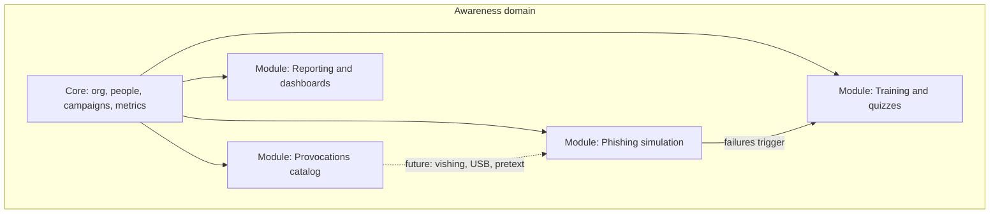
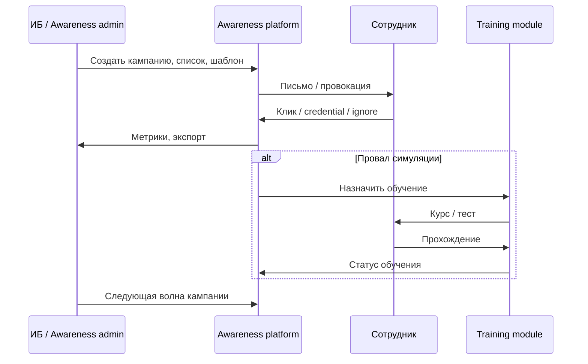
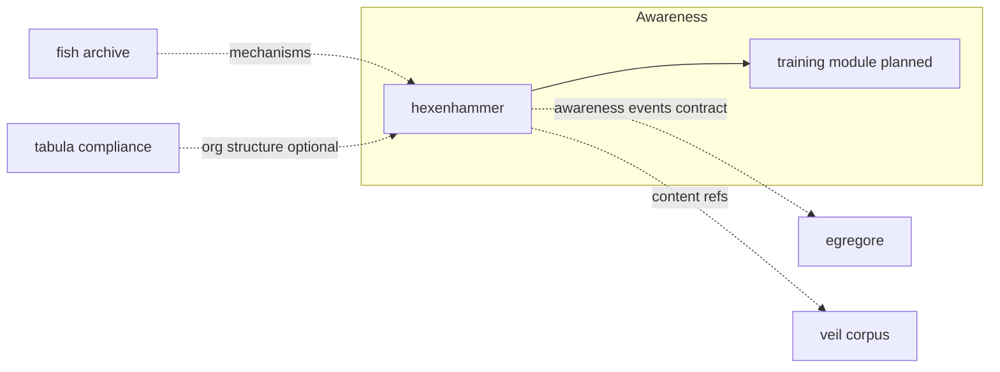

# Awareness — домен cxado

Регулярное тестирование сотрудников на устойчивость к атакам социальной инженерии и обучение информационной безопасности. Фишинг — **первый модуль**, не весь продукт.

| Поле | Значение |
|------|----------|
| Статус | active (модуль 1 — hexenhammer) |
| Первый продукт | [hexenhammer](../../projects/hexenhammer/) |
| Архив-донор | [fish](https://github.com/butbeautifulv/fish) — МАШ-специфика, не в workspace |
| См. также | [ecosystem-map.md](../ecosystem-map.md), [cxado-architecture ADR](../adr/cxado-architecture.md) |

---

## Зачем

Организации обязаны не только внедрять технические контроли, но и поддерживать **культуру безопасности**: сотрудник — часть периметра. Домен Awareness закрывает цикл:

1. **Измерить** — насколько персонал уязвим к провокациям (фишинг, в будущем — vishing, USB-drop, pretext и т.д.).
2. **Реагировать** — зафиксировать инциденты симуляции (клик, ввод учётных данных, скачивание).
3. **Обучать** — дать целевое обучение тем, кто не прошёл проверку.
4. **Повторять** — регулярные кампании и метрики улучшения во времени.

Это **не** пентест (Veneno) и **не** compliance-реестр мер (Tabula/fstec). Awareness работает с **людьми и поведением**, а не с инфраструктурой или нормативными чеклистами.

---

## Границы домена

| В домене | Вне домена |
|----------|------------|
| Симуляции и провокации для сотрудников | Реальные атаки, red team без согласия (Veneno) |
| Учёт результатов симуляций, отчёты для ИБ | Агрегация сканов, ASOC, SOC-агенты (Egregore) |
| Обучение и тесты по ИБ (планируется) | Реестр мер ФСТЭК, приказы, аудит соответствия (Tabula) |
| Брендируемые лендинги, SMTP-доставка | TI-граф, плейбуки (Veil) — возможная **интеграция**, не владение |

---

## Модульная модель

Домен строится как **набор модулей** с общей идентичностью сотрудника, организацией и метриками. Сегодня реализован один модуль; остальные — в roadmap.



| Модуль | Назначение | Продукт / статус |
|--------|------------|------------------|
| **Phishing simulation** | Списки получателей, шаблоны писем, токенизированные лендинги, трекинг кликов/учёток | **hexenhammer** — active |
| **Training & quizzes** | Микрообучение и тесты для «попавшихся» и для планового обучения | planned |
| **Provocations catalog** | Расширяемый каталог сценариев (email, voice, physical) | planned |
| **Reporting** | Дашборды, экспорт, тренды по подразделениям | partial (admin stats в hexenhammer) |

### Модуль 1: фишинг (hexenhammer)

Текущая реализация — org-agnostic платформа из механизмов fish:

| Контекст | Путь | Роль |
|----------|------|------|
| Public | `app/(public)/` | Лендинг по токену, фиксация событий |
| Admin | `app/(admin)/` | Кампании, списки, почтовые настройки |
| API | `app/api/` | Audit events, admin API |
| Shared | `lib/` | campaign, audit, mail, db, crypto |

События аудита: визит, ввод учётных данных, скачивание, открытие письма — основа для **таргетированного обучения** в следующих модулях.

### Модуль 2: обучение и тесты (planned)

Целевая модель:

- Сотрудник, попавший на фишинг (или другую провокацию), **автоматически** получает назначенный курс или короткий тест.
- Плановое обучение для всех / по ролям (разработчики, бухгалтерия, руководители).
- Прохождение фиксируется; повторная симуляция проверяет, снизилась ли уязвимость.

Открытые решения (не зафиксированы):

- Отдельный репозиторий vs расширение hexenhammer (`/learn`, LMS-подмодуль).
- Контент: встроенный редактор vs импорт SCORM / ссылки на внешний LMS.
- Связь с Veil corpus (плейбуки anti-phishing) как источник материалов.

---

## Жизненный цикл программы



| Этап | Описание | Сегодня |
|------|----------|---------|
| Планирование | Списки, периодичность, сценарии | hexenhammer admin |
| Доставка | SMTP / relay, шаблоны | hexenhammer |
| Фиксация | Audit events, шифрование чувствительных данных | hexenhammer |
| Анализ | Статистика, экспорт | hexenhammer (базово) |
| Обучение | Назначение по результатам | **не реализовано** |
| Ретест | Повторная кампания, сравнение волн | ручной процесс |

---

## Место в cxado



| Сосед | Связь |
|-------|--------|
| **fish** | Архив; донор кода для hexenhammer. МАШ/VPN-специфика не переносится. |
| **Tabula** | Потенциально общие сущности «организация / подразделение»; разные домены. |
| **Egregore** | План: `shared/contracts/awareness-campaign-event.json` — события кампаний в SOC-пайплайн. |
| **Veil** | Плейбуки и skills по anti-phishing — контент для обучения, не runtime hexenhammer. |
| **@cxado/gui** | Phase 05 hexenhammer — общий UI-kit после стабилизации fstec. |

Паттерн как у Tabula: **домен в meta-repo**, продукты — submodules. Сейчас домен = один submodule (`hexenhammer`); при появлении LMS-модуля возможен umbrella-репозиторий `projects/awareness` по аналогии с `projects/tabula`.

---

## Roadmap

| Фаза | Содержание | Статус |
|------|------------|--------|
| 00–04 | Scaffold, core libs, generic env, cxado submodule, public branding | done |
| 05 | `@cxado/gui` tier-1 | planned |
| 06 | Контракты событий awareness ↔ egregore | planned |
| 07+ | **Training & quizzes** — назначение обучения по audit events | idea |
| 08+ | Каталог провокаций beyond email | idea |

Детальный план продукта: [hexenhammer_master.plan.md](../../projects/hexenhammer/docs/plans/hexenhammer_master.plan.md).

---

## Термины

| Термин | Значение |
|--------|----------|
| **Кампания** | Волна симуляции: список, шаблон, окно отправки |
| **Провокация** | Любой сценарий тестирования человека (фишинг — подвид) |
| **Audit event** | Зафиксированное действие сотрудника на лендинге или в письме |
| **Попался** | Сотрудник сработал на триггер (клик, credential, download) — кандидат на обучение |
| **Awareness admin** | Оператор программы в admin-контуре (не путать с SOC analyst) |

---

## Быстрый старт (модуль фишинг)

```bash
cd projects/hexenhammer
cp .env.example .env.local
# HEX_ENCRYPTION_KEY: openssl rand -hex 32
# SESSION_SECRET: openssl rand -base64 48
npm ci
npm run dev          # Postgres в docker-compose.dev.yml
```

Admin: `http://localhost:3000/admin/login` — `ADMIN_USER` / `ADMIN_PASSWORD` из `.env.local`.

См. [hexenhammer README](../../projects/hexenhammer/README.md), [AGENTS.md](../../projects/hexenhammer/AGENTS.md).
