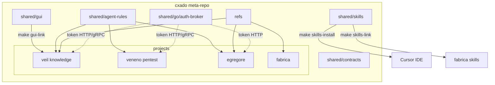
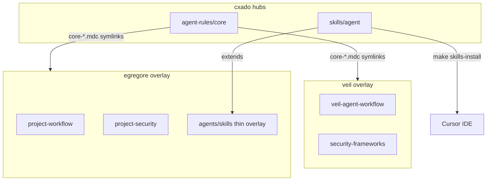
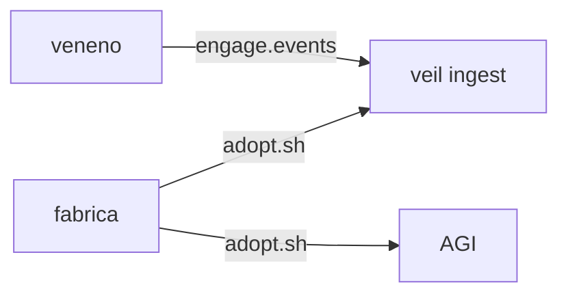
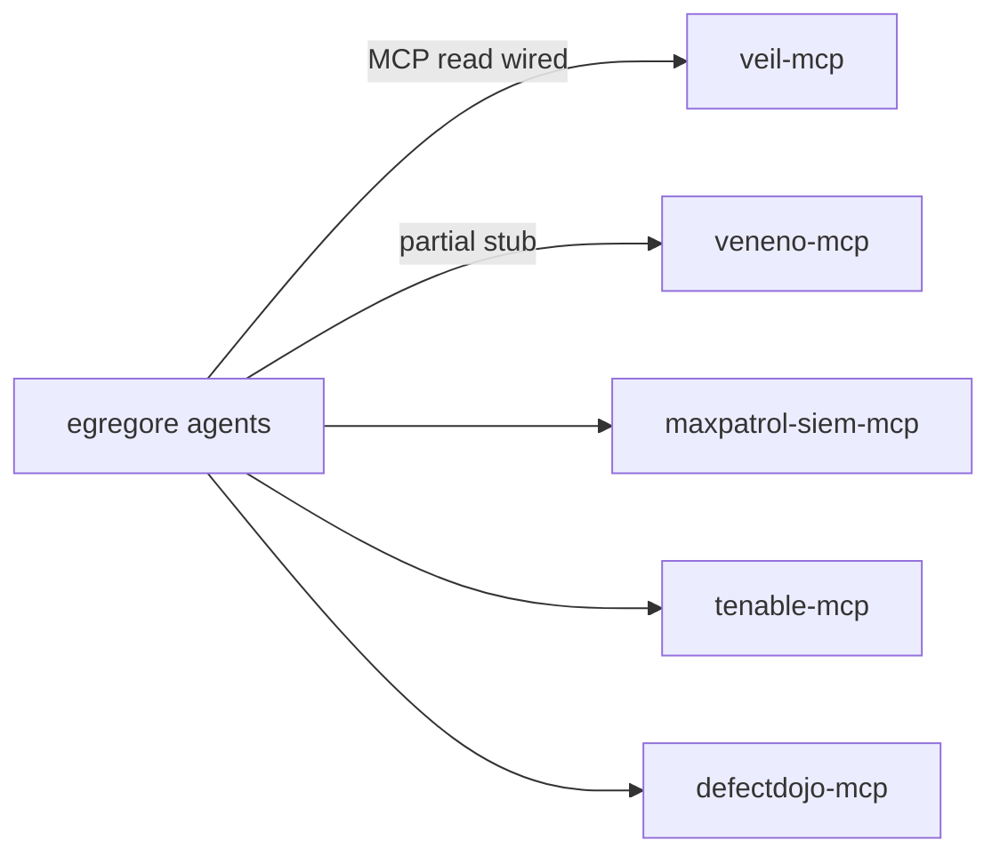

# cxado ecosystem map

High-level view of projects, shared hubs, and planned integrations.

**Public entrypoint:** [github.com/butbeautifulv/cxado](https://github.com/butbeautifulv/cxado) — clone with submodules, then `make bootstrap`.

## Public catalog

All repositories under [butbeautifulv](https://github.com/butbeautifulv) that form the cxado ecosystem. Submodule URLs match [`.gitmodules`](../.gitmodules). Catalog repos are public on GitHub.

### Meta-repo

| Path | Repository | Role |
|------|------------|------|
| `.` | [cxado](https://github.com/butbeautifulv/cxado) | Umbrella: submodules, docs, `shared/contracts`, `shared/go/auth-broker` |

### Platform projects (submodules)

| Path | Repository | Role | Stack |
|------|------------|------|-------|
| `projects/veil` | [veil](https://github.com/butbeautifulv/veil) | TI graph, ingest, veil-api, veil-mcp | Go, Neo4j |
| `projects/veneno` | [veneno](https://github.com/butbeautifulv/veneno) | Pentest execution, veneno-api, veneno-mcp | Go |
| `projects/egregore` | [egregore](https://github.com/butbeautifulv/egregore) | Event-driven multi-agent SOC + Operator UI (`web_ui/`) | Python, FastAPI, Next.js |
| `projects/fabrica` | [fabrica](https://github.com/butbeautifulv/fabrica) | DevSecOps CI/CD reference (`adopt.sh`) | YAML, scripts |

### Out of cxado scope (standalone on ~/Desktop/)

hexenhammer (awareness), tabula (compliance + fstec submodule), asoc-api.

### Integration MCP (submodule)

| Path | Repository | Role |
|------|------------|------|
| `projects/precursor` | [precursor](https://github.com/butbeautifulv/precursor) | Private monorepo: maxpatrol-siem-mcp, tenable-mcp, defectdojo-mcp |

### Shared hubs (in meta-repo)

| Path | Purpose |
|------|---------|
| `shared/agent-rules/` | Core Cursor rules — meta `.cursor/rules/` |
| `shared/skills/` | DevSecOps + agent skills (`make skills-install`) |
| `refs/` | JCSF, DAF, OWASP — **gitignored** (~1 GB local); meta-repo root, no per-project symlinks |
| `shared/gui/` | `@cxado/gui` UI kit (`make gui-link`) |
| `shared/contracts/` | Wire schemas — `make test-contracts` |
| `shared/go/auth-broker/` | OAuth2 M2M token broker |
| `deploy/` | Unified Docker Compose (`make cxado-up`) |
| `docs/` | ADR, ecosystem map, integration runbooks |
| `docs/architecture-site/` | Visual architecture landing — k3s port **30080** |

### In meta-repo only (no separate GitHub repo)

_Removed legacy separate repos: cxado-agent-rules, cxado-skills, cxado-references, cxado-gui — content lives under `shared/` in cxado._



## DRY agent rules & skills



| Layer | Location | Runtime? |
|-------|----------|----------|
| **Core rules** | `shared/agent-rules/core/*.mdc` | No — symlinked into projects |
| **Project overlay** | 1–4 `.mdc` per repo | No |
| **Generic agent skills** | `shared/skills/agent/*` | No — Cursor dev |
| **Product skills** | `egregore/agents/skills/` | Yes — Skill Gateway |

## Agent rules & skills (by project)

Core rules: `shared/agent-rules/core/` — Cursor loads via meta [`.cursor/rules/`](../.cursor/rules/) when using `cxado.code-workspace`.

Domain vision (archived): [docs/domains/](domains/README.md).

| Domain | Status |
|--------|--------|
| Awareness (hexenhammer) | **Out of scope** — `~/Desktop/hexenhammer` |
| Compliance (tabula/fstec) | **Out of scope** — `~/Desktop/tabula` |
| ASOC API | **Out of scope** — `~/Desktop/asoc-api` |

## Shared hubs

| Hub | Path | Contents | Not included |
|-----|------|----------|--------------|
| **@cxado/gui** | `shared/gui` | Compliance/cybersec UI kit (tiers 1–3) | App domain logic, Prisma/API |
| **agent-rules** | `shared/agent-rules` | 7 core Cursor rules | Project overlays |
| **skills** | `shared/skills` | devsecops + veil + agent/* generic skills | Veil corpus, egregore runtime |
| **references** | `refs` | JCSF, DAF, OWASP, hexstrike extracts | Anthropic Skills upstream (Veil-local) |
| **cxado-contracts** | in [cxado](https://github.com/butbeautifulv/cxado) · `shared/contracts` | Cross-repo wire schemas | — |
| **auth-broker** | in [cxado](https://github.com/butbeautifulv/cxado) · `shared/go/auth-broker` | OAuth2 M2M token broker (gRPC + HTTP) | JWT resource-server middleware |
| **cxado_auth_client** | in [cxado](https://github.com/butbeautifulv/cxado) · `shared/python/cxado_auth_client` | Python client for auth-broker | — |

## Agent rules & skills (by project)

Core rules: `shared/agent-rules/core/` — Cursor loads via meta [`.cursor/rules/`](../.cursor/rules/) when using `cxado.code-workspace`.

| Project | Repo | Core rules | Project overlay | Product / runtime skills |
|---------|------|------------|-----------------|--------------------------|
| **veil** | [veil](https://github.com/butbeautifulv/veil) | `core-*.mdc` symlinks | 4 `veil-*.mdc` (knowledge) | `corpus/` (754 playbooks) |
| **veneno** | [veneno](https://github.com/butbeautifulv/veneno) | `core-*.mdc` symlinks | 2 `project-*.mdc` | tool catalog runtime |
| **egregore** | [egregore](https://github.com/butbeautifulv/egregore) | `core-*.mdc` symlinks | 2 `project-*.mdc` | `agents/skills/` (Skill Gateway) |
| **fabrica** | [fabrica](https://github.com/butbeautifulv/fabrica) | `core-*.mdc` symlinks | `project-workflow.mdc` + `.cursor/rules/` | `skills-link` devsecops |

- **skills** (`make skills-install` + `make skills-link`): devsecops symlinks in fabrica; agent/* via global install — **not** egregore runtime overlays.
- **egregore** OWASP: `refs/owasp/` at meta root; sync pointers via `scripts/generate_owasp_skills.py`.
- **Wire contracts:** `shared/contracts/` — `make test-contracts`.

## Data flows (planned / partial)



- **Veneno → veil:** engage.events ingest bridge (wired).
- **Fabrica → projects:** `scripts/adopt.sh` copies gates and profiles.

## MCP integration



- **egregore ↔ veil-mcp:** [integration/egregore-veil-mcp.md](integration/egregore-veil-mcp.md)
- **egregore ↔ veneno-mcp:** [integration/egregore-veneno-mcp.md](integration/egregore-veneno-mcp.md)
- **egregore ↔ SIEM / Tenable / DefectDojo MCP:** [integration/README.md](integration/README.md)

## Architecture ADR

See [adr/cxado-architecture.md](adr/cxado-architecture.md) for the accepted meta-repo architecture decision record.

Domain docs: [docs/domains/](domains/README.md).

## Make targets (public bootstrap)

| Target | What it does |
|--------|----------------|
| `make bootstrap` | Submodules + `skills-link` + `skills-install` + `gui-link` + legacy symlink cleanup |
| `make skills-install` | Install `shared/skills` to `~/.cursor/skills/` |
| `make gui-link` | Symlink `@cxado/gui` into consumer projects |
| `make agent-skills-install` | Fetch HashiCorp/terraform + docker/grafana skills into `.agents/skills/` |
| `make test-contracts` | Cross-repo wire contract smoke |
| `make auth-broker-test` | Unit tests for `shared/go/auth-broker` |
| `make cxado-up` | Default local stack: Veil graph + egregore infra + observability |
| `make cxado-up-lite` | Lite profile: no Tempo, 1 worker, Langfuse |
| `make k3s-baseline` | Collect k3s Prometheus baseline snapshot |
| `make k3s-validation-gate` | Phase 9 offline validation gate |
| `make cxado-down` | Stop obs + egregore infra (optional veil/langfuse) |
| `make cxado-status` | Health checks (veil, egregore API, Grafana, Prometheus) |

## Default local stack

```bash
make cxado-up
make -C projects/egregore dev
```

See [deploy/cxado-default-stack.md](deploy/cxado-default-stack.md) and [deploy/ports.md](../deploy/ports.md).

## k3s offline (P30)

| Path | Role |
|------|------|
| `deploy/k8s/cxado-offline/` | Egregore Helm values + offline bundle |
| `deploy/k8s/veil-offline/` | Veil graph-only / workers-obs profiles |
| `deploy/k8s/obs-offline/` | Prometheus, Grafana, Loki, Tempo |
| `deploy/k8s/defectdojo-offline/` | DefectDojo ASPM in-cluster (`:30808`) |
| `deploy/k8s/offline-tls/` | TLS gateway NodePorts |
| `docs/observability/` | Runbooks, SLO, validation matrix |

Runbook: [deploy/k3s-offline-baseline.md](deploy/k3s-offline-baseline.md) · observability index: [observability/README.md](observability/README.md).


## Agent MCP tooling (Cursor IDE)

For development in this meta-repo, agents use **Context7** (live library docs) and scoped **Grep/Read** for internal navigation. See [agents/cursor-mcp-tooling.md](agents/cursor-mcp-tooling.md).

## Clone entrypoint

```bash
git clone --recurse-submodules https://github.com/butbeautifulv/cxado.git
cd cxado && make bootstrap
```
