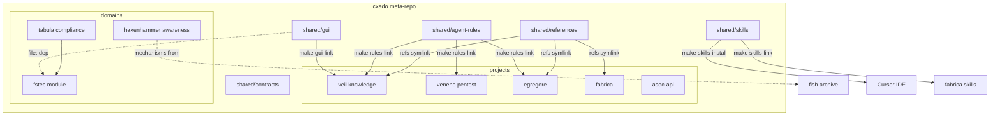
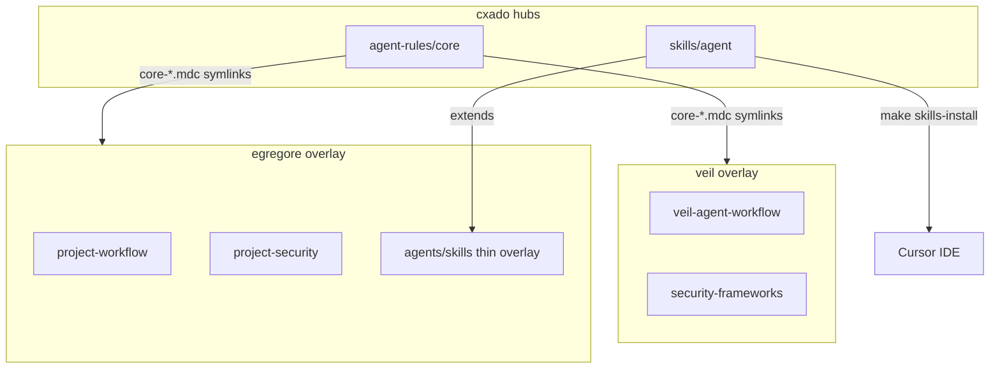
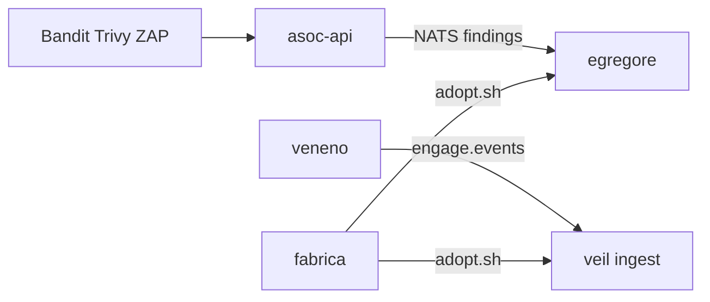
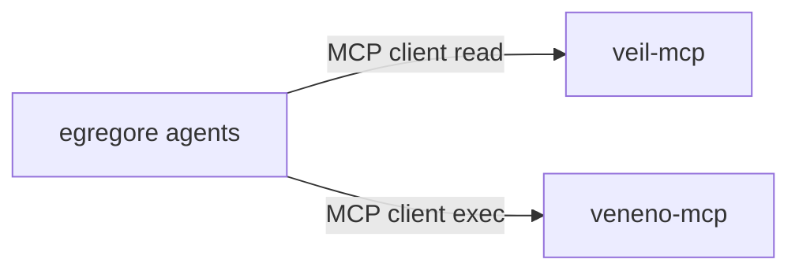

# cxado ecosystem map

High-level view of projects, shared hubs, and planned integrations.



## DRY agent rules & skills



| Layer | Location | Runtime? |
|-------|----------|----------|
| **Core rules** | `shared/agent-rules/core/*.mdc` | No — symlinked into projects |
| **Project overlay** | 1–4 `.mdc` per repo | No |
| **Generic agent skills** | `shared/skills/agent/*` | No — Cursor dev |
| **Product skills** | `egregore/agents/skills/` | Yes — Skill Gateway |

## Projects

| Project | Role | Stack |
|---------|------|-------|
| **veil** | TI graph, ingest, veil-api, veil-mcp | Go, Neo4j |
| **veneno** | Pentest execution, veneno-api, veneno-mcp | Go |
| **egregore** | Event-driven multi-agent SOC | Python |
| **fabrica** | DevSecOps CI/CD reference | YAML, scripts |
| **asoc-api** | Scan aggregation → NATS | Go |

## Domains

| Domain | Repo / path | Role | Status |
|--------|-------------|------|--------|
| **Tabula** | `projects/tabula` (submodule) | Compliance umbrella | active |
| **fstec** | `projects/tabula/fstec` (submodule) | First Tabula module — FSTEC measures | active; GUI migration on `fstec/gui-detach-wip` |
| **Hexenhammer** | `projects/hexenhammer` (submodule) | Awareness: phishing simulation, campaigns | phase 04 done |
| **fish** | [butbeautifulv/fish](https://github.com/butbeautifulv/fish) (external archive) | Legacy МАШ phishing audit — donor for hexenhammer | archive — not cloned in cxado workspace |

## Shared hubs

| Hub | Contents | Not included |
|-----|----------|--------------|
| **@cxado/gui** (`shared/gui`) | Compliance/cybersec UI kit (tiers 1–3) | App domain logic, Prisma/API |
| **cxado-agent-rules** | 7 core Cursor rules (karpathy, critic, branches, kaizen, docs, workflow, **mcp-tooling**) | Project overlays |
| **cxado-skills** | 12 devsecops + veil + 5 agent/* generic skills | Veil corpus (754 playbooks), egregore product runtime |
| **cxado-references** | JCSF, DAF, OWASP cheat sheets, hexstrike extracts | Anthropic Skills upstream (Veil-local) |

## Agent rules & skills (by project)

Core rules linked via `make rules-link`; see [Veil cursor-rules-index](projects/veil/docs/agents/cursor-rules-index.md).

| Project | Core rules | Project overlay | Product / runtime skills |
|---------|------------|-----------------|--------------------------|
| **veil** | `core-*.mdc` symlinks | 4 `veil-*.mdc` (knowledge) | `corpus/` (754 playbooks) |
| **veneno** | `core-*.mdc` symlinks | 2 `project-*.mdc` | tool catalog runtime |
| **egregore** | `core-*.mdc` symlinks | 2 `project-*.mdc` | `agents/skills/` (Skill Gateway) |
| **fabrica** | `core-*.mdc` symlinks | `project-workflow.mdc` + `.cursor/rules/` | `skills-link` devsecops |
| **fish** (external) | copy (pre-DRY) | `.agents/rules/fish-*.mdc` | — |
| **hexenhammer** | `core-*.mdc` symlinks | `hexenhammer-*.mdc` overlay | campaign runtime |
| **tabula** | `core-*.mdc` symlinks | `tabula-agent-workflow.mdc` | fstec product in submodule |

- **cxado-skills** (`make skills-install` + `make skills-link`): devsecops symlinks in fabrica; agent/* via global install — **not** egregore runtime overlays.
- **egregore** OWASP: `shared/references/owasp/` via `refs-link`; sync pointers via `scripts/generate_owasp_skills.py`.
- **Wire contracts:** `shared/contracts/` — `make test-contracts`.

## Data flows (planned / partial)



- **ASOC → egregore:** NATS JetStream normalized scan events (not wired in egregore yet).
- **Veneno → veil:** engage.events ingest bridge (wired).
- **Fabrica → projects:** `scripts/adopt.sh` copies gates and profiles.

## MCP integration (planned)



egregore can consume Veil graph read and veneno tool execution via MCP — **not implemented** in this meta-repo bootstrap. See [integration/egregore-veil-mcp.md](integration/egregore-veil-mcp.md).

## Architecture ADR

See [adr/cxado-architecture.md](adr/cxado-architecture.md) for the accepted meta-repo architecture decision record (synced with codebase-memory-mcp).

## Agent MCP tooling (Cursor IDE)

For development in this meta-repo, agents use **codebase-memory-mcp** (graph + ADR), **Serena** (LSP symbols/refactor), and **Context7 / ctx7** (live library docs). See [agents/cursor-mcp-tooling.md](agents/cursor-mcp-tooling.md).

## Clone entrypoint

```bash
git clone --recurse-submodules https://github.com/butbeautifulv/cxado.git
cd cxado && make bootstrap
```
