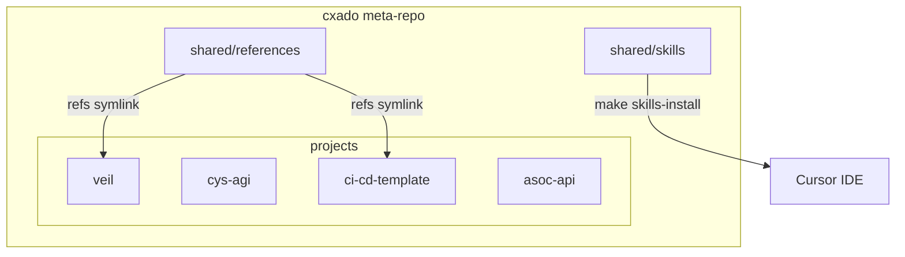
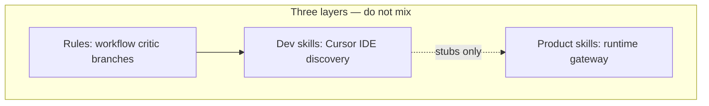
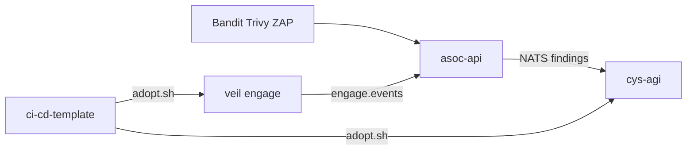
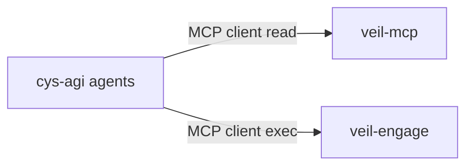

# cxado ecosystem map

High-level view of projects, shared hubs, and planned integrations.



## Projects

| Project | Role | Stack |
|---------|------|-------|
| **veil** | Threat intelligence, engage tools, MCP | Go, Neo4j |
| **cys-agi** | Event-driven multi-agent SOC | Python |
| **ci-cd-template** | DevSecOps CI/CD reference | YAML, scripts |
| **asoc-api** | Scan aggregation → NATS | Go |

## Shared hubs

| Hub | Contents | Not included |
|-----|----------|--------------|
| **cxado-skills** | 13 Cursor dev skills | Veil corpus (754 playbooks), cys-agi runtime skills |
| **cxado-references** | JCSF, DAF, hexstrike, OWASP PDFs | Anthropic Skills upstream (Veil-local) |

## Agent rules & skills (by project)

Veil is the **template** for agent workflow rules; Fish and cys-agi adapt via `.agents/rules/` (see [Veil cursor-rules-index](projects/veil/docs/agents/cursor-rules-index.md)).

| Project | Rules path | Cursor dev skills | Product / runtime skills |
|---------|------------|-------------------|--------------------------|
| **veil** | `.cursor/rules/veil-*.mdc` | cxado-skills/veil | `corpus/` (754 playbooks) |
| **ci-cd-template** | `.cursor/rules/` | cxado-skills/devsecops | — |
| **cys-agi** | `.agents/rules/cys-agi-*.mdc` | `.agents/skills/` stubs | `agents/skills/` (Skill Gateway) |
| **fish** (external) | `.agents/rules/fish-*.mdc` | `.agents/skills/` | — |



- **cxado-skills** (`make skills-install`): cross-repo dev skills only — **not** cys-agi `ai-agent-security`.
- **cys-agi** OWASP batch: vendored in `docs/reference/owasp/`; sync via `scripts/generate_owasp_skills.py`.

## Data flows (planned / partial)



- **ASOC → cys-agi:** NATS JetStream normalized scan events (not wired in cys-agi yet).
- **Veil engage → ASOC:** engage audit/events export (roadmap).
- **CI/CD template → projects:** `scripts/adopt.sh` copies gates and profiles.

## MCP integration (planned)



cys-agi can consume Veil graph read and engage tool execution via MCP — **not implemented** in this meta-repo bootstrap. See [integration/cys-agi-veil-mcp.md](integration/cys-agi-veil-mcp.md).

## Clone entrypoint

```bash
git clone --recurse-submodules https://github.com/butbeautifulv/cxado.git
cd cxado && make bootstrap
```
