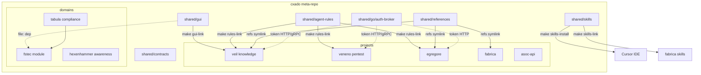
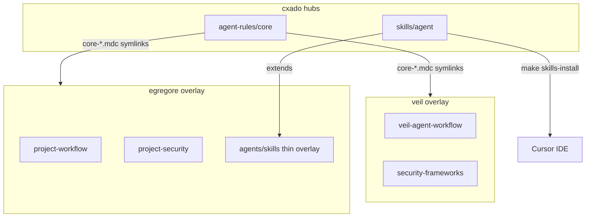
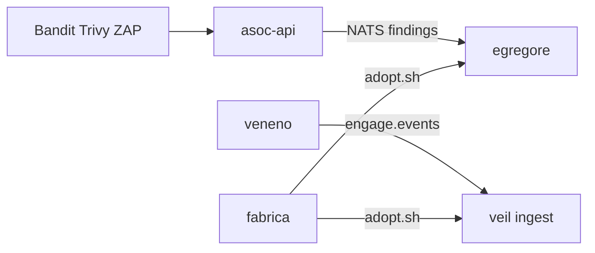
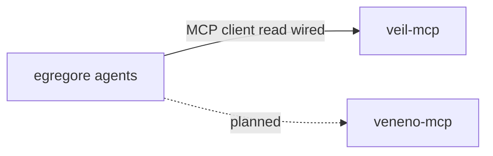

# cxado ecosystem map

High-level view of projects, shared hubs, and planned integrations.

**Public entrypoint:** [github.com/butbeautifulv/cxado](https://github.com/butbeautifulv/cxado) — clone with submodules, then `make bootstrap`.

## Public catalog

All repositories under [butbeautifulv](https://github.com/butbeautifulv) that form the cxado ecosystem. Submodule URLs match [`.gitmodules`](../.gitmodules). Catalog repos are public on GitHub.

### Meta-repo

| Path | Repository | Role |
|------|------------|------|
| `.` | [cxado](https://github.com/butbeautifulv/cxado) | Umbrella: submodules, docs, `shared/contracts`, `shared/go/auth-broker` |

### Platform projects (submodules)

| Path | Repository | Role | Stack |
|------|------------|------|-------|
| `projects/veil` | [veil](https://github.com/butbeautifulv/veil) | TI graph, ingest, veil-api, veil-mcp | Go, Neo4j |
| `projects/veneno` | [veneno](https://github.com/butbeautifulv/veneno) | Pentest execution, veneno-api, veneno-mcp | Go |
| `projects/egregore` | [egregore](https://github.com/butbeautifulv/egregore) | Event-driven multi-agent SOC + Operator UI (`ui/`) | Python, FastAPI, Next.js |
| `projects/fabrica` | [fabrica](https://github.com/butbeautifulv/fabrica) | DevSecOps CI/CD reference (`adopt.sh`) | YAML, scripts |
| `projects/asoc-api` | [asoc-api](https://github.com/butbeautifulv/asoc-api) | Scan aggregation → NATS | Go |

### Domain umbrellas & products (submodules)

| Path | Repository | Role | Stack |
|------|------------|------|-------|
| `projects/tabula` | [tabula](https://github.com/butbeautifulv/tabula) | Compliance domain umbrella | meta |
| `projects/tabula/fstec` | [fstec](https://github.com/butbeautifulv/fstec) | FSTEC measures, orders, reporting | Next.js, Prisma |
| `projects/hexenhammer` | [hexenhammer](https://github.com/butbeautifulv/hexenhammer) | Awareness module 1: phishing simulation | Next.js, Drizzle |

Domain vision: [docs/domains/](domains/README.md) · Awareness: [awareness.md](domains/awareness.md)

### Shared hubs (submodules)

| Path | Repository | Purpose |
|------|------------|---------|
| `shared/agent-rules` | [cxado-agent-rules](https://github.com/butbeautifulv/cxado-agent-rules) | Core Cursor rules (`make rules-link`) |
| `shared/skills` | [cxado-skills](https://github.com/butbeautifulv/cxado-skills) | DevSecOps + agent skills (`make skills-install`) |
| `shared/references` | [cxado-references](https://github.com/butbeautifulv/cxado-references) | JCSF, DAF, OWASP, hexstrike extracts |
| `shared/gui` | [cxado-gui](https://github.com/butbeautifulv/cxado-gui) | `@cxado/gui` UI kit (`make gui-link`) |

### In meta-repo only (no separate repo yet)

| Path | Purpose |
|------|---------|
| `shared/contracts/` | Wire schemas (`engage.events`, auth-broker token v1) — `make test-contracts` |
| `shared/go/auth-broker/` | OAuth2 M2M token broker (gRPC + HTTP) — `make auth-broker-test` |
| `shared/python/cxado_auth_client/` | Python HTTP client for auth-broker |
| `deploy/` | Unified Docker Compose for cxado default stack (`make cxado-up`) |
| `docs/` | ADR, ecosystem map, agent MCP tooling, integration runbooks |



## DRY agent rules & skills



| Layer | Location | Runtime? |
|-------|----------|----------|
| **Core rules** | `shared/agent-rules/core/*.mdc` | No — symlinked into projects |
| **Project overlay** | 1–4 `.mdc` per repo | No |
| **Generic agent skills** | `shared/skills/agent/*` | No — Cursor dev |
| **Product skills** | `egregore/agents/skills/` | Yes — Skill Gateway |

## Projects

| Project | Repo | Role | Stack |
|---------|------|------|-------|
| **veil** | [veil](https://github.com/butbeautifulv/veil) | TI graph, ingest, veil-api, veil-mcp | Go, Neo4j |
| **veneno** | [veneno](https://github.com/butbeautifulv/veneno) | Pentest execution, veneno-api, veneno-mcp | Go |
| **egregore** | [egregore](https://github.com/butbeautifulv/egregore) | Event-driven multi-agent SOC + Operator UI (`ui/`); kill-chain personas (intel, hunter, identity, dfir, cloud, purple) | Python, Next.js |
| **fabrica** | [fabrica](https://github.com/butbeautifulv/fabrica) | DevSecOps CI/CD reference | YAML, scripts |
| **asoc-api** | [asoc-api](https://github.com/butbeautifulv/asoc-api) | Scan aggregation → NATS | Go |

## Domains

Domain vision docs: [docs/domains/](domains/README.md).

| Domain | Repo / path | Role | Status |
|--------|-------------|------|--------|
| **Awareness** | [awareness.md](domains/awareness.md) | Employee testing + training; phishing = module 1 | active |
| **Hexenhammer** | [hexenhammer](https://github.com/butbeautifulv/hexenhammer) · `projects/hexenhammer` | Awareness module: phishing simulation, campaigns | phase 04 done |
| **Tabula** | [tabula](https://github.com/butbeautifulv/tabula) · `projects/tabula` | Compliance umbrella | active |
| **fstec** | [fstec](https://github.com/butbeautifulv/fstec) · `projects/tabula/fstec` | First Tabula module — FSTEC measures | active on `master` |

## Shared hubs

| Hub | Repo / path | Contents | Not included |
|-----|-------------|----------|--------------|
| **@cxado/gui** | [cxado-gui](https://github.com/butbeautifulv/cxado-gui) · `shared/gui` | Compliance/cybersec UI kit (tiers 1–3) | App domain logic, Prisma/API |
| **cxado-agent-rules** | [cxado-agent-rules](https://github.com/butbeautifulv/cxado-agent-rules) · `shared/agent-rules` | 7 core Cursor rules | Project overlays |
| **cxado-skills** | [cxado-skills](https://github.com/butbeautifulv/cxado-skills) · `shared/skills` | 12 devsecops + veil + 5 agent/* generic skills | Veil corpus (754 playbooks), egregore product runtime |
| **cxado-references** | [cxado-references](https://github.com/butbeautifulv/cxado-references) · `shared/references` | JCSF, DAF, OWASP cheat sheets, hexstrike extracts | Anthropic Skills upstream (Veil-local) |
| **cxado-contracts** | in [cxado](https://github.com/butbeautifulv/cxado) · `shared/contracts` | Cross-repo wire schemas | — |
| **auth-broker** | in [cxado](https://github.com/butbeautifulv/cxado) · `shared/go/auth-broker` | OAuth2 M2M token broker (gRPC + HTTP) | JWT resource-server middleware |
| **cxado_auth_client** | in [cxado](https://github.com/butbeautifulv/cxado) · `shared/python/cxado_auth_client` | Python client for auth-broker | — |

## Agent rules & skills (by project)

Core rules linked via `make rules-link`; see [Veil cursor-rules-index](projects/veil/docs/agents/cursor-rules-index.md).

| Project | Repo | Core rules | Project overlay | Product / runtime skills |
|---------|------|------------|-----------------|--------------------------|
| **veil** | [veil](https://github.com/butbeautifulv/veil) | `core-*.mdc` symlinks | 4 `veil-*.mdc` (knowledge) | `corpus/` (754 playbooks) |
| **veneno** | [veneno](https://github.com/butbeautifulv/veneno) | `core-*.mdc` symlinks | 2 `project-*.mdc` | tool catalog runtime |
| **egregore** | [egregore](https://github.com/butbeautifulv/egregore) | `core-*.mdc` symlinks | 2 `project-*.mdc` | `agents/skills/` (Skill Gateway) |
| **fabrica** | [fabrica](https://github.com/butbeautifulv/fabrica) | `core-*.mdc` symlinks | `project-workflow.mdc` + `.cursor/rules/` | `skills-link` devsecops |
| **hexenhammer** | [hexenhammer](https://github.com/butbeautifulv/hexenhammer) | `core-*.mdc` symlinks | `hexenhammer-*.mdc` overlay | campaign runtime |
| **tabula** | [tabula](https://github.com/butbeautifulv/tabula) | `core-*.mdc` symlinks | `tabula-agent-workflow.mdc` | [fstec](https://github.com/butbeautifulv/fstec) product |

- **cxado-skills** (`make skills-install` + `make skills-link`): devsecops symlinks in fabrica; agent/* via global install — **not** egregore runtime overlays.
- **egregore** OWASP: `shared/references/owasp/` via `refs-link`; sync pointers via `scripts/generate_owasp_skills.py`.
- **Wire contracts:** `shared/contracts/` — `make test-contracts`.

## Data flows (planned / partial)



- **ASOC → egregore:** NATS JetStream normalized scan events (not wired in egregore yet).
- **Veneno → veil:** engage.events ingest bridge (wired).
- **Fabrica → projects:** `scripts/adopt.sh` copies gates and profiles.

## MCP integration



- **egregore ↔ veil-mcp:** wired — graph read via tool gateway adapter. See [integration/egregore-veil-mcp.md](integration/egregore-veil-mcp.md).
- **egregore ↔ veneno-mcp:** planned — pentest execution path.

## Architecture ADR

See [adr/cxado-architecture.md](adr/cxado-architecture.md) for the accepted meta-repo architecture decision record (synced with codebase-memory-mcp).

Domain docs: [docs/domains/](domains/README.md).

## Make targets (public bootstrap)

| Target | What it does |
|--------|----------------|
| `make bootstrap` | Submodules + `refs-link` + `rules-link` + `skills-link` + `skills-install` + `gui-link` |
| `make rules-link` | Symlink core agent rules into projects |
| `make skills-install` | Install cxado-skills to `~/.cursor/skills/` |
| `make gui-link` | Symlink `@cxado/gui` into consumer projects |
| `make agent-skills-install` | Fetch HashiCorp/terraform + docker/grafana skills into `.agents/skills/` |
| `make test-contracts` | Cross-repo wire contract smoke |
| `make auth-broker-test` | Unit tests for `shared/go/auth-broker` |
| `make cxado-up` | Default local stack: Veil graph + egregore infra + observability |
| `make cxado-up-lite` | Lite profile: no Tempo, 1 worker, Langfuse |
| `make cxado-down` | Stop obs + egregore infra (optional veil/langfuse) |
| `make cxado-status` | Health checks (veil, egregore API, Grafana, Prometheus) |

## Default local stack

```bash
make cxado-up
make -C projects/egregore dev
```

See [deploy/cxado-default-stack.md](deploy/cxado-default-stack.md) and [deploy/ports.md](../deploy/ports.md).


## Agent MCP tooling (Cursor IDE)

For development in this meta-repo, agents use **codebase-memory-mcp** (graph + ADR), **Serena** (LSP symbols/refactor), and **Context7 / ctx7** (live library docs). See [agents/cursor-mcp-tooling.md](agents/cursor-mcp-tooling.md).

## Clone entrypoint

```bash
git clone --recurse-submodules https://github.com/butbeautifulv/cxado.git
cd cxado && make bootstrap
```
